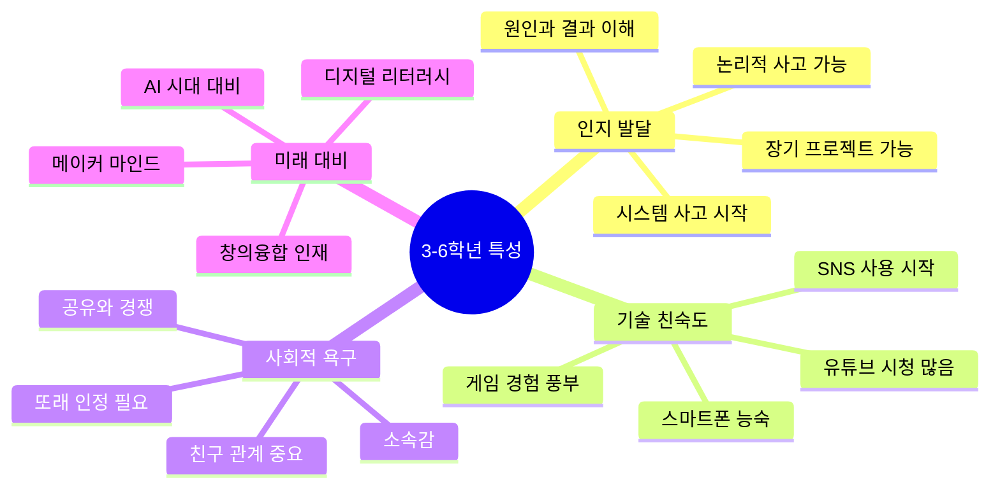
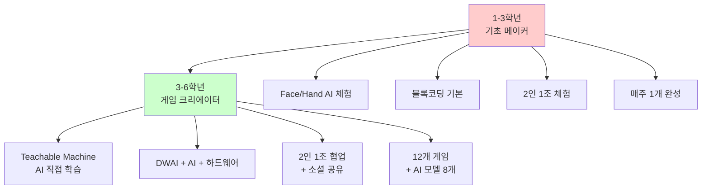
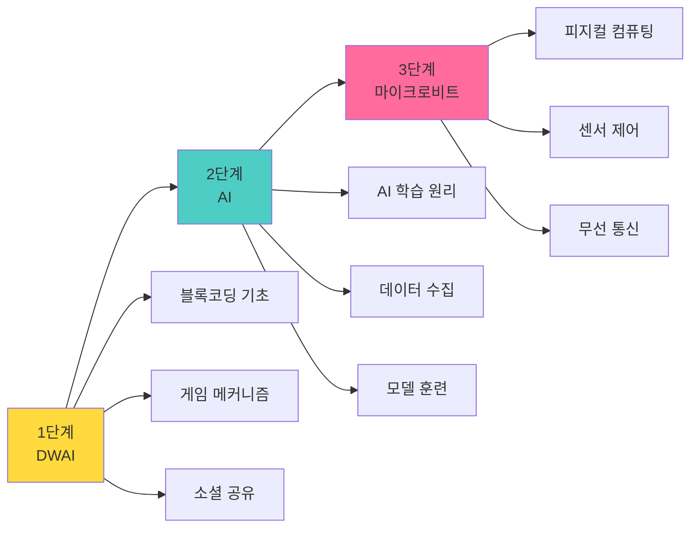
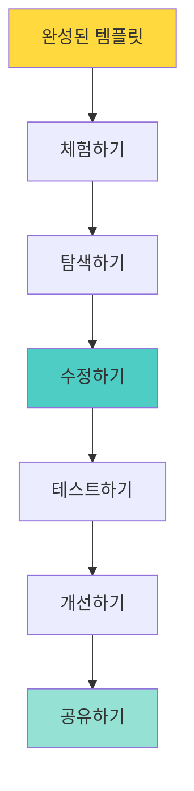
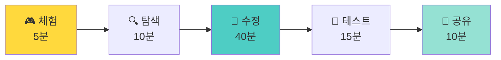
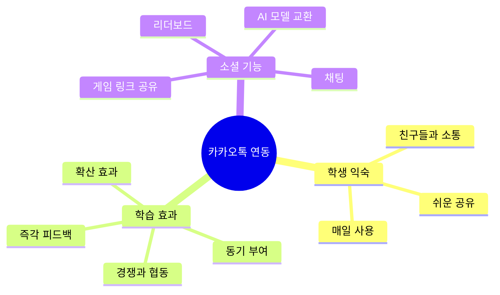
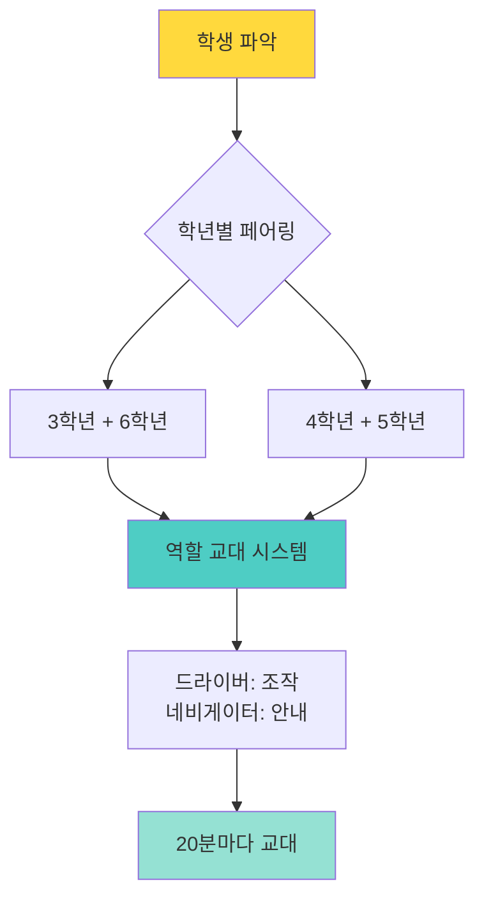
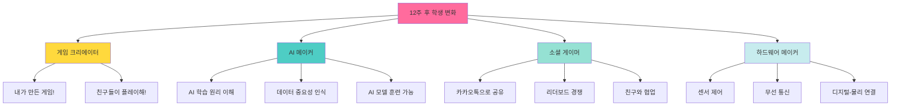

# 🎮 AI 게임 메이커 크리에이터 랩 (3-6학년)

> **초등 3-6학년을 위한 12주 게임 제작 커리큘럼**  
> DWAI → Teachable Machine → 마이크로비트  
> 템플릿 수정 방식 + 카카오톡 소셜 공유

## 📖 목차

- [교육 필요성](#-교육-필요성)
- [1-3학년과의 차별성](#-1-3학년과의-차별성)
- [3단계 학습 구조](#-3단계-학습-구조)
- [메이커 교육 방식](#-메이커-교육-방식)
- [카카오톡 소셜 기능](#-카카오톡-소셜-기능)
- [전체 커리큘럼](#-전체-커리큘럼)
- [기대 효과](#-기대-효과)

---

## 🎯 교육 필요성

### 왜 3-6학년에게 AI 게임 제작 교육인가?



### 📊 3-6학년 학습자 맞춤 설계

| 영역 | 특성 | 교육적 접근 |
|------|------|-----------|
| **관심사** | 게임, 유튜브, 친구 | 게임 제작 + 소셜 공유 |
| **학습 방식** | 실험하며 배우기 선호 | 템플릿 수정 방식 |
| **기술 수준** | 기본 컴퓨터 활용 가능 | DWAI 블록코딩부터 시작 |
| **AI 관심** | AI 체험하고 싶음 | Teachable Machine 직접 학습 |
| **피지컬** | 손으로 만지고 싶어함 | 마이크로비트 실물 제어 |

---

## 🔄 1-3학년과의 차별성

### 단계별 비교



### 상세 비교표

| 구분 | 1-3학년 | 3-6학년 |
|------|---------|---------|
| **AI 기술** | Face/Hand AI 체험 | **Teachable Machine 직접 학습** |
| **코딩** | 블록코딩 기본 | DWAI 블록코딩 + MakeCode |
| **하드웨어** | 웹캠만 | **마이크로비트** |
| **협업** | 2인 1조 (드라이버/네비게이터) | 2인 1조 + **카카오톡 소셜** |
| **프로젝트** | 주당 1개 완성 | 주당 1개 + **AI 모델 학습** |
| **공유** | 간단한 발표 | **카카오톡 게임방, 리더보드** |
| **9주차** | AI 그림 그리기 | **마이크로비트 LED 게임** |

---

## 📚 3단계 학습 구조

### 12주 로드맵

```mermaid
timeline
    title 12주 게임 제작 여정
    section 1단계: DWAI 게임 (1-4주)
        1주 : 🍔 햄버거 먹방
             : 클릭 게임, 인터페이스
             : 템플릿 수정 시작
        2주 : 🎯 타겟 슈팅
             : 마우스 추적, 충돌
             : 카카오톡 공유
        3주 : 🏃 달리기 챔피언
             : 키보드 제어, 장애물
             : 개발 프로세스 이해
        4주 : 🎮 게임 센터
             : 3개 게임 통합
             : 소셜 게임방 개설
    section 2단계: AI 게임 (5-8주)
        5주 : 📸 포즈 마스터
             : Teachable Machine 입문
             : AI 데이터 학습
        6주 : 🎤 소리 인식
             : 오디오 AI 학습
             : 소리로 게임 제어
        7주 : 🍔 햄버거 주문
             : 이미지 AI 학습
             : 실물 인식 게임
        8주 : 🤖 AI 슈퍼 게임
             : 3가지 AI 통합
             : AI 모델 교환
    section 3단계: 마이크로비트 (9-12주)
        9주 : 💡 LED 버튼
             : 마이크로비트 입문
             : 디지털 출력
        10주 : 🏃 움직임 센서
              : 가속도 센서 활용
              : 피지컬 게임
        11주 : 📡 무선 대전
              : 무선 통신
              : 친구와 배틀
        12주 : 🎉 메이커 페어
              : 최종 프로젝트
              : 포트폴리오 완성
```

### 단계별 핵심 목표



---

## 🎨 메이커 교육 방식

### 템플릿 기반 학습



### 템플릿 구조

**모든 게임은 3가지 영역으로 구성**

```python
# 🔒 안전 영역 (건드리지 않아도 작동)
게임_엔진()
충돌_감지_시스템()
점수_계산()

# 🎨 수정 영역 (자유롭게 수정!)
캐릭터 = "🏃"  # ← 여기 바꾸기!
속도 = 5  # 1~10
배경_색 = "하늘색"

# 🚀 도전 영역 (선택!)
특수_기능 = True
파워업 = "⚡"
```

### 메이커 프로세스 (매주 반복)



---

## 💬 카카오톡 소셜 기능

### 왜 카카오톡인가?



### 소셜 기능 상세

#### 1. 게임 공유

```
게임 완성
    ↓
"공유하기" 버튼
    ↓
카카오톡 메시지
    ↓
친구들이 바로 플레이!
```

**공유 메시지 예시**
```
🍔 내가 만든 햄버거 게임!

최고 기록: 35개 먹음
너는 몇 개?

[게임 하기 ▶️]

#DWAI #내가만듦
```

#### 2. 게임방 시스템

```
┌─────────────────────────────────┐
│   💬 게임방: 우리 반 3-2        │
│                                 │
│   참여자: 12명                  │
│                                 │
│   [실시간 리더보드]             │
│   1위: 민수 2500점 👑          │
│   2위: 지은 2200점             │
│   3위: 준호 2000점             │
│                                 │
│   [채팅]                        │
│   민수: "슈팅 게임 꿀잼!"       │
│   지은: "내 기록 깨봐 ㅋㅋ"     │
│                                 │
│   [친구 게임 추가]              │
│   ✨ 지은이의 햄버거 게임       │
│   🎯 준호의 슈팅 게임           │
└─────────────────────────────────┘
```

#### 3. AI 모델 장터 (8주차)

```
🤖 AI 모델 교환!

[민수의 포즈 모델]
- 5가지 포즈
- 정확도: 95%
[다운로드]

[지은의 소리 모델]
- 박수, 휘파람, 노래
- 정확도: 90%
[다운로드]

→ 친구 AI로 내 게임 업그레이드!
```

---

## 📅 전체 커리큘럼

### 1단계: DWAI 블록코딩 게임 (1-4주)

| 주차 | 게임 | 핵심 학습 | 재미 요소 |
|------|------|----------|----------|
| **1주** | 🍔 햄버거 먹방 | 클릭 이벤트, 변수 | 먹으면 "냠냠" 소리, 콤보 |
| **2주** | 🎯 타겟 슈팅 | 마우스 추적, 충돌 | 과녁 크기별 점수, 폭발 효과 |
| **3주** | 🏃 달리기 챔피언 | 키보드 입력, 장애물 | 파워업, 2단 점프, 코인 |
| **4주** | 🎮 게임 센터 | 게임 통합, 메뉴 | **카카오톡 게임방**, 리더보드 |

### 2단계: Teachable Machine AI 게임 (5-8주)

| 주차 | 게임 | AI 기술 | 학습 내용 |
|------|------|---------|----------|
| **5주** | 📸 포즈 마스터 | 이미지 분류 | 30장 × 3 포즈 학습 |
| **6주** | 🎤 소리 인식 | 오디오 분류 | 2초 × 10회 소리 녹음 |
| **7주** | 🍔 햄버거 주문 | 실물 인식 | 재료 이미지 30장 학습 |
| **8주** | 🤖 AI 슈퍼 게임 | 멀티 모달 | **3가지 AI 통합**, 모델 교환 |

### 3단계: 마이크로비트 게임 (9-12주)

| 주차 | 게임 | 하드웨어 | 기능 |
|------|------|---------|------|
| **9주** | 💡 LED 버튼 | LED 매트릭스, 버튼 | 두더지 잡기, 반응 속도 |
| **10주** | 🏃 움직임 센서 | 가속도 센서 | 주사위, 미로, 운동 카운터 |
| **11주** | 📡 무선 대전 | 라디오 통신 | **2팀 배틀**, 토너먼트 |
| **12주** | 🎉 메이커 페어 | 종합 | 최종 프로젝트, 전시, 시상 |

---

## 🎓 수업 운영 방식

### 2인 1조 짝 프로그래밍



### 80분 수업 구조

```mermaid
gantt
    title 메이커 수업 타임라인 (80분)
    dateFormat mm
    
    section 1차시 40분
    게임 체험 & 영감          :01, 05m
    템플릿 탐색              :06, 10m
    수정하기 1 (저학년 드라이버) :16, 20m
    중간 점검                :36, 05m
    
    section 2차시 40분
    수정하기 2 (고학년 드라이버) :01, 20m
    테스트 & 개선            :21, 15m
    공유 & 발표             :36, 05m
```



---

## 📊 기대 효과

### 정량적 성과

| 성과 지표 | 목표 | 비고 |
|----------|------|------|
| **완성 게임** | 12개 | DWAI 4개 + AI 4개 + 마이크로비트 4개 |
| **AI 모델** | 8개 | 포즈, 소리, 이미지 각 2~3개 |
| **카카오톡 공유** | 평균 10회/학생 | 친구들과 게임 공유 |
| **게임방 참여** | 반 전체 | 리더보드, 채팅 활용 |
| **마이크로비트** | 개인 1개 | 집에 가져가서 계속 플레이 |
| **포트폴리오** | 12주 완성 | 디지털 + 아날로그 |

### 정성적 성과



---

## 📁 폴더 구조

```
3_6_class_curriculum/
├── README.md (본 문서)
├── 운영계획서.md (상세 운영 가이드)
├── AI게임_아이디어_모음.md (12개 게임 상세)
└── 주차별_수업계획/ (각 주차 수업안 - 추후)
```

---

## 🔗 관련 문서

- [📋 운영계획서](./운영계획서.md) - 2인 1조 운영, 평가, 준비물
- [🎮 AI 게임 아이디어](./AI게임_아이디어_모음.md) - 12개 게임 + 템플릿
- [🎯 1-3학년 기초 과정](../1_3_class_curriculum/)

---

## 💡 핵심 차별점

### 1. 템플릿 수정 방식
```
완성된 게임 → 탐색 → 수정 → 개선
(1-3학년과 동일한 메이커 방식)
```

### 2. Teachable Machine 직접 학습
```
AI 체험이 아닌 AI 학습!
- 데이터 수집 (30장)
- 모델 훈련
- 테스트 및 개선
- 게임에 적용
```

### 3. 카카오톡 소셜 공유
```
혼자 만들기 → 함께 즐기기
- 게임 링크 공유
- 리더보드 경쟁
- 게임방 채팅
- AI 모델 교환
```

### 4. 마이크로비트 피지컬
```
디지털 → 실제 세계
- LED 제어
- 센서 활용
- 무선 통신
- 휴대 가능
```

---

## 📞 문의 및 지원

**메이커 교육 커뮤니티**
- 질문, 아이디어 공유 환영!

**참고 자료**
- DWAI: https://dwai.io
- Teachable Machine: https://teachablemachine.withgoogle.com/
- Micro:bit: https://microbit.org/ko/

---

**버전**: 2.0.0  
**최종 수정**: 2026-01-15  
**작성자**: 코딩엔메이커 교육팀

> 🎮 **교육 철학**: "체험을 넘어 창작으로, 혼자가 아닌 함께!"

> 💬 **소셜 메이커**: "내 게임을 친구들과 공유하고, 함께 즐기자!"

> 🤖 **AI 크리에이터**: "Teachable Machine으로 나만의 AI를 학습시키자!"

> 🔧 **피지컬 메이커**: "마이크로비트로 실제 세계를 제어하자!"
