# 🚀 AI 메이커 크리에이터 랩 운영계획서

## 📋 1. 프로그램 개요

| 구분 | 내용 |
|------|------|
| **프로그램명** | AI 메이커 크리에이터 랩 |
| **대상** | 초등학교 3~6학년 |
| **수업 방식** | 🤝 **2인 1조 짝 프로그래밍** (고학년 + 저학년 페어링) |
| **기간** | 12주 (3개월) |
| **수업 시간** | 매주 1회, 80분 (40분 × 2차시) |
| **총 차시** | 12차시 (각 80분) |
| **장소** | 컴퓨터실 (웹캠 필수, 컴퓨터 학생 수 ÷ 2대) |
| **교육 도구** | DWAI 블록코딩, Teachable Machine, 마이크로비트 |
| **핵심 기술** | 🎮 DWAI 게임, 🤖 Teachable Machine, 🔧 마이크로비트 |
| **공유 시스템** | 💬 프로젝트 저장, 스크린샷/영상 공유 |
| **메이커 정신** | 🎨 창작 → 🧪 테스트 → 🔄 개선 → 🤝 공유 → 🌍 확산 |

## 🎯 2. 교육 목표 (게임 기반 학습)

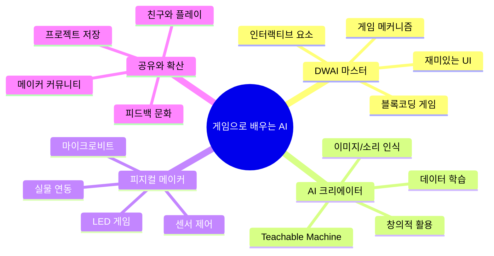

### 🎓 세부 목표

1. **DWAI 게임 제작**: 블록코딩으로 재미있는 게임 만들기
2. **AI 데이터 학습**: Teachable Machine으로 나만의 AI 모델 훈련
3. **피지컬 컴퓨팅**: 마이크로비트로 실제 세계와 게임 연결
4. **2인 1조 협업**: 짝과 함께 게임 완성하고 공유
5. **소셜 게임**: 카카오톡으로 게임 공유하고 친구들과 플레이
6. **포트폴리오**: 12개 게임 완성 및 전시

---

## 👥 3. 2인 1조 짝 프로그래밍 전략

### 🤝 페어링 원칙

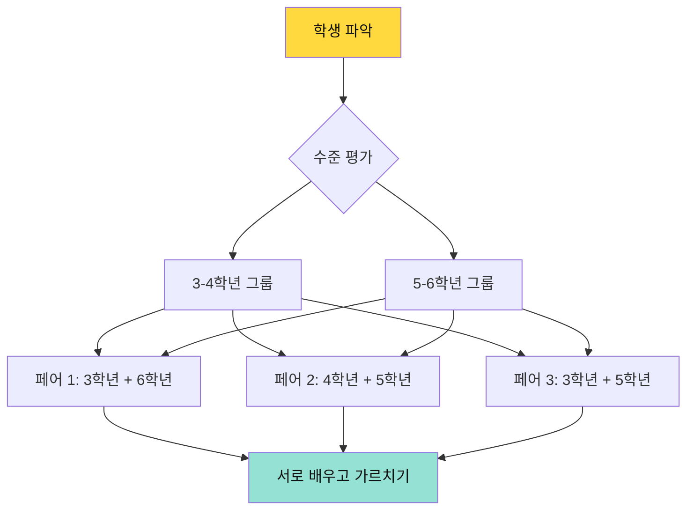

### 🎯 페어 구성 가이드

| 조합 | 장점 | 역할 분담 | 주의사항 |
|------|------|----------|----------|
| **3학년 + 6학년** | 가장 큰 학습 격차 활용 | 6학년: 주도적 제작<br>3학년: 아이디어 제공 | 6학년이 독점하지 않도록 |
| **4학년 + 5학년** | 비슷한 수준으로 협업 | 역할 자주 교대<br>평등한 협업 | 경쟁 구도 방지 |
| **3학년 + 5학년** | 적절한 도움 가능 | 5학년: 친근한 멘토<br>3학년: 따라하며 배우기 | 둘 다 도전적 과제 |

### 🔄 역할 교대 시스템

**드라이버(Driver)**: 실제로 마우스/키보드 조작  
**네비게이터(Navigator)**: 아이디어 제시, 방향 안내

```mermaid
gantt
    title 40분 수업 내 역할 교대
    dateFormat mm
    section 1차시
    저학년 드라이버      :01, 20m
    고학년 드라이버      :21, 20m
    
    section 2차시
    고학년 드라이버      :01, 20m
    저학년 드라이버      :21, 20m
```

**교대 규칙**
- ⏰ **20분마다 역할 교대** (타이머 사용)
- 🎮 저학년이 먼저 드라이버 (자신감 향상)
- 💡 네비게이터는 옆에서 응원하고 아이디어 제공
- 🤝 막히면 언제든 역할 바꿔도 OK

---

## 📅 4. 전체 커리큘럼 구조 (3단계)


| 단계 | 주차 | 주요 게임/활동 | 핵심 목표 |
|------|------|-------------------|------------------------------------------------|
| 1단계: DWAI 게임 | 1주 | 🍔 햄버거 먹방 게임 | DWAI 인터페이스 익히기, 클릭 이벤트 실습 |
|                 | 2주 | 🎯 타겟 슈팅 게임 | 마우스 입력, 변수/점수 기본 |
|                 | 3주 | 🏃 달리기 챔피언 | 키보드 제어, 충돌 처리 |
|                 | 4주 | 🎮 미니 게임 메들리 | 게임 조합, 공유 기능 경험 |
| 2단계: AI(Teachable Machine) | 5주 | 😷 마스크 안전 지킴이 | 컴퓨터 비전 기초, 얼굴 인식 |
|                               | 6주 | ♻️ 쓰레기 분류왕 | 이미지 분류, 환경 교육 |
|                               | 7주 | 🐦 손동작 Flappy Bird  | 손 인식 |
|                               | 8주 | 🎵 포즈 음악 메이커 | 전신 포즈 인식, 창의적 표현 |
| 3단계: 마이크로비트 | 9주 | 💡 LED 버튼 게임 | 하드웨어 기초, 버튼 입력 실습 |
|                    | 10주 | 🍎 과일 피하기 게임 | 가속도 센서, 인터페이스 제어 |
|                    | 11주 | 🎮 기울기 미로 게임 | 센서 응용, 실시간 반응 |
|                    | 12주 | 🎉 피지컬 게임 페어 | 센서 + 인터페이스 융합 |

### 🎮 1단계: DWAI 블록코딩 게임 (1-4주)

> **메이커 수업 방식**: 완성 게임 플레이(5분) → 템플릿 탐색(10분) → 수정하며 만들기(55분) → 테스트 & 공유(10분)

**메이커 프로세스**
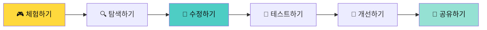

**템플릿 구조**
- 🔒 **안전 영역**: 핵심 게임 로직 (건드리지 않아도 OK)
- 🎨 **수정 영역**: 시각 디자인, 게임 규칙 (자유롭게 수정!)
- 🚀 **도전 영역**: 새로운 기능 추가 (선택사항)

#### 📘 1주차: 🍔 햄버거 먹방 게임

**게임 컨셉**: 떨어지는 햄버거를 클릭해서 먹는 게임!

**게임 화면 예시**
```
┌─────────────────────────────────┐
│   🍔 햄버거 먹방 챌린지!         │
│                                 │
│     🍔        🍟       🍕       │
│         🍗                      │
│               🌭                │
│                                 │
│   👤 먹은 개수: 15개            │
│   ⏰ 남은 시간: 30초            │
│   🏆 목표: 20개                 │
└─────────────────────────────────┘
```

**📦 템플릿 구조**

```python
# 🔒 안전 영역 (건드리지 않아도 작동함)
게임_시작()
충돌_감지_시스템()
타이머_관리()

# 🎨 수정 영역 (여기를 바꿔보세요!)
음식_종류 = ["🍔", "🍟", "🍕"]  # ← 좋아하는 음식으로 바꾸기
떨어지는_속도 = 3  # 1(느림) ~ 10(빠름)
배경_색깔 = "하늘색"
목표_점수 = 20

# 🚀 도전 영역 (선택! 추가 기능)
특수_아이템 = "⭐"  # 별 먹으면 +10점
폭탄 = "💣"  # 폭탄 먹으면 -5점
```

**🎯 메이커 프로세스 (80분)**

| 시간 | 활동 | 교사 | 2인 1조 활동 |
|------|------|------|-------------|
| **5분** | 🎮 **완성 게임 플레이** | 시연 | 함께 플레이하며 관찰 |
| **10분** | 🔍 **템플릿 탐색** | 파일 열기 안내 | 코드 구조 파악, "여기 바꾸면?" |
| **20분** | 🎨 **수정 1단계** | 순회 도움 | 저학년 드라이버: 음식 바꾸기 |
| **20분** | 🎨 **수정 2단계** | ⏰ 역할 교대 | 고학년 드라이버: 속도/점수 조절 |
| **15분** | 🧪 **테스트 & 개선** | 격려 | 짝과 플레이, 밸런스 조정 |
| **10분** | 💬 **공유 & 발표** | 우수 사례 | 프로젝트 발표 및 공유 |

**2인 1조 수정 예시**

| 난이도 | 저학년 (3-4학년) | 고학년 (5-6학년) |
|--------|----------------|----------------|
| **⭐ 초급** | ✅ 음식 이모지 바꾸기<br>✅ 배경 색 바꾸기<br>✅ 목표 점수 조절 | ✅ 떨어지는 속도 조절<br>✅ 제한 시간 변경<br>✅ 효과음 추가 |
| **⭐⭐ 중급** | ✅ 초급 + <br>✅ 새로운 음식 추가<br>✅ 배경 이미지 업로드 | ✅ 초급 + <br>✅ 점수별 다른 음식<br>✅ 레벨 시스템 |
| **⭐⭐⭐ 고급** | ✅ 중급 + <br>✅ 특수 아이템 디자인<br>✅ 스토리 추가 | ✅ 중급 + <br>✅ 폭탄 피하기<br>✅ 콤보 시스템 |

**학습 목표**
- ✅ DWAI 인터페이스 이해
- ✅ 템플릿 탐색 및 분석
- ✅ 변수 수정하며 실험
- ✅ 게임 밸런스 조정
- ✅ 짝 프로그래밍 협업

**💬 작품 공유 방법**
```
방법 1: 프로젝트 저장 및 공유
1. 게임 완성 → "저장하기" 버튼 클릭
2. 프로젝트 파일(.dwai) 저장
3. USB나 클라우드로 파일 공유
4. 친구 컴퓨터에서 파일 열어서 플레이

방법 2: 화면 녹화/스크린샷
1. 게임 플레이 화면 녹화
2. 유튜브나 학급 게시판에 업로드
3. 링크 공유 또는 QR 코드 생성
4. 댓글로 피드백 남기기

방법 3: 발표 및 시연
1. 수업 시간에 직접 시연
2. 프로젝터로 화면 공유
3. 친구들이 돌아가며 플레이
4. 즉석 피드백 및 개선
```

**📊 개발 프로세스 학습**
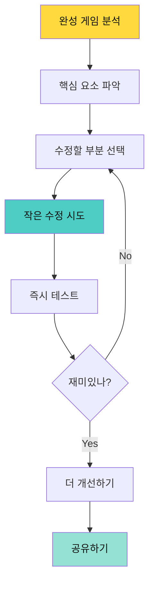

---

#### 📘 2주차: 🎯 타겟 슈팅 게임

**게임 컨셉**: 움직이는 과녁을 마우스로 클릭해서 맞추는 게임!

**게임 화면 예시**
```
┌─────────────────────────────────┐
│   🎯 타겟 슈팅 챌린지!           │
│                                 │
│   ●  (과녁이 이리저리 움직임)    │
│        ●                        │
│             ●                   │
│                                 │
│   🎯 명중: 8/10                 │
│   💯 점수: 850점                │
│   ⏰ 남은 시간: 25초            │
└─────────────────────────────────┘
```

**📦 템플릿 구조**

```python
# 🔒 안전 영역 (게임 엔진)
마우스_추적()
충돌_감지()
점수_계산()

# 🎨 수정 영역 (여기를 바꿔보세요!)
과녁_모양 = "🎯"  # ← 풍선, 별, 괴물로 바꾸기
과녁_크기 = [큰과녁, 중간과녁, 작은과녁]
과녁_속도 = 5  # 1(느림) ~ 10(빠름)
과녁_개수 = 3  # 동시에 나타나는 과녁 수

# 점수 규칙
큰과녁_점수 = 10
중간과녁_점수 = 50
작은과녁_점수 = 100

# 🚀 도전 영역 (선택!)
움직임_패턴 = "랜덤"  # 지그재그, 원형, 랜덤
특수_과녁 = "💎"  # 다이아몬드 = 보너스
```

**🎯 메이커 프로세스**

| 단계 | 활동 | 2인 1조 협업 |
|------|------|-------------|
| **🎮 체험** | 완성 게임 플레이 | "와! 이거 어떻게 만들었지?" |
| **🔍 탐색** | 템플릿 열어보기 | 저학년: "이 숫자는 뭐야?"<br>고학년: "속도 조절하는 부분이네!" |
| **🎨 수정** | 변수 바꾸기 | 저학년: 과녁 모양 변경<br>고학년: 점수 시스템 조정 |
| **🧪 테스트** | 플레이해보기 | "너무 빠르다!", "점수가 안 맞아!" |
| **🔄 개선** | 밸런스 조정 | 함께 토론하며 수정 |
| **💬 공유** | 카카오톡 전송 | "친구들, 내 최고 기록 깨봐!" |

**2인 1조 수정 가이드**

| 난이도 | 수정 요소 | 학습 개념 |
|--------|----------|----------|
| **⭐ 초급** | - 과녁 모양 바꾸기 (🎈🌟👾)<br>- 배경 색 변경<br>- 제한 시간 조절 | 변수 이해<br>스프라이트 |
| **⭐⭐ 중급** | - 과녁 크기별 점수 조정<br>- 움직이는 속도 변경<br>- 효과음 추가 | 조건문<br>배열 |
| **⭐⭐⭐ 고급** | - 움직임 패턴 변경<br>- 특수 과녁 추가<br>- 콤보 시스템 | 반복문<br>복잡한 로직 |

**💬 작품 공유 & 대결**
```
[교실 리더보드]
화이트보드에 점수 기록:
1위: 민수 - 2000점 👑
2위: 지은 - 1800점
3위: 준호 - 1500점

[영상 공유]
- 게임 플레이 영상 촬영
- 학급 유튜브/패들릿에 업로드
- QR 코드로 빠른 공유

[직접 대결]
- 2명씩 돌아가며 플레이
- 최고 점수 경쟁
- 실시간 응원 및 피드백
```

**개발 프로세스 이해**
```
문제 발견: "과녁이 너무 빨라서 못 맞춰!"
↓
해결 방법: 속도 변수 찾기
↓
실험: 속도 = 10 → 5로 변경
↓
테스트: 다시 플레이
↓
개선: "이제 딱 좋다!"
↓
공유: 친구들과 대결
```

---

#### 📘 3주차: 🏃 달리기 챔피언

**게임 컨셉**: 키보드로 캐릭터를 조작해서 장애물을 피하는 러닝 게임!

**게임 화면 예시**
```
┌─────────────────────────────────┐
│   🏃 달리기 챔피언!              │
│                                 │
│               🪨  🌳            │
│   🏃‍♂️                          │
│   ━━━━━━━━━━━━━━━━━━━━━        │
│                                 │
│   💯 점수: 450점                │
│   ❤️ 생명: ♥♥♥                │
│   ⚡ 속도: FAST                 │
└─────────────────────────────────┘
```

**📦 템플릿 구조**

```python
# 🔒 안전 영역 (게임 엔진)
키보드_입력_처리()
충돌_감지_시스템()
자동_스크롤()

# 🎨 수정 영역 (여기를 바꿔보세요!)
캐릭터 = "🏃‍♂️"  # ← 다른 캐릭터로 변경
장애물_목록 = ["🪨", "🌳", "🚧"]
배경_속도 = 5  # 1(천천히) ~ 10(빠르게)
생명 = 3

# 장애물 출현 빈도
쉬움 = 30%
보통 = 50%
어려움 = 70%

# 🚀 도전 영역 (선택!)
파워업 = "⚡"  # 무적 상태
코인 = "💰"  # 점수 보너스
```

**🎯 메이커 프로세스 (80분)**

| 시간 | 활동 | 짝 프로그래밍 |
|------|------|-------------|
| **5분** | 🎮 체험 | "우와! 장애물 피하기 재밌다!" |
| **10분** | 🔍 탐색 | 템플릿에서 수정 가능 영역 찾기 |
| **20분** | 🎨 수정 1 | 저학년: 캐릭터, 장애물 디자인 |
| **20분** | 🎨 수정 2 | 고학년: 속도, 난이도 조절 |
| **15분** | 🧪 테스트 | 짝과 번갈아 플레이, 밸런스 확인 |
| **10분** | 💬 공유 | 최고 기록 경쟁, 작품 발표 |

**2인 1조 수정 예시**

| 난이도 | 3-4학년 (드라이버) | 5-6학년 (네비게이터) |
|--------|-------------------|---------------------|
| **⭐ 초급** | ✅ 캐릭터 바꾸기 (🐱🐶🦁)<br>✅ 장애물 바꾸기<br>✅ 배경 색상 | ✅ 속도 조절<br>✅ 생명 개수<br>✅ 충돌 판정 크기 |
| **⭐⭐ 중급** | ✅ 초급 + <br>✅ 점프 높이 조절<br>✅ 효과음 추가 | ✅ 초급 + <br>✅ 난이도 증가 시스템<br>✅ 점수 계산 방식 |
| **⭐⭐⭐ 고급** | ✅ 중급 + <br>✅ 특수 아이템 디자인<br>✅ 스테이지 디자인 | ✅ 중급 + <br>✅ 2단 점프 구현<br>✅ 보스 장애물 |

**개발 프로세스 학습**
```
🎯 문제 정의
"달리기 게임을 더 재미있게 만들려면?"

💡 아이디어
- 더 다양한 장애물
- 특수 아이템 추가
- 난이도 점진적 증가

🛠️ 구현
1. 장애물 목록에 새로운 것 추가
2. 파워업 아이템 코드 활성화
3. 속도 증가 로직 수정

🧪 테스트
- 짝과 번갈아 플레이
- "이 부분 너무 어려워!"
- "여기 재미있네!"

🔄 개선
- 피드백 반영해서 수정
- 밸런스 조정

💬 공유
- 카카오톡으로 친구들에게
- 최고 기록 대결!
```

**💬 작품 공유 방법**
```
[직접 시연]
"🏃 달리기 챔피언 - 내가 만든 게임!

최고 기록: 850점 🏆
평균 생존 시간: 45초

너도 도전해봐!"

→ 친구 컴퓨터에 프로젝트 파일 전달
→ 또는 USB로 공유
→ 화면 녹화하여 영상 공유

[친구 피드백]
민수: "헐 500점 넘기기 어렵네 ㅋㅋ"
지은: "파워업 아이템 좋은데? 나도 추가할래!"
→ 피드백 받아서 개선하기!

[전시 및 체험]
- 메이커 페어에서 부스 운영
- 친구들이 직접 플레이
- 즉석 피드백 수집
```

---

#### 📘 4주차: 🎮 미니 게임 메들리

**게임 컨셉**: 3개의 미니 게임을 모아놓은 게임 센터! 친구들과 점수 경쟁!

**게임 화면 예시**
```
┌─────────────────────────────────┐
│   🎮 미니 게임 센터              │
│                                 │
│   [🍔 햄버거]  [🎯 슈팅]        │
│                                 │
│   [🏃 달리기]  [❓ 랜덤]        │
│                                 │
│   총 플레이: 15회               │
│   최고 기록: 1200점             │
│                                 │
│   💬 카카오톡으로 친구 초대!     │
└─────────────────────────────────┘
```

**📦 템플릿 구조**

```python
# 🔒 안전 영역 (게임 센터 시스템)
게임_메뉴_시스템()
점수_저장_불러오기()
카카오톡_연동()

# 🎨 수정 영역 (여기를 바꿔보세요!)
게임_목록 = ["햄버거", "슈팅", "달리기"]
게임_센터_테마 = "오락실"  # 학교, 우주 등
BGM = "신나는음악.mp3"

# 각 게임별 설정
햄버거_게임 = {
    음식: ["🍔", "🍕", "🍗"],
    난이도: "보통"
}

슈팅_게임 = {
    과녁: "🎯",
    속도: 5
}

달리기_게임 = {
    캐릭터: "🏃",
    장애물: ["🪨", "🌳"]
}

# 🚀 도전 영역 (선택!)
새로운_게임_추가 = True
랭킹_시스템 = True
친구_초대_보너스 = 100점
```

**🎯 메이커 프로세스 (특별!)**

이번 주는 **리믹스 주간**! 지난 3주간 만든 게임을 합쳐서 게임 센터 제작!

| 단계 | 활동 | 2인 1조 |
|------|------|---------|
| **🔍 분석** | 지난 3주 게임 복습 | "어떤 게임이 가장 재미있었어?" |
| **🎨 리믹스** | 게임 3개 선택 | 저학년: 테마 디자인<br>고학년: 메뉴 시스템 |
| **🔗 통합** | 게임 센터 구성 | 함께 게임 배치, UI 설계 |
| **💬 소셜** | 카카오톡 연동 | 친구 초대 기능 테스트 |
| **🏆 대회** | 반 전체 대결 | 최고 점수 경쟁! |

**작품 공유 및 전시 시스템**

```
┌─────────────────────────────────┐
│   🎮 우리 반 게임 센터           │
│                                 │
│   [게임 부스 운영]               │
│   → 각자 컴퓨터에 게임 설치      │
│   → 친구들이 돌아가며 플레이     │
│                                 │
│   [리더보드 (화이트보드)]        │
│   1위: 민수 - 2500점 👑         │
│   2위: 지은 - 2200점            │
│   3위: 준호 - 2000점            │
│   ...                           │
│   12위: 나 - 1800점             │
│                                 │
│   [피드백 포스트잇]              │
│   민수: "슈팅 게임 개꿀잼 ㅋㅋ"   │
│   지은: "내 기록 깨봐!"          │
│                                 │
│   [게임 파일 공유]               │
│   USB로 게임 파일 교환           │
│   친구 게임 → 내 컴퓨터에 복사   │
└─────────────────────────────────┘
```

**교실 내 공유 방법**

1. **게임 부스 운영**
   ```
   "우리 반 3학년 2반 게임 센터"
   → 각자 컴퓨터에 게임 설치
   → 친구들 초대하여 플레이
   ```

2. **실시간 랭킹 보드**
   ```
   화이트보드에 점수 기록
   → 수동 업데이트
   "민수님이 1위를 차지했습니다! 👑"
   → 실시간 응원
   ```

3. **게임 파일 교환**
   ```
   내가 만든 게임 → USB 저장
   → 친구들에게 파일 전달
   → "지은이의 햄버거 게임 플레이 가능!"
   ```

4. **대면 피드백**
   ```
   직접 대화로 피드백
   → "이거 어떻게 만들었어?"
   → "속도 좀 줄여줘!"
   → 즉시 수정 & 개선
   ```

**2인 1조 활동**

| 난이도 | 활동 |
|--------|------|
| **⭐ 초급** | - 게임 3개 선택<br>- 테마 디자인<br>- 간단한 메뉴 |
| **⭐⭐ 중급** | - 초급 + <br>- 점수 저장<br>- 랭킹 시스템<br>- 게임 파일 공유 |
| **⭐⭐⭐ 고급** | - 중급 + <br>- 멀티 플레이<br>- 실시간 리더보드<br>- 다양한 게임 모드 |

**학습 목표**
- ✅ 여러 게임 통합 (모듈화)
- ✅ 메뉴 시스템 설계
- ✅ 데이터 저장/불러오기
- ✅ 소셜 기능 구현
- ✅ 친구들과 협업 & 경쟁

**💬 작품 공유 예시**
```
[구두 초대]
"🎮 우리 반 게임 센터 오픈!

3가지 게임 즐기고
최고 점수 경쟁하자!

내 컴퓨터로 와서 플레이해봐!
또는 USB에 담아줄게!"

현재 12명 플레이 완료
1위: 민수 (2500점)

[게임 파일 공유]
"내가 만든 햄버거 게임!
USB에 파일 담았어.
네 컴퓨터에서 열어봐!"
```

**개발 프로세스 총정리 (1-4주)**
```
1주: 체험 → 수정 → 테스트
     (햄버거 게임)

2주: 탐색 → 실험 → 개선
     (슈팅 게임)

3주: 분석 → 창작 → 공유
     (달리기 게임)

4주: 통합 → 협업 → 확산
     (게임 센터 + 소셜)

→ 완전한 게임 개발 사이클 경험!
```

| 역할 | 업무 | 난이도별 과제 |
|------|------|-------------|
| **기획자** | 감정 시나리오, 스토리 | 초급: 3가지 감정<br>고급: 8가지 + 복합 감정 |
| **개발자** | Face + Voice AI 통합 | 초급: 개별 인식<br>고급: 복합 분석 |
| **디자이너** | NPC 표정, 감정 이모티콘 | 초급: 기본 표정<br>고급: 미세 표현 |
| **테스터** | 감정 인식 정확도 | 초급: 명확한 표정<br>고급: 미묘한 차이 |

**AI 기술**: Face API + Sentiment Analysis
**학습 목표**: 감정 AI 원리, 멀티모달 인식

---

#### 📘 4주차: 🎮 멀티센서 RPG

**게임**: 음성 + 얼굴 + 손동작을 모두 활용하는 롤플레잉 게임

| 역할 | 업무 | 난이도별 과제 |
|------|------|-------------|
| **기획자** | 게임 시스템, 퀘스트 | 초급: 선형 스토리<br>고급: 분기형 스토리 |
| **개발자** | 멀티 AI 통합 시스템 | 초급: 순차 입력<br>고급: 동시 입력 처리 |
| **디자이너** | 게임 세계관, 캐릭터 | 초급: 2D 맵<br>고급: 3D 환경 |
| **테스터** | 시스템 통합 테스트 | 초급: 기능별 테스트<br>고급: 스트레스 테스트 |

**AI 기술**: Speech + Face + Hand AI 통합
**학습 목표**: 복잡한 시스템 설계, AI 통합

---

---

## 🌐 DWAI 플랫폼 공유 기능 안내

### 💡 현실적인 공유 방법

DWAI 블록코딩 플랫폼에서 만든 게임은 다음과 같은 방법으로 공유할 수 있습니다:

**1. 프로젝트 저장 및 내보내기**
```
- DWAI에서 "프로젝트 저장" 기능 사용
- .dwai 또는 .sb3 파일로 내보내기
- USB 메모리나 클라우드(구글 드라이브)에 저장
- 친구 컴퓨터에서 "불러오기"로 실행
```

**2. 화면 녹화 및 영상 공유**
```
- Windows: Xbox Game Bar (Win + G)
- Mac: QuickTime Player 화면 녹화
- 게임 플레이 영상 촬영
- 유튜브, 학급 게시판 업로드
- QR 코드로 빠른 접근
```

**3. 교실 내 직접 공유**
```
- 프로젝터로 화면 시연
- 친구들이 돌아가며 플레이
- 즉석 피드백 및 개선
- 메이커 페어 부스 운영
```

**4. 온라인 플랫폼 활용 (선택)**
```
- Scratch Community 업로드 (Scratch 호환 시)
- 학교 LMS나 학급 홈페이지 게시
- 패들릿, 구글 사이트 등에 임베드
```

### ⚠️ 유의사항

- **직접 링크 공유**: DWAI는 현재 원클릭 링크 생성 기능이 제한적일 수 있습니다
- **파일 기반 공유**: 프로젝트 파일을 직접 전달하는 방식이 가장 확실합니다
- **교사 확인 필요**: 사용 중인 DWAI 버전의 공유 기능을 미리 테스트하세요

---

### 🤖 2단계: Teachable Machine AI 게임 (5-8주)

> **메이커 수업 방식**: AI 체험(5분) → 데이터 학습(15분) → 템플릿 수정(50분) → 공유(10분)

**Teachable Machine이란?**
```
구글이 만든 초간단 AI 학습 도구!
코딩 없이도 나만의 AI 모델을 만들 수 있어요.

1. 웹캠으로 사진/동작/소리 녹음
2. AI가 자동으로 학습
3. 게임에 연결!
```

**메이커 프로세스 (AI 특화)**
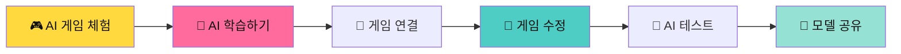

**템플릿 구조 (AI 게임)**
- 🔒 **AI 엔진**: Teachable Machine 연결 (자동)
- 🤖 **학습 영역**: 내 데이터로 AI 훈련 (핵심!)
- 🎨 **게임 영역**: 시각 디자인, 규칙 (자유 수정)
- 💬 **공유 영역**: AI 모델 내보내기, 카카오톡 공유

#### 📘 5주차: 😷 마스크 안전 지킴이 (코로나 시대 배경)

**게임 컨셉**: AI가 마스크 착용 여부를 감지! 학교 안전 지킴이 게임!

**게임 화면 예시**
```
┌─────────────────────────────────┐
│   😷 마스크 안전 지킴이!         │
│                                 │
│   [웹캠 화면]                   │
│   AI 분석 중...                 │
│                                 │
│   ✅ 마스크 착용 확인! (95%)    │
│   → 교실 입장 허가! 🚪          │
│                                 │
│   🏫 오늘 체크: 15명/20명       │
│   🏆 연속 착용: 5일차           │
│   ⭐ 안전 점수: 950점           │
└─────────────────────────────────┘
```

**교육적 의미 (코로나 시대)**
```
코로나19 팬데믹 경험을 교육으로!
→ AI 기술로 방역 이해
→ 마스크의 중요성 체험
→ 실생활 문제 해결
```

**🤖 Teachable Machine 학습 과정**

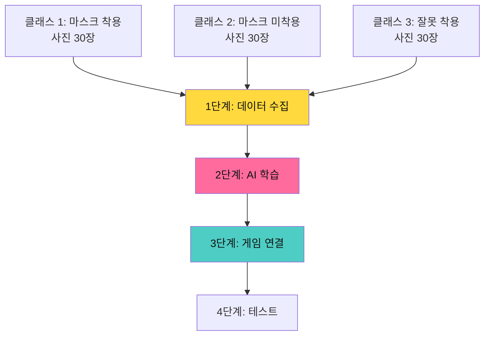

**📦 템플릿 구조**

```python
# 🔒 AI 엔진 (자동 연결)
Teachable_Machine_연결()
웹캠_실행()
얼굴_인식_시스템()

# 🤖 AI 학습 영역 (Teachable Machine 웹사이트)
클래스1 = "마스크 착용"  # 30장 사진 (제대로 착용)
클래스2 = "마스크 미착용"  # 30장 사진 (얼굴 그대로)
클래스3 = "잘못 착용"  # 30장 사진 (코 나온 상태 등)

→ AI 모델 다운로드: mask_detector.json
→ 게임에 업로드!

# 🎨 게임 수정 영역
체크_대상 = "우리 반 학생"
입장_허가_조건 = "마스크 착용"
경고_메시지 = "마스크를 써주세요!"

# 점수 시스템
마스크_착용 = +10점
미착용 = -5점
잘못_착용 = 경고 메시지

# 🚀 도전 영역
연속_착용_보너스 = True
일일_체크_리스트 = True
안전_등급_시스템 = "초록(안전), 노랑(주의), 빨강(위험)"
```

**🎯 메이커 프로세스 (80분)**

| 시간 | 활동 | 2인 1조 협업 |
|------|------|-------------|
| **5분** | 🎮 **AI 게임 체험** | 완성된 게임 플레이, "AI가 인식한다!" |
| **15분** | 🤖 **AI 학습** | 📸 저학년: 포즈 모델<br>💻 고학년: 사진 촬영 30장 |
| **10분** | 🔗 **모델 연결** | AI 모델 다운로드 → 게임 업로드 |
| **30분** | 🎨 **게임 수정** | 템플릿 수정: 포즈, 점수, 난이도 |
| **10분** | 🧪 **AI 테스트** | 다양한 각도, 조명에서 테스트 |
| **10분** | 💬 **모델 공유** | AI 모델 + 게임 파일 공유 |

**🤖 Teachable Machine 학습 가이드**

**1단계: 프로젝트 생성**
```
Teachable Machine 웹사이트 접속
→ "새 프로젝트" → "이미지 프로젝트"
→ 프로젝트명: "마스크 감지기"
```

**2단계: 데이터 수집 (2인 1조)**
```
클래스 1: 마스크 제대로 착용
├─ 저학년: 마스크 착용 모델
└─ 고학년: 웹캠으로 30장 촬영
   (정면, 측면, 고개 돌린 상태 등)

클래스 2: 마스크 미착용
├─ 역할 교대!
└─ 저학년: 촬영 / 고학년: 얼굴 그대로
   (다양한 표정, 각도)

클래스 3: 잘못 착용
├─ 함께 연구
└─ 코 나온 상태, 턱에 걸친 상태 등
   (실제 잘못된 사례들)
```

**3단계: AI 학습**
```
"모델 학습" 버튼 클릭
→ AI가 3가지 상태 학습 (30초)
→ "완료!" 메시지
→ "이제 마스크를 감지할 수 있어요!"
```

**4단계: 테스트**
```
미리보기에서 실험
→ 마스크 쓰기: "마스크 착용 95%"
→ 마스크 벗기: "미착용 92%"
→ 코만 내기: "잘못 착용 88%"
```

**5단계: 내보내기**
```
"모델 내보내기" → "다운로드"
→ mask_detector.json
→ 게임 템플릿에 업로드!
→ "우리 반 마스크 지킴이 완성!"
```

**2인 1조 수정 예시**

| 난이도 | 저학년 역할 | 고학년 역할 |
|--------|------------|------------|
| **⭐ 초급** | ✅ 마스크 모델 (3가지)<br>✅ 경고 메시지 디자인<br>✅ 효과음 선택 | ✅ 데이터 30장 촬영<br>✅ AI 학습 실행<br>✅ 정확도 확인 |
| **⭐⭐ 중급** | ✅ 초급 + <br>✅ 다양한 마스크 종류<br>✅ UI 디자인 개선 | ✅ 초급 + <br>✅ 체크리스트 시스템<br>✅ 일일 통계 기능 |
| **⭐⭐⭐ 고급** | ✅ 중급 + <br>✅ 스토리 모드 추가<br>✅ 캐릭터 디자인 | ✅ 중급 + <br>✅ 여러 사람 동시 감지<br>✅ 안전 등급 시스템 |

**학습 목표**
- ✅ AI 이미지 분류 원리 이해
- ✅ Teachable Machine 활용
- ✅ 실생활 문제 해결 (코로나 방역)
- ✅ 컴퓨터 비전 기초 체험
- ✅ 데이터 품질의 중요성

**💬 작품 공유 방법**
```
[직접 시연]
"😷 우리 반 마스크 지킴이!

AI가 마스크 착용 감지!
정확도: 95% ✨

와서 체험해봐!"

[AI 모델 파일 공유]
"mask_detector.json 파일 USB 저장
→ 다른 반/학교에 전달
→ '우리도 안전 지킴이 만들자!'"

[화면 녹화 영상]
- 게임 작동 영상 촬영
- 유튜브나 학급 게시판 업로드
- QR 코드로 공유
```

**교육적 의미 & 개발 프로세스**
```
🎓 교육 목표
"코로나 시대의 마스크, AI로 이해하기"
→ 방역의 중요성
→ AI 기술로 안전 지키기

📸 데이터 수집
"마스크 착용한 얼굴 30장"
"미착용 얼굴 30장"
"잘못 착용한 상태 30장"

🤖 AI 학습
"컴퓨터가 3가지 상태를 학습"
→ 얼굴 특징 인식
→ 마스크 유무 판단

🧪 테스트
"마스크 쓰고 벗으며 테스트"
→ 정확도 확인
→ 다양한 마스크로 실험

✅ 완성
"우리 반 안전 지킴이 AI 완성!
학교에서 실제로 사용 가능!"
```

#### 📘 6주차: 🎤 소리 인식 게임

**게임 컨셉**: 카메라에 쓰레기를 보여주면 AI가 분류! 올바른 분리수거로 지구를 지키자!

**게임 화면**
```
┌─────────────────────────────────┐
│   ♻️ 쓰레기 분류왕!              │
│                                 │
│   [웹캠에 쓰레기 보여주기]       │
│   AI 분석 중...                 │
│                                 │
│   ✅ 플라스틱 인식! (93%)       │
│   → 🔵 플라스틱 통에 버리기     │
│                                 │
│   올바른 분류! +10점 ✨         │
│                                 │
│   📊 오늘의 분류:               │
│   ♻️ 플라스틱: 5개              │
│   📃 종이: 3개                  │
│   🗑️ 일반: 2개                  │
│   💯 정확도: 90%                │
└─────────────────────────────────┘
```

**🤖 Teachable Machine (이미지 분류)**

```
Teachable Machine → "이미지 프로젝트"

클래스 1: 플라스틱 쓰레기 ♻️
- 페트병, 플라스틱 용기 등 30장

클래스 2: 종이 쓰레기 📃
- 종이컵, 박스, 신문 등 30장

클래스 3: 캔/금속 쓰레기 🔷
- 음료수 캔, 금속 뚜껑 등 30장

클래스 4: 일반 쓰레기 🗑️
- 비닐, 음식물 등 30장

→ AI 학습 → 게임 연결!
```

**📦 템플릿 구조**
```python
# 🔒 AI 엔진
Teachable_Machine_Image()
웹캠_실행()
쓰레기_인식_시스템()

# 🤖 AI 학습 (Teachable Machine)
클래스1 = "플라스틱"  # 30장
클래스2 = "종이"  # 30장
클래스3 = "캔/금속"  # 30장
클래스4 = "일반 쓰레기"  # 30장

# 🎨 게임 수정
분리수거_통 = ["플라스틱", "종이", "캔", "일반"]
정답_점수 = 10점
오답_페널티 = -3점
제한_시간 = 60초

# 점수 계산
올바른_분류 = +10
잘못된_분류 = -5
빠른_분류 보너스 = +5 (3초 이내)

# 🚀 도전 영역
혼합_쓰레기 = True  # 여러 개 동시 인식
환경_퀴즈 = True  # 분리수거 팁 제공
레벨_시스템 = "쉬움(4종) → 어려움(7종)"
```

**2인 1조 AI 학습**
| 단계 | 저학년 | 고학년 |
|------|--------|--------|
| **수집** | 쓰레기 준비 (실물/사진) | 웹캠으로 30장 촬영 |
| **학습** | 다양한 각도로 보여주기 | AI 학습 실행 |
| **테스트** | 새로운 쓰레기로 테스트 | 정확도 확인 |

---

#### 📘 7주차: 🐦 손동작 Flappy Bird

**게임 컨셉**: 손의 높이로 새를 조종! 좌우 움직임으로 방향 전환!

**게임 화면**
```
┌─────────────────────────────────┐
│   🐦 손동작 Flappy Bird!        │
│                                 │
│              ║                  │
│     🐦      ║                  │
│              ║                  │
│                                 │
│   [웹캠 - 손 인식]              │
│   손 높이: ↑↑ (85%)            │
│   손 위치: ← 왼쪽               │
│                                 │
│   💯 점수: 12점                 │
│   🏆 최고: 25점                 │
└─────────────────────────────────┘
```

**손동작 조작 방식**
```
손 높이 (Y축):
손 위 → 새 올라감 ↑
손 가운데 → 새 수평 →
손 아래 → 새 내려감 ↓

손 위치 (X축):
손 왼쪽 → 새 왼쪽으로
손 오른쪽 → 새 오른쪽으로
손 가운데 → 직진

→ 마우스 없이 손으로 플레이!
```

**🤖 Teachable Machine (손 인식)**

```
Teachable Machine → "이미지 프로젝트"

방법 1: 손 높이 인식
클래스 1: 손 위 (상단)
클래스 2: 손 가운데 (중단)
클래스 3: 손 아래 (하단)

방법 2: 손 위치 인식  
클래스 1: 손 왼쪽
클래스 2: 손 가운데
클래스 3: 손 오른쪽

→ 2개 모델 학습 or 1개로 통합!
```

**📦 템플릿 구조**

```python
# 🔒 AI 엔진
Hand_Tracking_AI()
손_위치_인식()
좌표_추출()

# 🤖 AI 학습
손_높이_모델 = "hand_height.json"
손_위치_모델 = "hand_position.json"

# 🎨 게임 수정
새_종류 = "🐦"  # 새, 비행기, 로켓
장애물 = "파이프", "구름", "산"
난이도 = "보통"

# 손 민감도
높이_민감도 = 0.8  # 0~1
좌우_민감도 = 0.7

# 🚀 도전 영역
무한_모드 = True
스코어_보드 = True
2인_대결 = True  # 양손 사용
```

**🎯 메이커 프로세스 (80분)**

| 시간 | 활동 | 2인 1조 협업 |
|------|------|-------------|
| **5분** | 🎮 **완성 게임 체험** | "우와! 손으로 조종해!" |
| **15분** | 🤖 **AI 학습** | 저학년: 손 모델<br>고학년: Teachable Machine 촬영 |
| **10분** | 🔗 **모델 연결** | AI 모델 → 게임 템플릿 연결 |
| **30분** | 🎨 **게임 수정** | 새 디자인, 장애물 변경, 난이도 조절 |
| **10분** | 🧪 **테스트** | 다양한 손 높이로 테스트 |
| **10분** | 💬 **발표 & 피드백** | 우수 작품 시연 |

**2인 1조 수정 예시**

| 난이도 | 저학년 역할 | 고학년 역할 |
|--------|------------|------------|
| **⭐ 초급** | ✅ 손 모델 (3가지 높이)<br>✅ 새 디자인<br>✅ 배경 색상 | ✅ AI 학습 30장<br>✅ 장애물 속도<br>✅ 난이도 조절 |
| **⭐⭐ 중급** | ✅ 초급 + <br>✅ 다양한 새 종류<br>✅ 효과음 선택 | ✅ 초급 + <br>✅ 손 민감도 조절<br>✅ 스코어 시스템 |
| **⭐⭐⭐ 고급** | ✅ 중급 + <br>✅ 스토리 모드<br>✅ 파워업 아이템 | ✅ 중급 + <br>✅ 양손 사용<br>✅ 2인 대결 모드 |

**재미있는 요소**

- 🎨 **다양한 캐릭터**: 새, 비행기, 로켓, 드래곤
- ⚡ **파워업**: 무적, 슬로우 모션, 크기 변경
- 🏆 **챌린지**: 10점마다 난이도 증가
- 👥 **2인 모드**: 양손으로 2마리 동시 조종

**학습 목표**
- ✅ 손 추적 AI 학습
- ✅ 실시간 좌표 제어
- ✅ 게임 물리 엔진 이해
- ✅ 난이도 밸런싱
- ✅ AI 민감도 조절

**개발 프로세스**
```
문제: "손 인식이 부정확해!"
→ 해결: 더 많은 데이터 수집
→ 다양한 조명에서 촬영
→ 손 크기, 각도 변화

문제: "너무 어려워!"
→ 해결: 민감도 조절
→ 장애물 속도 감소
→ 새 크기 증가
```

---

#### 📘 8주차: 🎵 포즈 음악 메이커

**게임 컨셉**: 몸으로 연주하는 악기! 포즈에 따라 다른 소리가 나는 AI 음악 게임!

**게임 화면**
```
┌─────────────────────────────────┐
│   🎵 포즈 음악 메이커!           │
│                                 │
│   [웹캠 - 전신 촬영]             │
│                                 │
│   현재 포즈: T자 포즈            │
│   🎹 음: 도 (C)                 │
│   🔊 음량: ████████ 80%         │
│                                 │
│   연주 중: ♪♪♪♪♪               │
│   녹음 시간: 00:15              │
│                                 │
│   🎼 내 곡: "즐거운 춤"         │
│   📀 녹음 완료! 재생 가능       │
└─────────────────────────────────┘
```

**포즈-음악 매핑 시스템**
```
포즈 1: 양팔 벌리기 (T자) → 도 (C) 🎵
포즈 2: 한 팔 위 → 레 (D) 🎵
포즈 3: 양팔 위 (Y자) → 미 (E) 🎵
포즈 4: 한쪽 다리 들기 → 파 (F) 🎵
포즈 5: 점프 자세 → 솔 (G) 🎵
포즈 6: 앉기 → 라 (A) 🎵
포즈 7: 눕기 → 시 (B) 🎵

→ 몸으로 음계를 표현!
```

**🤖 Teachable Machine (전신 포즈)**
```
Teachable Machine → "이미지 프로젝트"

클래스 1: T자 포즈 (팔 벌리기)
클래스 2: Y자 포즈 (양팔 위)
클래스 3: 한 팔 위
클래스 4: 다리 들기
클래스 5: 점프 자세
클래스 6: 앉기
클래스 7: 눕기

각 포즈 30장 (전신이 보이도록!)
→ AI 학습 → 음악 게임 연결!
```

**📦 템플릿 구조**
```python
# 🔒 AI 엔진
Pose_Recognition_AI()
전신_포즈_인식()
음악_재생_시스템()

# 🤖 AI 학습
포즈_모델 = "pose_music.json"
포즈_음계_매핑 = {
    "T자": "도",
    "Y자": "미",
    "한팔위": "레",
    "다리들기": "파",
    "점프": "솔",
    "앉기": "라",
    "눕기": "시"
}

# 🎨 게임 수정
악기_선택 = "피아노", "기타", "드럼", "실로폰"
템포 = 120  # BPM
음량 = 80  # 0~100

# 녹음 시스템
녹음_최대시간 = 60초
저장_형식 = "MP3"

# 🚀 도전 영역
화음_모드 = True  # 2개 포즈 동시
리듬_게임_모드 = True
친구와_합주 = True
```

**2인 1조 창작**
```
저학년: 포즈 모델 (7가지 포즈)
고학년: 데이터 촬영, AI 학습

함께: 음악 작곡
"어떤 순서로 포즈하면 멜로디 될까?"
"우리만의 춤 음악 만들자!"

최종: 곡 녹음 → 카카오톡 공유
"내가 몸으로 만든 음악!"
```

**재미있는 활용**
```
1. 음악 수업 연계
   → 음계 학습
   → 신체 표현

2. 체육 수업 연계
   → 포즈 운동
   → 리듬 체조

3. 창작 활동
   → 안무 + 음악
   → 뮤직비디오 제작

4. 공연
   → 메이커 페어에서 라이브 공연
   → "보는 음악회"
```

**카카오톡 공유**
```
"🎵 내가 몸으로 만든 음악!

포즈 악기로 작곡한 곡:
'즐거운 춤' (30초)

[음악 듣기 ▶️]
[포즈 악보 보기]

#포즈음악 #AI작곡 #메이커"
```

---

#### 📘 6주차: 🏃 움직임 탐정 게임

**게임**: 마이크로비트를 흔들거나 기울여서 게임 조작

| 역할 | 업무 | 센서 활용 |
|------|------|----------|
| **기획자** | 동작 정의, 게임 메커니즘 | 동작별 반응 설계 |
| **개발자** | 가속도 센서, 나침반 제어 | 센서 데이터 처리 |
| **디자이너** | 피드백 효과 (LED, 소리) | 직관적 피드백 |
| **테스터** | 동작 인식 테스트 | 다양한 동작 패턴 |

**마이크로비트 기능**: 가속도 센서, 나침반
**학습 목표**: 아날로그 센서, 동작 인식

---

#### 📘 7주차: 📡 무선 배틀 게임

**게임**: 두 마이크로비트 간 무선 통신으로 대전

| 역할 | 업무 | 통신 활용 |
|------|------|----------|
| **기획자** | 대전 규칙, 승패 조건 | 패킷 프로토콜 설계 |
| **개발자** | 라디오 통신, 데이터 송수신 | 무선 통신 구현 |
| **디자이너** | 공격/방어 효과 | LED 애니메이션 |
| **테스터** | 통신 안정성, 지연 시간 | P2P 통신 테스트 |

**마이크로비트 기능**: 라디오 통신
**학습 목표**: 무선 통신, 프로토콜 설계

---

#### 📘 8주차: 🌡️ 환경 모니터링 게임

**게임**: 센서 데이터를 수집하고 시각화하는 게임

| 역할 | 업무 | IoT 구현 |
|------|------|----------|
| **기획자** | 데이터 수집 목표, 시나리오 | 데이터 활용 방안 |
| **개발자** | 센서 데이터 수집, 웹 전송 | 시리얼 통신, API |
| **디자이너** | 데이터 시각화 (그래프) | 대시보드 디자인 |
| **테스터** | 센서 정확도, 데이터 무결성 | 장시간 모니터링 |

**마이크로비트 기능**: 온도, 조도, 소리 센서
**학습 목표**: IoT 기초, 데이터 시각화

---

### 🔧 3단계: 마이크로비트 피지컬 게임 (9-12주)

> **메이커 수업 방식**: 하드웨어 체험(10분) → 템플릿 탐색(10분) → 수정 제작(50분) → 공유(10분)

**마이크로비트란?**
```
영국 BBC가 만든 교육용 마이크로 컴퓨터!

📱 손바닥만한 크기
💡 LED 25개 (5×5)
🔘 버튼 A, B
📊 센서: 가속도, 나침반, 온도
📡 무선 통신 가능
🔋 배터리로 휴대 가능

→ 디지털 게임을 실제 세계로!

#### 📘 9주차: 💡 LED 버튼 게임 (마이크로비트 기초)

**게임**: 마이크로비트로 두더지 잡기! LED에 나타나는 불빛을 버튼으로 잡아라!

**마이크로비트 화면**
```
5×5 LED 매트릭스

[●][○][○][○][○]  ← 불빛 랜덤 등장
[○][○][●][○][○]
[○][○][○][○][○]
[○][●][○][○][○]
[○][○][○][○][○]

버튼 A: 왼쪽 불빛 잡기
버튼 B: 오른쪽 불빛 잡기
```

**📦 템플릿 구조 (MakeCode)**

```python
# 🔒 안전 영역
버튼_입력_처리()
LED_제어_시스템()
점수_계산()

# 🎨 수정 영역
게임_난이도 = "보통"
불빛_속도 = 1000  # 밀리초
목표_점수 = 10
불빛_크기 = 1  # 1칸 또는 3칸

# 🚀 도전 영역
특수_불빛 = "폭탄"  # -1점
파워업 = "별"  # +5점
```

**2인 1조 활동**
```
저학년: LED 패턴 디자인
고학년: 속도, 난이도 조절

함께: 최고 점수 경쟁!
```

---

#### 📘 10주차: 🍎 과일 피하기 게임 (가속도 센서 + 인터페이스!)

**게임 컨셉**: 마이크로비트를 기울여서 캐릭터 조종! 떨어지는 과일을 피하는 게임!

**게임 화면 (컴퓨터 인터페이스 + 마이크로비트)**

```
[컴퓨터 화면]
┌─────────────────────────────────┐
│   🍎 과일 피하기!                │
│                                 │
│        🍎  🍊  🍌              │
│           ↓  ↓  ↓              │
│                                 │
│            🧑 (캐릭터)          │
│   ━━━━━━━━━━━━━━━━━━━━━        │
│                                 │
│   💯 점수: 250                  │
│   ❤️ 생명: ♥♥♥                │
│                                 │
│   📱 마이크로비트 연결됨         │
│   기울기: ← 왼쪽                │
└─────────────────────────────────┘
```

**마이크로비트를 컨트롤러로!**

```
마이크로비트 기울이기:

왼쪽으로 기울임 ←
→ 컴퓨터 화면 캐릭터 왼쪽 이동

오른쪽으로 기울임 →
→ 컴퓨터 화면 캐릭터 오른쪽 이동

앞으로 기울임 ↑
→ 캐릭터 빨리 이동

뒤로 기울임 ↓
→ 캐릭터 느리게 이동
```

**📦 시스템 구조**

```python
# 🔒 마이크로비트 파트
가속도_센서_읽기()
X축 = acceleration.x  # 좌우
Y축 = acceleration.y  # 앞뒤

# 시리얼 통신으로 전송
serial.write_line(f"{X축},{Y축}")

# 🔒 컴퓨터 게임 파트
데이터 = serial.read()
X, Y = parse_data(데이터)

if X < -200:  # 왼쪽
    캐릭터.x -= 5
elif X > 200:  # 오른쪽
    캐릭터.x += 5

# 🎨 수정 영역
과일_종류 = ["🍎", "🍊", "🍌", "🍇"]
과일_속도 = 3  # 1~10
생명 = 3
특수_과일 = "⭐"  # 보너스

# 🚀 도전 영역
난이도_증가 = True  # 시간이 지날수록 빨라짐
2인_대결 = True  # 마이크로비트 2개 사용
```

**인터페이스 연결 방법**

```
1단계: 마이크로비트 프로그래밍
→ MakeCode에서 센서 값 읽기
→ 시리얼로 전송

2단계: 컴퓨터 게임 제작
→ DWAI에서 게임 만들기
→ 시리얼 데이터 받기

3단계: 연결!
→ USB로 마이크로비트 연결
→ 게임 실행
→ 마이크로비트로 조작!
```

**2인 1조 활동**
```
저학년: 마이크로비트 기울이기 (플레이어)
고학년: 센서 값 조절, 게임 밸런스

함께:
"민감도가 너무 높아!"
"과일이 너무 빨라!"
→ 함께 조정
```

**재미있는 요소**
- 피지컬 인터랙션 (몸으로 조작!)
- 마이크로비트가 게임 컨트롤러
- 마이크로비트 LED로도 미니 게임 표시
- 컴퓨터 화면은 큰 화면으로!

---

#### 📘 11주차: 🎮 기울기 미로 게임

**게임 컨셉**: 마이크로비트를 기울여서 공을 굴려 미로 탈출!

**게임 화면**

```
[컴퓨터 화면 - 미로]
┌─────────────────────────────────┐
│   🎮 미로 탈출!                  │
│                                 │
│   ┌──┬──┬──┬──┬──┐            │
│   │  │▓▓│  │  │🎯│  ← 목표    │
│   ├──┼──┼──┼──┼──┤            │
│   │  │  │▓▓│▓▓│  │            │
│   ├──┼──┼──┼──┼──┤            │
│   │🔴│  │  │  │  │  ← 공      │
│   ├──┼──┼──┼──┼──┤            │
│   │▓▓│▓▓│  │▓▓│  │            │
│   └──┴──┴──┴──┴──┘            │
│                                 │
│   ⏱️ 시간: 01:25                │
│   🏆 레벨: 3                    │
└─────────────────────────────────┘

[마이크로비트 LED에도 간단한 미로 표시]
```

**2인 1조 활동**
```
저학년: 미로 디자인 (종이 스케치)
고학년: 미로 코딩, 센서 조절

함께: 미로 테스트
"이 길로는 못 가!"
"여기 비밀 통로 만들자!"
```

**확장 아이디어**
- 여러 레벨 (쉬움 → 어려움)
- 장애물 (움직이는 벽)
- 타임어택 모드
- 2인 대결 (먼저 탈출하기)
- 실제 물리 미로 만들기 (상자 + 구슬)

---

#### 📘 12주차: 🎉 메이커 페어 & 발표

**오전 (40분): 최종 점검**
- 프로젝트 완성도 확인
- 발표 리허설
- 전시 부스 준비

**오후 (40분 + 연장): 메이커 페어**

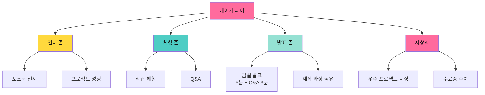

---

## 🎯 6. 수업 운영 세부 계획

### 📖 80분 수업 구조 (역할별 협업)

```mermaid
gantt
    title 역할별 팀 프로젝트 수업 (80분)
    dateFormat mm
    
    section 1차시 40분
    프로젝트 브리핑 10분      :01, 10m
    기술 시연 및 실습 15분     :11, 15m
    역할별 동시 작업 10분      :26, 10m
    중간 통합 및 점검 5분      :36, 05m
    
    section 2차시 40분
    빠른 리캡 5분             :01, 05m
    역할별 심화 작업 20분      :06, 20m
    팀 통합 및 테스트 10분     :26, 10m
    발표 및 회고 5분          :36, 05m
```

### 🎮 1차시 세부 내용 (40분)

| 시간 | 활동 | 교사 역할 | 팀 활동 (역할별) | 산출물 |
|------|------|----------|----------------|--------|
| **10분** | 🎯 **프로젝트 브리핑** | - 주제 소개<br>- 목표 제시<br>- 평가 기준 안내 | - 팀 목표 설정<br>- 역할 확인<br>- 일정 계획 | 팀 계획서 |
| **15분** | 🔬 **기술 시연** | - 새로운 기술 시연<br>- 예제 코드 제공<br>- 리소스 안내 | - 따라하며 학습<br>- 질문 및 탐색 | 기술 이해 |
| **10분** | 👥 **역할별 작업** | - 순회 지도<br>- 개별 멘토링 | - 기획자: 문서 작성<br>- 개발자: 코드 작성<br>- 디자이너: 그래픽<br>- 테스터: 테스트 계획 | 역할별 산출물 |
| **5분** | 🔄 **중간 점검** | - 진행 상황 확인<br>- 피드백 제공 | - 팀 내 공유<br>- 문제점 논의 | 중간 보고 |

### 🎮 2차시 세부 내용 (40분)

| 시간 | 활동 | 교사 역할 | 팀 활동 (역할별) | 산출물 |
|------|------|----------|----------------|--------|
| **5분** | 🔄 **빠른 리캡** | - 1차시 요약<br>- 이번 차시 목표 | - 진행 상황 공유<br>- 목표 재확인 | - |
| **20분** | 🚀 **심화 작업** | - 최소 개입<br>- 필요시 도움 | - 역할별 집중 작업<br>- 팀 내 협업 | 기능 완성 |
| **10분** | 🧪 **통합 테스트** | - 다른 팀과 교환<br>- 피드백 안내 | - 통합 테스트<br>- 다른 팀 플레이<br>- 피드백 수집 | 피드백 리스트 |
| **5분** | 🎤 **발표 회고** | - 우수 사례 공유<br>- 다음 주 예고 | - 팀 발표<br>- 배운 점 공유<br>- 개선 계획 | 회고록 |

---

## 📋 7. 준비물 및 환경 구성

### 🖥️ 디지털 환경

| 항목 | 사양 | 수량 | 비고 |
|------|------|------|------|
| **컴퓨터** | 웹캠, 마이크 내장 | 팀당 1대 | 고사양 권장 |
| **마이크로비트** | v2 이상 | **학생 수 ÷ 2** | 2인 1세트 |
| **USB 케이블** | 마이크로비트 연결용 | 학생 수 | - |
| **배터리 팩** | 마이크로비트 휴대용 | 학생 수 | 옵션 |
| **확장 키트** | 서보모터, LED 등 | 팀당 1세트 | 선택사항 |
| **인터넷** | 안정적 연결 | - | AI API 사용 |

### 🎨 메이커 도구

| 항목 | 용도 | 수량 | 비고 |
|------|------|------|------|
| **화이트보드** | 팀별 아이디어 스케치 | 팀당 1개 | 소형 보드 |
| **포스트잇** | 브레인스토밍 | 충분히 | 다양한 색상 |
| **마커펜** | 스케치, 다이어그램 | 팀당 1세트 | - |
| **기획서 양식** | 프로젝트 문서화 | 프린트 | 템플릿 제공 |
| **전시판** | 작품 전시 | 팀당 1개 | 코르크보드 |

### 🏫 메이커 스페이스 구성

```
┌────────────────── 프로젝터 & 화이트보드 ──────────────────┐
│                                                           │
│   팀1           팀2           팀3           팀4          │
│  [💻]         [💻]         [💻]         [💻]         │
│  👤👤👤       👤👤👤       👤👤👤       👤👤👤       │
│  화이트보드    화이트보드    화이트보드    화이트보드      │
│                                                           │
│   팀5           팀6           팀7           팀8          │
│  [💻]         [💻]         [💻]         [💻]         │
│  👤👤👤       👤👤👤       👤👤👤       👤👤👤       │
│  화이트보드    화이트보드    화이트보드    화이트보드      │
│                                                           │
│        🛠️ 공유 자료 테이블 (마이크로비트 키트)           │
│                                                           │
│  [전시판] [전시판] [전시판] [전시판] [전시판] [전시판]    │
└───────────────────────────────────────────────────────────┘

각 팀: 의자 3-4개 + 컴퓨터 1대 + 화이트보드
```

---

## 📊 8. 평가 계획

### 🎯 평가 비중

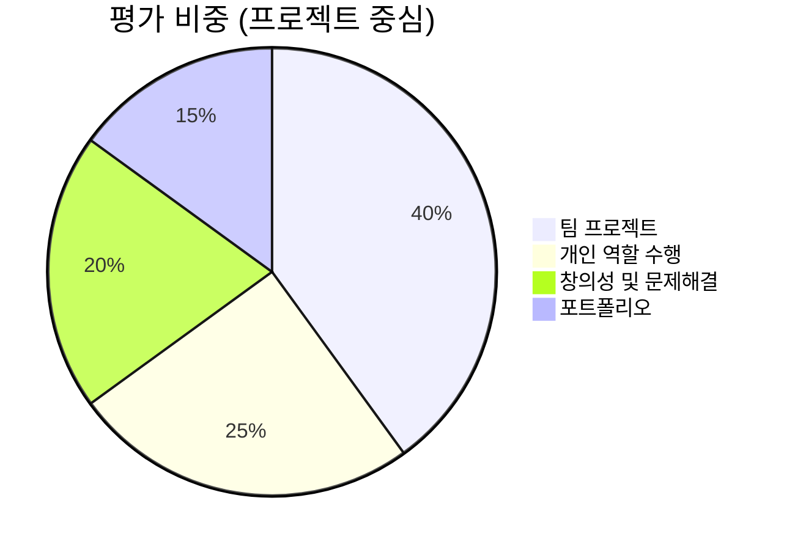

### 🌟 평가 기준

#### 팀 프로젝트 평가 (40%)

| 평가 항목 | 세부 기준 | 배점 |
|----------|----------|------|
| **완성도** | 기획한 기능 구현 정도 | 15% |
| **기술 활용** | AI/마이크로비트 적절한 활용 | 10% |
| **협업** | 팀워크, 의사소통 | 10% |
| **발표** | 명확한 전달, 시연 | 5% |

#### 개인 역할 수행 평가 (25%)

| 역할 | 평가 기준 |
|------|----------|
| **기획자** | 기획서 품질, 일정 관리 |
| **개발자** | 코드 품질, 기능 구현 |
| **디자이너** | UI/UX, 시각적 완성도 |
| **테스터** | 테스트 계획, 버그 리포트 |

#### 창의성 및 문제해결 (20%)

- 독창적 아이디어
- 문제 발견 능력
- 창의적 솔루션
- 도전 정신

#### 포트폴리오 (15%)

- 작품 수 (목표: 10개)
- 프로젝트 문서화
- 성찰 일지
- 발표 자료

### 📁 포트폴리오 구성

```markdown
[학생 이름]의 크리에이터 포트폴리오
================================

📅 기간: ____년 __월 ~ __월
🎯 나의 비전: "________________"

━━━━━━━━━━━━━━━━━━━━━━━━━━━━━━

[ 1주차: 보이스 어드벤처 ]
📱 프로젝트: [스크린샷]
🎯 나의 역할: 기획자
💡 주요 업무: 게임 스토리 작성, 명령어 설계
⭐ 배운 점: 음성 인식 API 활용법
💭 어려웠던 점: 명령어 인식 정확도 향상
📊 평가: A

[ 5주차: LED 리듬 게임 ]
📱 프로젝트: [마이크로비트 사진]
🎯 나의 역할: 개발자
💡 주요 업무: LED 제어 로직, 타이밍 시스템
🤖 하드웨어: 마이크로비트 v2
⭐ 배운 점: 디지털 출력, 이벤트 처리
💭 어려웠던 점: 정밀한 타이밍 구현
📊 평가: A+

[ 9주차: AI 로봇 컨트롤 ]
📱 프로젝트: [AI + 마이크로비트 통합 사진]
🎯 나의 역할: 시스템 통합
💡 주요 업무: AI-하드웨어 연결
🔗 기술 스택: Face AI + 마이크로비트 + 서보모터
⭐ 배운 점: 복합 시스템 설계
💭 어려웠던 점: 실시간 통신 지연 해결
📊 평가: S

[ 10-11주차: 창작 프로젝트 ]
📱 최종 프로젝트: "스마트 책가방"
🎯 문제 정의: 무거운 책가방으로 인한 허리 통증
💡 솔루션: 무게 센서 + 알림 시스템
🔗 기술: 마이크로비트 + 압력 센서 + 앱
👥 팀원: 3명
📊 사용자 테스트: 10명
⭐ 성과: 학교 대표 프로젝트 선정
💭 가장 뿌듯했던 순간: 실제 친구들이 사용하는 모습

━━━━━━━━━━━━━━━━━━━━━━━━━━━━━━

📈 나의 성장 그래프
기술 역량:    ████████████ 90%
창의성:      ██████████░░ 85%
협업 능력:    ███████████░ 95%
문제 해결:    ████████░░░░ 80%

🎯 다음 목표
1. Python 텍스트 코딩 심화 학습
2. 3D 프린팅과 메이커 프로젝트 결합
3. 지역사회 문제 해결 프로젝트 참여
```

---

## 🎓 9. 기대 효과

### 🌟 학습자 변화

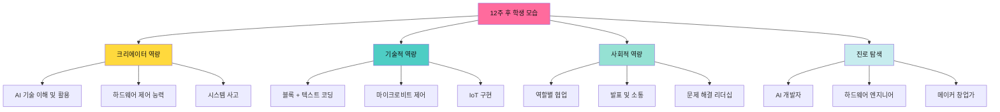

### 📈 정량적 목표

- ✅ **완성 작품**: 10개
- ✅ **AI 프로젝트**: 6개
- ✅ **마이크로비트 프로젝트**: 5개
- ✅ **팀 프로젝트**: 12개
- ✅ **장기 프로젝트**: 1개 (2-3주)
- ✅ **발표 경험**: 12회 이상
- ✅ **역할 경험**: 4가지 모두

### 💡 정성적 목표

- 🚀 **크리에이터 정체성**: "나는 기술로 문제를 해결하는 사람!"
- 🤖 **AI 리터러시**: "AI를 이해하고 활용할 수 있어!"
- 🔧 **피지컬 메이커**: "디지털과 물리 세계를 연결할 수 있어!"
- 👥 **협업 리더십**: "팀에서 나의 역할을 완수할 수 있어!"
- 💡 **문제 해결**: "실생활 문제를 기술로 해결할 수 있어!"
- 📊 **프로젝트 관리**: "장기 프로젝트를 완수할 수 있어!"

---

## 📞 10. 학부모 소통 계획

### 📧 소통 채널

| 시기 | 방법 | 내용 |
|------|------|------|
| **오리엔테이션** | 가정통신문 | 전체 커리큘럼, 준비물 (마이크로비트) |
| **매주** | 사진/영상 공유 | 이번 주 프로젝트, 작품 시연 |
| **월 1회** | 뉴스레터 | 학습 내용, 우수 프로젝트 소개 |
| **중간** | 학부모 설명회 | 마이크로비트 활용 안내 |
| **최종** | 메이커 페어 초대 | 프로젝트 전시, 체험 |

### 🎉 최종 메이커 페어

**메이커 페어 프로그램**

```
14:00-14:30  전시 부스 준비
14:30-15:00  자유 관람 (학부모, 학생)
15:00-15:30  팀별 발표 (6팀 선발)
15:30-16:00  체험 존 (직접 플레이)
16:00-16:20  시상식
16:20-16:30  수료증 수여
```

### 🏅 시상 부문

- 🏆 **최우수 프로젝트상**: 기술적 완성도 + 창의성
- 🎨 **크리에이티브상**: 가장 독창적인 아이디어
- 🤝 **베스트 팀워크상**: 협업이 뛰어난 팀
- 🤖 **AI 마스터상**: AI 기술 활용 우수
- 🔧 **피지컬 메이커상**: 마이크로비트 활용 우수
- 💡 **문제 해결상**: 실생활 문제 해결 우수
- 🎤 **베스트 프레젠테이션상**: 발표 능력 우수
- ⭐ **성장상**: 가장 많이 성장한 학생

---

## 📚 11. 참고 자료

### 🌐 온라인 리소스

**AI 교육**
- MIT Dancing with AI: https://dancingwithai.media.mit.edu/
- Teachable Machine: https://teachablemachine.withgoogle.com/
- ML5.js: https://ml5js.org/

**마이크로비트**
- 공식 사이트: https://microbit.org/ko/
- MakeCode: https://makecode.microbit.org/
- Python Editor: https://python.microbit.org/

**블록코딩**
- DWAI 블록코딩 플랫폼
- Scratch: https://scratch.mit.edu/

### 📖 교사 연수

**기술 연수**
- AI API 활용법 (3시간)
- 마이크로비트 기초 (2시간)
- AI-하드웨어 연동 (2시간)

**메이커 교육 연수**
- 프로젝트 기반 학습 (2시간)
- 팀 프로젝트 운영 (2시간)
- 평가 및 피드백 (1시간)

---

## ✅ 운영 체크리스트

### 📅 수업 시작 4주 전
- [ ] 마이크로비트 구매 (학생 수 ÷ 2)
- [ ] 확장 키트 구매 (선택)
- [ ] 전체 템플릿 12개 제작
- [ ] 마이크로비트 테스트

### 📅 수업 시작 2주 전
- [ ] 컴퓨터실 웹캠/마이크 확인
- [ ] DWAI 플랫폼 학생 계정 생성
- [ ] 학부모 안내문 발송
- [ ] 마이크로비트 펌웨어 업데이트

### 📅 수업 시작 1주 전
- [ ] 1주차 템플릿 최종 테스트
- [ ] 예시 작품 제작
- [ ] 수업 자료 준비
- [ ] 팀 구성 계획

### 📅 매주 수업 전날
- [ ] 해당 주차 템플릿 재점검
- [ ] 마이크로비트 충전 (5-9주차)
- [ ] 이전 주차 백업
- [ ] 발표 자료 준비

### 📅 매주 수업 후
- [ ] 학생 작품 저장
- [ ] 사진/영상 촬영
- [ ] 학부모 공유
- [ ] 다음 주 준비

---

**작성일**: 2026-01-15  
**작성자**: [교사명]  
**문의**: [이메일]

> 🚀 **고급 메이커 교육 핵심**: "AI를 이해하고, 하드웨어를 제어하고, 문제를 해결한다"

> 💡 **수업 모토**: "체험을 넘어 창조로, 메이커에서 크리에이터로!"

---

## 📎 부록: 마이크로비트 구매 가이드

### 🛒 필수 구매 목록

| 항목 | 수량 | 예상 가격 | 비고 |
|------|------|---------|------|
| 마이크로비트 v2 | 학생 수 ÷ 2 | 개당 25,000원 | BBC 공식 제품 |
| USB 케이블 | 학생 수 | 개당 3,000원 | 마이크로 USB |
| 배터리 팩 | 학생 수 | 개당 5,000원 | AAA 2개용 |
| **기본 세트 총액** | **20명 기준** | **약 330,000원** | - |

### 🔧 확장 키트 (선택)

| 항목 | 수량 | 예상 가격 | 용도 |
|------|------|---------|------|
| 서보모터 키트 | 5세트 | 개당 15,000원 | 로봇팔 제작 |
| LED 스트립 | 5세트 | 개당 10,000원 | 시각 효과 |
| 센서 확장 | 5세트 | 개당 20,000원 | 거리, 소리 센서 |
| **확장 세트 총액** | **5세트** | **약 225,000원** | - |

### 💰 예산 계획 (20명 기준)

```
필수 구매: 330,000원
확장 키트: 225,000원 (선택)
━━━━━━━━━━━━━━━━━━
총액: 555,000원

1인당: 약 27,750원
```

---

**메이커 교육의 성공을 응원합니다! 🚀**
