# 🎮 게임 기획자로 성장하는 AI 블록코딩 커리큘럼

## 📌 핵심 교육 철학

### "만드는 사람이 아닌, 기획하는 사람으로!"

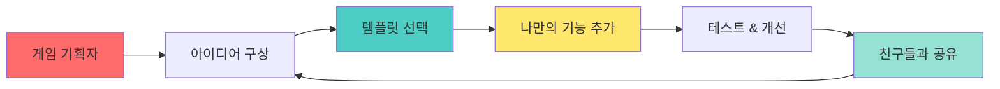

### 🎯 왜 템플릿 기반인가?
- ✅ **빠른 성취감**: 5분 안에 작동하는 게임 체험
- ✅ **창의성 집중**: 코딩보다 아이디어와 기획에 집중
- ✅ **실패 두려움 제거**: 이미 작동하는 기반 제공
- ✅ **기획자 마인드**: "어떻게 더 재미있게 만들까?" 사고

## 🎮 3개월 게임 기획 여정

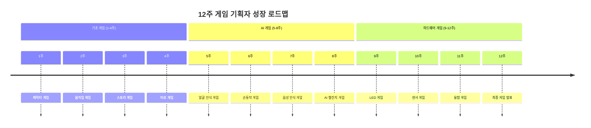

## 📊 주차별 게임 프로젝트 상세

### 🎨 1단계: 게임 기획 기초 (1-4주)

| 주차 | 게임 템플릿 | 기획 미션 | AI 요소 | 기획 역량 |
|------|-------------|-----------|---------|-----------|
| 1주 | 🎭 캐릭터 드레스업 | 나만의 캐릭터 꾸미기 | - | 캐릭터 디자인 기획 |
| 2주 | 🏃 러닝 게임 | 장애물과 점수 기획 | - | 난이도 설계 |
| 3주 | 📖 선택형 스토리 | 엔딩 3가지 기획 | - | 스토리 분기 설계 |
| 4주 | 🧩 미로 탈출 | 함정과 아이템 배치 | - | 레벨 디자인 |

### 🤖 2단계: AI 게임 기획 (5-8주)

| 주차 | 게임 템플릿 | 기획 미션 | AI 요소 | 기획 역량 |
|------|-------------|-----------|---------|-----------|
| 5주 | 😊 표정 맞추기 | 표정별 점수 규칙 | **페이스 AI** | AI 규칙 설계 |
| 6주 | ✋ 손동작 게임 | 제스처 명령 정의 | **핸드 AI** | 인터랙션 설계 |
| 7주 | 🗣️ 음성 퀴즈 | 문제와 정답 기획 | 음성 인식 | 콘텐츠 기획 |
| 8주 | 🎯 AI 챌린지 | 3가지 AI 융합 게임 | 통합 AI | 융합 기획 |

### 🔧 3단계: 하드웨어 게임 기획 (9-12주)

| 주차 | 게임 템플릿 | 기획 미션 | AI 요소 | 기획 역량 |
|------|-------------|-----------|---------|-----------|
| 9주 | 💡 LED 감정 표현 | 상황별 표정 기획 | - | 피드백 설계 |
| 10주 | 🎲 동작 감지 게임 | 동작별 반응 정의 | 핸드 AI | 물리적 UX 설계 |
| 11주 | 🌡️ 환경 반응 게임 | 센서 기반 규칙 | 페이스 AI | 실시간 반응 설계 |
| 12주 | 🏆 나만의 게임 | 완전 자유 기획 | 선택 | 종합 기획 |

## 🎯 기획자 역량 성장 로드맵

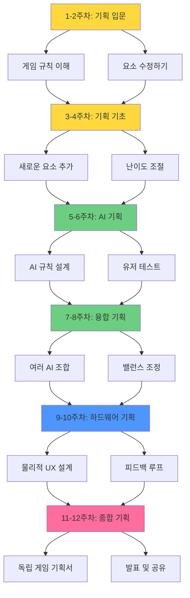

## 🎨 템플릿 활용 3단계 학습법

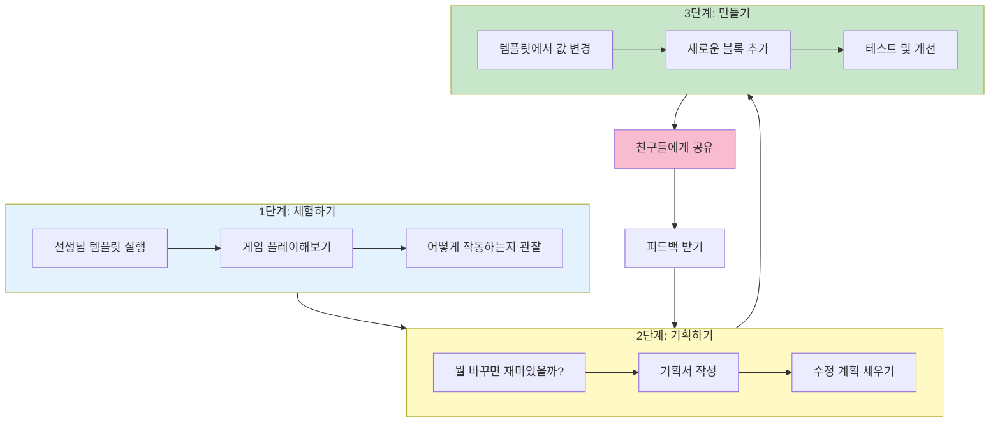

## 🎮 주차별 상세 커리큘럼

### 📅 1주차: 캐릭터 게임 기획자 되기

```mermaid
gantt
    title 1주차 수업 흐름 (2차시)
    dateFormat mm
    section 1차시
    게임 체험(5분)           :01, 05m
    기획 아이디어(10분)       :06, 10m
    템플릿 수정(20분)         :16, 20m
    테스트(5분)              :36, 05m
    
    section 2차시
    지난 시간 복습(3분)       :01, 03m
    추가 기능 기획(7분)       :04, 07m
    자유 창작(25분)          :11, 25m
    발표 및 공유(5분)         :36, 05m
```

**🎯 학습 목표**
- 블록코딩 인터페이스 익히기
- 캐릭터 외형 변경하기
- 나만의 캐릭터 콘셉트 기획하기

**🎮 제공 템플릿: "마법의 드레스룸"**
- 기본 캐릭터 1개
- 옷 5가지 (모자, 상의, 하의, 신발, 액세서리)
- 색상 변경 블록
- 저장 기능

**📝 기획 미션**
1. 내 캐릭터 콘셉트 정하기 (예: 우주인, 공주, 닌자 등)
2. 추가하고 싶은 아이템 3가지 그리기
3. 특별한 애니메이션 1가지 기획하기

**⚡ 수정 포인트 (선택)**
- [ ] 옷 색상 바꾸기
- [ ] 새로운 액세서리 추가하기
- [ ] 배경 변경하기
- [ ] 캐릭터 표정 바꾸기
- [ ] 음악 추가하기

**🎨 기획자 워크시트**
```
캐릭터 이름: __________
콘셉트: __________
특별한 능력: __________
좋아하는 색: __________
```

---

### 📅 2주차: 러닝 게임 기획자 되기

**🎯 학습 목표**
- 이동과 충돌 개념 이해
- 게임 난이도 조절하기
- 장애물 배치 기획하기

**🎮 제공 템플릿: "끝없는 달리기"**
- 자동으로 달리는 캐릭터
- 장애물 3종류
- 점수 시스템
- 게임 오버 화면

**📝 기획 미션**
1. 장애물 속도 조절하기 (쉬움/보통/어려움)
2. 새로운 장애물 1가지 추가
3. 특별 아이템 기획 (예: 무적, 점프력 UP)

**⚡ 수정 포인트 (선택)**
- [ ] 캐릭터 속도 변경
- [ ] 장애물 간격 조정
- [ ] 배경 스크롤 속도
- [ ] 점수 획득 규칙 변경
- [ ] 효과음 추가

**🎯 난이도 설계 워크시트**
```
초반 속도: _____ (1-10)
증가 속도: _____ (느림/보통/빠름)
장애물 개수: _____ (적음/보통/많음)
특별 아이템 출현 빈도: _____ (낮음/보통/높음)
```

---

### 📅 5주차: 😊 표정 인식 게임 기획자 되기 (AI 시작!)

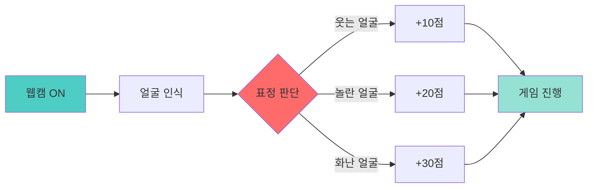

**🎯 학습 목표**
- 페이스 AI 블록 이해하기
- 표정과 게임 규칙 연결하기
- AI 기반 게임 기획하기

**🎮 제공 템플릿: "표정 마스터"**
- 페이스 AI 블록 (웃음/놀람/화남/슬픔 감지)
- 기본 점수 시스템
- 제한 시간 30초
- 목표 점수 100점

**📝 기획 미션**
1. 각 표정별 점수 규칙 만들기
2. 특별 콤보 기획 (예: 3초 동안 웃으면 보너스)
3. 난이도별 목표 점수 설정

**⚡ 수정 포인트 (선택)**
- [ ] 표정별 점수 변경
- [ ] 새로운 표정 추가 (눈 깜빡임 등)
- [ ] 제한 시간 조정
- [ ] 연속 성공 보너스 추가
- [ ] 실패 패널티 기획

**🎨 AI 게임 기획서**
```
게임 이름: __________
목표: __________
표정 1 (____) → 점수: _____ / 효과: _____
표정 2 (____) → 점수: _____ / 효과: _____
표정 3 (____) → 점수: _____ / 효과: _____
특별 규칙: __________
```

---

### 📅 6주차: ✋ 손동작 게임 기획자 되기

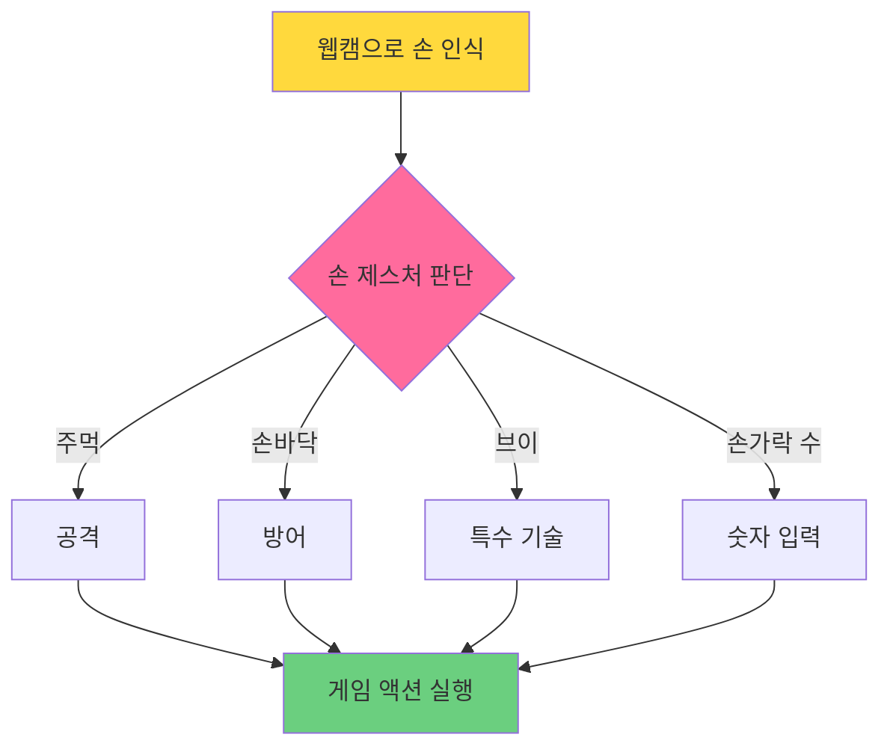

**🎯 학습 목표**
- 핸드 AI 블록 이해하기
- 손동작을 게임 컨트롤로 연결
- 제스처 기반 인터랙션 기획

**🎮 제공 템플릿: "손동작 배틀"**
- 핸드 AI 블록 (주먹/손바닥/손가락 개수 인식)
- 캐릭터 배틀 시스템
- HP 시스템
- 승리/패배 조건

**📝 기획 미션**
1. 손동작 3가지를 게임 명령으로 연결
2. 특수 콤보 기획 (예: 주먹→손바닥→브이 = 필살기)
3. 적 캐릭터 AI 패턴 만들기

**⚡ 수정 포인트 (선택)**
- [ ] 손동작별 공격력 조정
- [ ] 새로운 제스처 추가
- [ ] 연속 기술 시스템
- [ ] 방어 성공 시 반격
- [ ] 체력 회복 아이템

**🎮 제스처 매핑 워크시트**
```
제스처 1: ______ → 게임 액션: ______ (데미지: ___)
제스처 2: ______ → 게임 액션: ______ (데미지: ___)
제스처 3: ______ → 게임 액션: ______ (데미지: ___)
특별 콤보: ______ + ______ → ______
```

---

### 📅 12주차: 🏆 최종 게임 발표회

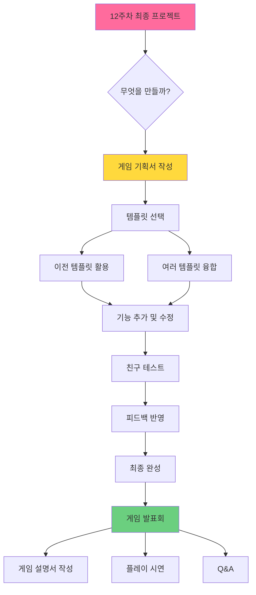

**🎯 최종 목표**
- 독립적으로 게임 기획하기
- 11주간 배운 모든 기술 활용
- 완성된 게임 발표하기

**📝 최종 프로젝트 선택지**
1. **AI + 마이크로비트 융합 게임**
   - 예: 손동작으로 마이크로비트 LED 제어
2. **멀티 AI 게임**
   - 예: 표정 + 음성 + 손동작 통합
3. **스토리 어드벤처 게임**
   - 예: 선택형 + AI 인식 혼합
4. **교육용 게임**
   - 예: 수학/한글 학습 게임

**🎨 최종 게임 기획서 템플릿**
```
게임 제목: _______________
만든 사람: _______________

[ 게임 소개 ]
장르: _______________
한 줄 설명: _______________

[ 조작 방법 ]
- 
- 
- 

[ 게임 규칙 ]
목표: _______________
승리 조건: _______________
특별 기능: _______________

[ 사용한 기술 ]
□ 블록코딩 기초
□ 페이스 AI
□ 핸드 AI
□ 음성 인식
□ 마이크로비트
□ 기타: _______________

[ 만들면서 어려웠던 점 ]
_______________

[ 가장 재미있는 부분 ]
_______________
```

## 🎯 기획자 역량 평가 기준

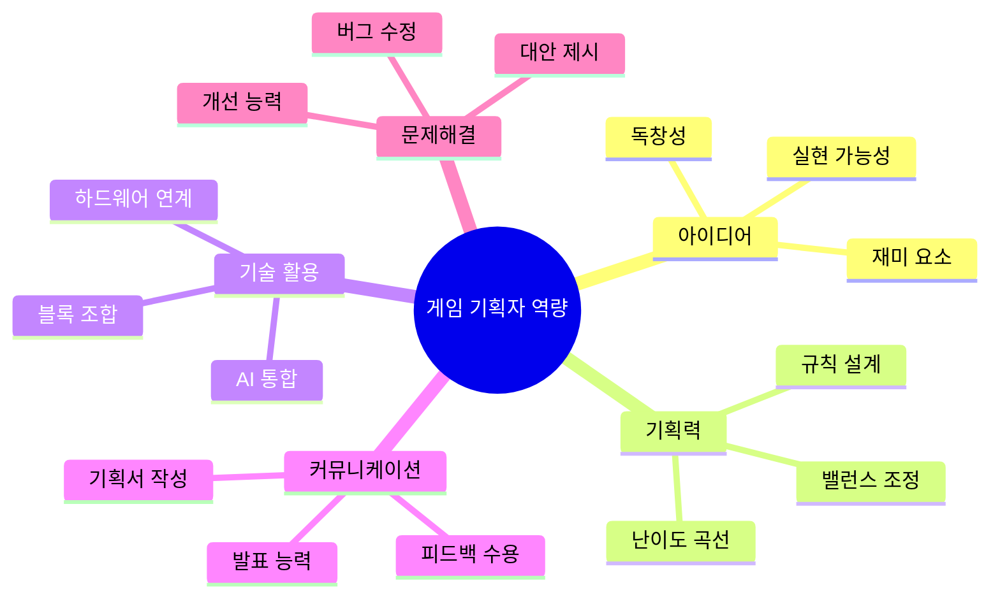

### 📋 역량별 체크리스트

| 역량 | 1-4주 | 5-8주 | 9-12주 |
|------|-------|-------|--------|
| **아이디어 구상** | 템플릿 이해 | 독창적 변형 | 완전 새로운 기획 |
| **규칙 설계** | 숫자 변경 | 새 규칙 추가 | 복합 시스템 설계 |
| **밸런스 조정** | 난이도 조절 | 테스트 기반 조정 | 데이터 기반 밸런싱 |
| **기획서 작성** | 간단한 메모 | 구조화된 기획서 | 전문적 기획서 |
| **발표 능력** | 게임 소개 | 기획 의도 설명 | 전략적 프레젠테이션 |
| **협업** | 아이디어 공유 | 협력 제작 | 멘토링 |

## 💡 템플릿 제공 전략

### 🎮 템플릿 설계 원칙

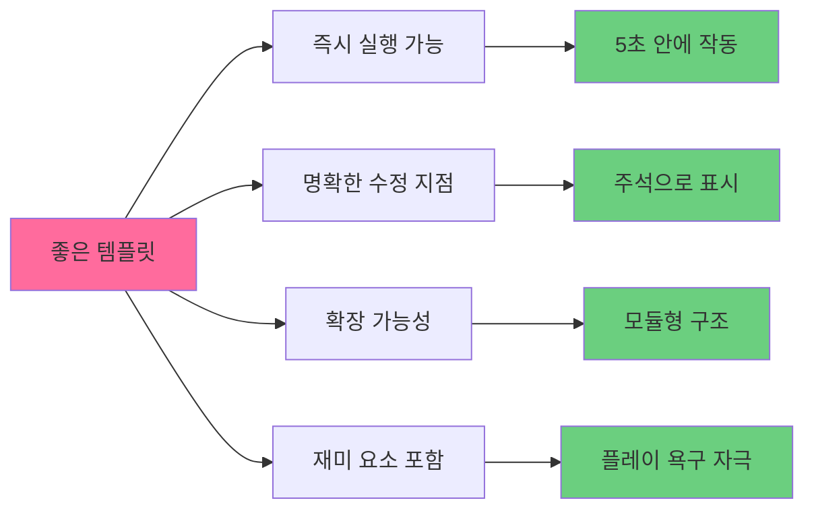

### 📦 템플릿 구성 요소

1. **핵심 시스템** (수정 금지)
   - 게임 루프
   - 기본 물리 엔진
   - AI 연결 블록

2. **조정 가능 변수** (쉬운 수정)
   - 속도, 크기, 색상
   - 점수, 시간, 난이도
   - 캐릭터, 배경, 음악

3. **확장 영역** (추가 가능)
   - 새로운 캐릭터
   - 추가 아이템
   - 특수 효과

4. **주석 가이드** (학습 지원)
   - "여기를 수정해보세요!"
   - "도전: 이 기능을 추가해보세요"
   - "힌트: 이 블록은 ~을 합니다"

## 🎓 교사 가이드

### 📝 수업 준비 체크리스트

**수업 1주일 전**
- [ ] 해당 주차 템플릿 테스트
- [ ] 예시 수정본 2-3개 제작
- [ ] 기획서 워크시트 인쇄
- [ ] AI 기능 (카메라) 작동 확인

**수업 1일 전**
- [ ] 학생 계정 확인
- [ ] 템플릿 배포 준비
- [ ] 이전 주차 프로젝트 백업

**수업 당일**
- [ ] 데모 영상 준비
- [ ] 문제해결 가이드 준비
- [ ] 평가 체크리스트 출력

### 🎯 학생 질문 대응 가이드

**"선생님, 이거 어떻게 해요?"**
→ "먼저 템플릿에서 비슷한 부분을 찾아볼까?"

**"제 아이디어가 너무 어려워요"**
→ "1단계만 먼저 만들어보자! 나머지는 나중에"

**"친구 걸 따라했어요"**
→ "좋아! 이제 너만의 특별한 부분 1개를 추가해보자"

**"다 끝났어요!"**
→ "친구들이 테스트하게 해볼까? 피드백 받아보자"

### 🌟 차별화 전략

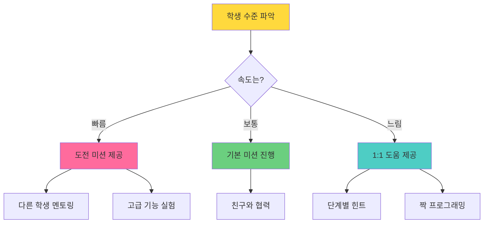

## 📚 다음 단계

각 주차별 상세 수업 계획은 아래 문서를 참고하세요:

1. [1-4주차: 게임 기획 입문](./1-4주차_게임기획입문.md)
2. [5-8주차: AI 게임 기획](./5-8주차_AI게임기획.md)
3. [9-12주차: 융합 게임 기획](./9-12주차_융합게임기획.md)

---

**버전**: 2.0.0 (템플릿 기반 + 기획자 중심)  
**최종 수정일**: 2026-01-15
