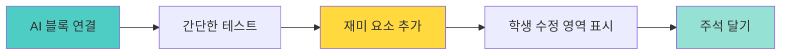

# 🤖 AI 게임 아이디어 모음집

> **MIT Dancing with AI 스타일 게임들**  
> Face AI와 Hand AI를 활용한 재미있는 게임 아이디어

## 📸 Face AI 게임 (얼굴 인식)

### 1. 😊 표정 마스터 게임

**게임 방식**
```
화면에 표정이 뜬다 → 그 표정을 지어라! → 성공하면 점수!
```

**예시 화면**
```
┌─────────────────────────────────┐
│                                 │
│     😊 웃는 얼굴을 지어봐!      │
│                                 │
│     ⏰ 3초 남음                 │
│     💯 점수: 50점               │
│                                 │
│  [당신의 얼굴 화면]              │
│                                 │
└─────────────────────────────────┘
```

**학생이 바꿀 수 있는 것**
- 표정 종류 (웃음, 놀람, 화남, 슬픔, 윙크 등)
- 표정별 점수 (어려운 표정 높은 점수)
- 제한 시간 (빠른 모드 vs 느린 모드)
- 콤보 시스템 (연속 성공 시 보너스)

**난이도 변형**
- 초급: 표정 3개, 5초 시간
- 중급: 표정 5개, 3초 시간
- 고급: 표정 바로바로 바뀜, 1초!

---

### 2. 🐦 플래피 페이스 (Flappy Bird 스타일)

**게임 방식**
```
입을 벌리면 새가 날아올라! → 장애물 피해가기 → 떨어지지 마!
```

**조작 방법**
- 입 다물기 = 새가 떨어짐
- 입 벌리기 = 새가 위로!
- 크게 벌리면 = 더 높이 올라감

**예시 화면**
```
┌─────────────────────────────────┐
│                    ║            │
│          🐦       ║            │
│                    ║            │
│  점수: 5           ║            │
│                                 │
│  ↓ 입 벌려! ↓                   │
│  [당신의 얼굴]                   │
└─────────────────────────────────┘
```

**학생이 바꿀 수 있는 것**
- 새 캐릭터 (용, 비행기, 로켓 등)
- 장애물 모양 (파이프, 구름, 건물)
- 배경 테마 (하늘, 우주, 바다)
- 난이도 (장애물 간격, 속도)

---

### 3. 🎭 AR 가면 메이커

**게임 방식**
```
얼굴에 실시간으로 가면 씌우기! → 표정으로 효과 추가!
```

**인터랙션**
- 웃으면 = 무지개 색으로 변함
- 윙크하면 = 반짝 효과
- 입 벌리면 = 크기 커짐
- 고개 돌리면 = 회전

**예시 아이디어**
```
기본 가면들:
🎩 모자 (중절모, 왕관, 마법사 모자)
👓 안경 (하트, 별, 선글라스)
👃 코 (피노키오, 코끼리, 토끼)
😺 동물 귀 (고양이, 토끼, 곰)
💄 장식 (스티커, 문신, 별)
```

**학생이 만드는 것**
- 가면 디자인 그리기
- 표정별 반응 설정
- 색상 변화 규칙
- 특수 효과 추가

---

### 4. 😮 표정으로 장애물 피하기

**게임 방식**
```
캐릭터가 자동으로 달린다 → 표정으로 점프/슬라이드!
```

**조작**
- 웃는 얼굴 = 점프
- 놀란 얼굴 = 높이 점프
- 화난 얼굴 = 슬라이드

**예시 화면**
```
┌─────────────────────────────────┐
│                          🪨     │
│        😊                       │
│    ━━━━━━━━━━━━━━━━━━━━        │
│                                 │
│  😊 = 점프  😮 = 높이 점프      │
└─────────────────────────────────┘
```

---

## ✋ Hand AI 게임 (손동작 인식)

### 5. ✂️ 과일 닌자 (손 버전)

**게임 방식**
```
과일이 날아온다 → 손으로 자른다! → 폭탄은 피해!
```

**조작 방법**
- 손을 빠르게 움직이면 = 과일이 잘림
- 손이 과일에 닿으면 = 득점!
- 폭탄 건드리면 = 게임 오버

**예시 화면**
```
┌─────────────────────────────────┐
│    🍎      🍌                   │
│                    💣           │
│         🍊                      │
│                                 │
│  점수: 15  콤보: x3             │
│  손: [●]                        │
└─────────────────────────────────┘
```

**학생이 바꿀 수 있는 것**
- 자를 물건 (과일, 케이크, 별)
- 피할 물건 (폭탄, 똥, 벌레)
- 속도 조절
- 특수 아이템 (슬로우 모션, 더블 점수)

---

### 6. 🎹 손으로 피아노 연주

**게임 방식**
```
손 위치에 따라 음이 난다! → 왼손-낮은음, 오른손-높은음
```

**악기 선택**
- 피아노
- 기타
- 드럼
- 실로폰

**예시 화면**
```
┌─────────────────────────────────┐
│                                 │
│  낮음 ←───────────→ 높음        │
│  도  레  미  파  솔  라  시     │
│       [●]        [●]            │
│     왼손         오른손          │
│                                 │
│  ♫ 녹음 중... ●                 │
└─────────────────────────────────┘
```

**학생이 만드는 것**
- 악기 종류 선택
- 음계 배치
- 녹음 및 재생 기능
- 반주 추가

---

### 7. 🏀 손으로 농구 게임

**게임 방식**
```
손을 올리면 골대 위치! → 공을 던져서 골인!
```

**조작**
- 양손 올리기 = 골대 위치 이동
- 손 내리기 = 공 던지기
- 손 넓게 벌리기 = 막기

**예시 화면**
```
┌─────────────────────────────────┐
│         [  🏀  ]               │
│                                 │
│         [  🥅  ]  ← 손으로 이동 │
│                                 │
│  ━━━━━━━━━━━━━━━━━━━━          │
│  득점: 5  시간: 30초            │
└─────────────────────────────────┘
```

---

### 8. ✌️ 가위바위보 배틀

**게임 방식**
```
AI와 가위바위보 대결! → 손 모양 인식 → 이기면 공격!
```

**제스처**
- ✊ 주먹 = 바위
- ✋ 손바닥 = 보
- ✌️ 브이 = 가위

**게임 화면**
```
┌─────────────────────────────────┐
│   AI 🤖                 You 👤 │
│   HP: ❤️❤️❤️            HP: ❤️❤️ │
│                                 │
│   준비...                       │
│   가위! 바위! 보!               │
│                                 │
│   [AI의 선택]     [당신의 손]   │
└─────────────────────────────────┘
```

---

### 9. 🖐️ 손가락 세기 게임

**게임 방식**
```
화면에 숫자가 뜬다 → 그만큼 손가락을 펴라! → 빠르게!
```

**예시**
```
┌─────────────────────────────────┐
│                                 │
│       숫자 4를 보여줘!          │
│                                 │
│       ⏰ 2초 남음               │
│                                 │
│       [당신의 손: ✋ 4개?]      │
└─────────────────────────────────┘
```

**난이도**
- 쉬움: 1-5까지, 5초
- 보통: 1-10까지 (양손 사용), 3초
- 어려움: 빠르게 바뀜, 1초!

---

### 10. 🎨 손으로 그림 그리기

**게임 방식**
```
허공에 손으로 그리면 → 화면에 그림이 그려진다!
```

**조작**
- 검지 펴기 = 그리기 모드
- 주먹 쥐기 = 그리기 멈춤
- 손바닥 = 지우개

**표정으로 색 바꾸기**
- 웃으면 = 빨강
- 놀라면 = 파랑
- 화나면 = 검정

**예시 기능**
```
📏 도구:
- 브러시 (얇게/굵게)
- 형광펜
- 분무기
- 지우개

🎨 효과:
- 무지개 색
- 반짝이
- 네온 효과
- 그라데이션
```

---

## 🎭 Face + Hand 복합 게임

### 11. 🎪 서커스 마스터

**게임 방식**
```
얼굴로 공 균형 잡기 + 손으로 장애물 제거!
```

**조작**
- 고개 왼쪽/오른쪽 = 공이 움직임
- 손 움직임 = 날아오는 장애물 막기
- 웃으면 = 보너스 점수

---

### 12. 🧙 마법사 게임

**게임 방식**
```
손동작으로 마법 발동! → 표정으로 마법 종류 선택!
```

**마법 조합**
- 웃으면서 손 올리기 = 힐링 마법 ✨
- 화나면서 손 뻗기 = 공격 마법 💥
- 놀라면서 양손 = 방어 마법 🛡️

---

### 13. 🎵 보디 밴드 (전신 악기)

**게임 방식**
```
손 = 멜로디, 얼굴 = 리듬!
```

**조작**
- 왼손 위치 = 음높이
- 오른손 위치 = 음량
- 입 벌림 = 드럼 효과
- 윙크 = 심벌즈

---

### 14. 🏃 장애물 마라톤

**게임 방식**
```
표정으로 뛰고, 손으로 장애물 피하기!
```

**조작**
- 웃으면 = 달리기
- 손 위로 = 점프
- 손 아래로 = 슬라이드

---

## 🎓 교육용 AI 게임

### 15. 🔢 수학 손가락 게임

**게임 방식**
```
문제: 2 + 3 = ? → 손가락 5개로 답하기!
```

---

### 16. 🔤 알파벳 표정 게임

**게임 방식**
```
A는 웃는 얼굴! → B는 놀란 얼굴! → 표정으로 암기!
```

---

### 17. 🌍 영어 단어 제스처

**게임 방식**
```
"Big" → 손 벌리기! / "Small" → 손 좁히기!
```

---

## 💡 게임 제작 팁 (교사용)

### 🎯 좋은 AI 게임의 3요소

1. **즉각적 반응**: AI가 인식하면 바로 피드백
2. **명확한 목표**: 학생이 무엇을 해야 하는지 분명
3. **재미있는 실패**: 틀려도 웃으면서 다시 도전

### 🔧 템플릿 제작 가이드



### 📝 주석 예시

```python
# 🎮 과일 닌자 게임
# AI 블록: 손 위치 추적

# 🎨 여기를 바꿔보세요!
과일_종류 = ["🍎", "🍌", "🍊"]  # 원하는 이모지 추가
과일_속도 = 5  # 1~10 (빠르기)
폭탄_확률 = 20  # 0~100 (%)

# 🔒 이 아래는 건드리지 마세요!
# (AI 연결 및 게임 로직)
```

---

## 🌐 참고 자료

**MIT Dancing with AI 프로젝트**
- URL: https://dancingwithai.media.mit.edu/
- 프로젝트 갤러리에서 더 많은 아이디어 확인
- PoseBlocks 활용 예시

**추천 프로젝트**
1. Face Filter Party
2. Hand Music
3. Body Painting
4. Gesture Controller
5. Expression Game

---

## 🎉 학생 작품 아이디어 예시

**실제 학생들이 만들 수 있는 것들**

- 🦖 "표정으로 공룡 키우기" (웃으면 밥, 화나면 게임)
- 🎨 "손으로 무지개 그리기" (손 위치별 색상)
- 🏃 "얼굴로 장애물 달리기" (표정으로 점프)
- 🎵 "얼굴 DJ" (윙크하면 비트 체인지)
- 🎭 "감정 연기자" (표정 연기 연습 게임)
- 🏀 "손 농구" (손으로 공 슛!)
- 🎯 "표정 타깃" (특정 표정 빠르게 만들기)
- ✨ "마법 지팡이" (손으로 주문 그리기)

---

**버전**: 1.0.0  
**최종 수정**: 2026-01-15  
**출처**: MIT Dancing with AI, 교육 현장 경험

> 💡 **핵심**: 재미있으면 자연스럽게 배운다! 게임이 곧 학습이다!
