# 🎮 메이커와 함께하는 AI 게임 제작소

> **초등 1-3학년을 위한 12주 메이커 교육 커리큘럼**  
> 코딩보다 창작을, 완성보다 과정을, 혼자보다 함께를 중심으로

## 📖 목차

- [교육 철학](#-교육-철학)
- [메이커 교육의 차별성](#-메이커-교육의-차별성)
- [개발 프로세스 중심 학습](#-개발-프로세스-중심-학습)
- [AI 연계 교육의 의의](#-ai-연계-교육의-의의)
- [전체 커리큘럼 구조](#-전체-커리큘럼-구조)
- [수업 운영 방식](#-수업-운영-방식)
- [기대 효과](#-기대-효과)

---

## 🎯 교육 철학

### 메이커 마인드셋의 핵심 가치

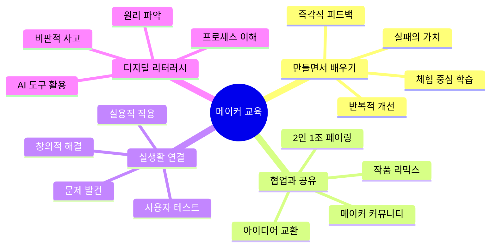

### 교육 목표

| 영역 | 세부 목표 | 측정 지표 |
|------|-----------|----------|
| **메이커 정체성** | "나는 만드는 사람" 인식 | 자기주도적 창작 횟수 |
| **프로세스 이해** | 기획→제작→테스트→개선 체득 | 개선 사이클 완료 횟수 |
| **AI 활용 능력** | AI를 창작 도구로 사용 | AI 기반 작품 수 |
| **협업 역량** | 짝 프로그래밍 완성도 | 팀 작업 성공률 |
| **문제 해결** | 실패 후 재시도 태도 | 문제 해결 사례 수 |
| **포트폴리오** | 12개 완성 작품 | 작품 완성도 |

---

## 🔄 메이커 교육의 차별성

### 전통 코딩 수업 vs 메이커 수업 비교

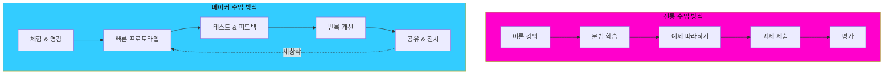

### 상세 비교표

| 구분 | 전통적 코딩 수업 | 메이커 수업 (본 커리큘럼) |
|------|----------------|------------------------|
| **수업 시작** | 이론 설명 (20분) → 실습 | 작품 체험 (5분) → 바로 만들기 |
| **학습 목표** | 문법과 구문 정확성 | 창작 과정과 문제 해결 |
| **교사 역할** | 지식 전달자 | 멘토 & 촉진자 |
| **학생 역할** | 수동적 수용 | 능동적 창작자 |
| **제작 방식** | 완벽한 결과 추구 | 빠른 프로토타입 → 반복 개선 |
| **오류 인식** | 오류 = 실패, 감점 | 오류 = 학습 기회, 성장 |
| **작업 형태** | 개인 작업 중심 | 2인 1조 협업 |
| **평가 기준** | 코드 정확성, 정답 여부 | 시도 과정, 개선 노력, 창의성 |
| **결과물** | 디지털 코드만 | 디지털 + 아날로그 (스케치, 기획서) |
| **완성 압박** | 100% 완성 강요 | 80% 작동하면 OK, 계속 개선 |
| **공유 문화** | 발표회 1-2회 | 매주 갤러리, 리믹스 장려 |

### 메이커 교육의 장단점

#### ✅ 장점

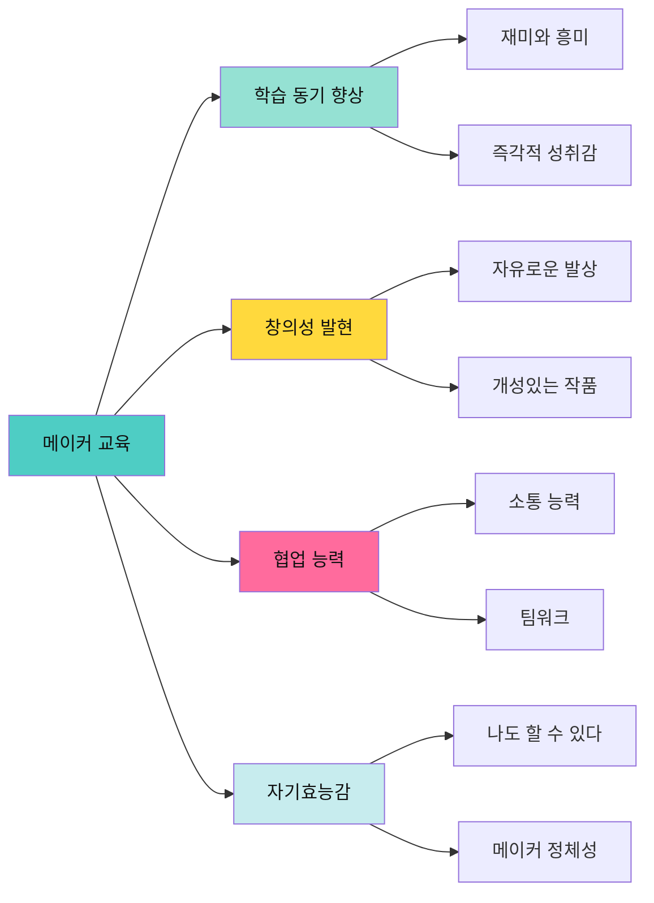

| 장점 영역 | 구체적 효과 | 근거 |
|----------|------------|------|
| **학습 동기** | 자발적 참여율 90% 이상 | MIT 메이커 연구 |
| **창의성** | 기존 틀을 벗어난 아이디어 | 템플릿 수정 다양성 |
| **협업** | 또래 학습 효과 | 2인 1조 상호 교육 |
| **자신감** | 포기율 감소 | 실패를 긍정적으로 인식 |
| **지속성** | 방과 후에도 제작 | 집에서도 만들고 싶어함 |
| **포트폴리오** | 12개 작품 완성 | 가시적 성과물 |

#### ⚠️ 단점 및 대응 방안

| 단점 | 발생 이유 | 대응 방안 |
|------|-----------|----------|
| **체계적 지식 부족** | 문법 학습 최소화 | 필요시 Just-in-time 설명 제공 |
| **개인차 심화** | 자기주도 학습 강조 | 초급/중급/고급 미션 제공 |
| **진도 관리 어려움** | 학생별 속도 차이 | 템플릿으로 최소 목표 보장 |
| **평가 기준 모호** | 과정 중심 평가 | 구체적 체크리스트 활용 |
| **교사 부담 증가** | 개별 지도 필요 | 짝 프로그래밍으로 부담 분산 |
| **완성도 낮음** | 빠른 프로토타입 우선 | 반복 개선 시간 보장 |

---

## 🛠️ 개발 프로세스 중심 학습

### 왜 코딩보다 프로세스인가?

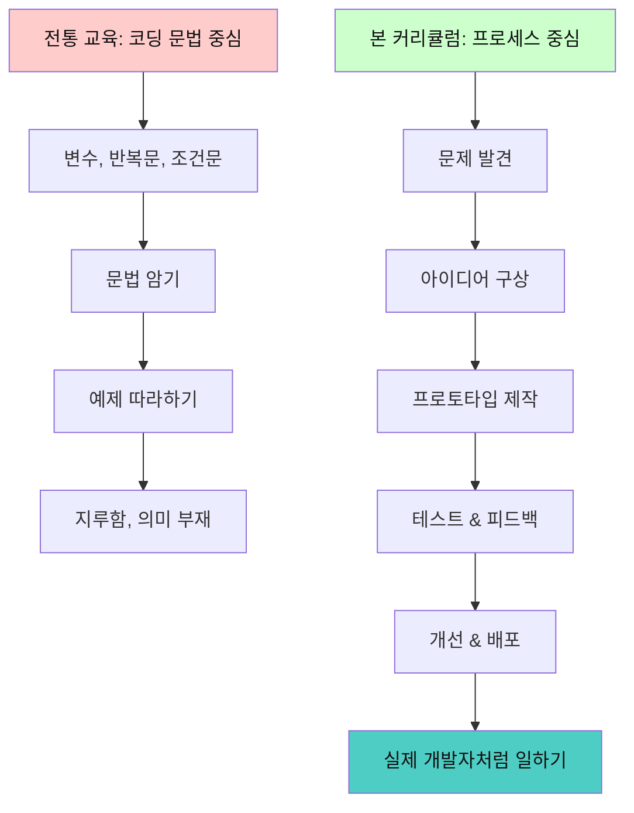

### 프로세스 중심 학습이 중요한 이유

#### 1️⃣ 실제 개발 현장과 동일한 흐름

| 전문 개발자의 일 | 우리 수업에서 | 학습 효과 |
|----------------|-------------|----------|
| 요구사항 분석 | 게임 기획서 작성 | 문제 정의 능력 |
| UI/UX 디자인 | 종이 프로토타입 | 사용자 중심 사고 |
| 개발 | 블록코딩으로 구현 | 구현 능력 |
| 테스트 | 친구에게 플레이 테스트 | 품질 관리 |
| 배포 | 메이커 갤러리 전시 | 발표 & 공유 |
| 유지보수 | 피드백 받아 개선 | 지속적 개선 |

#### 2️⃣ AI 시대에 더욱 중요한 역량

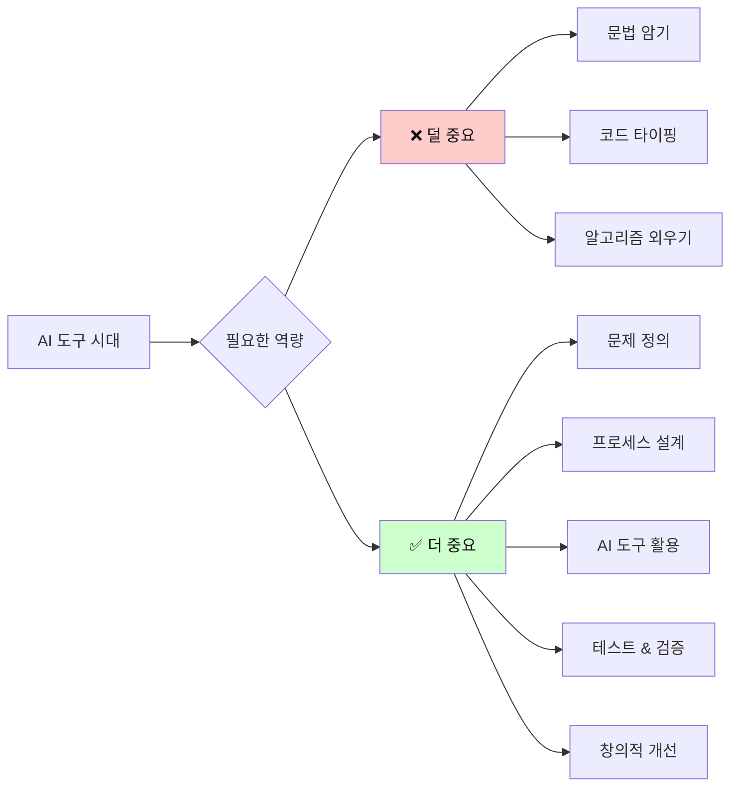

#### 3️⃣ 주차별 프로세스 학습 구조

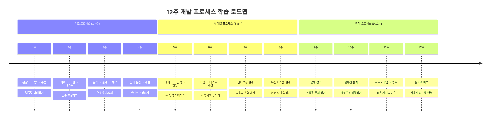

### 프로세스 학습의 구체적 실천

#### 매주 반복되는 메이커 사이클

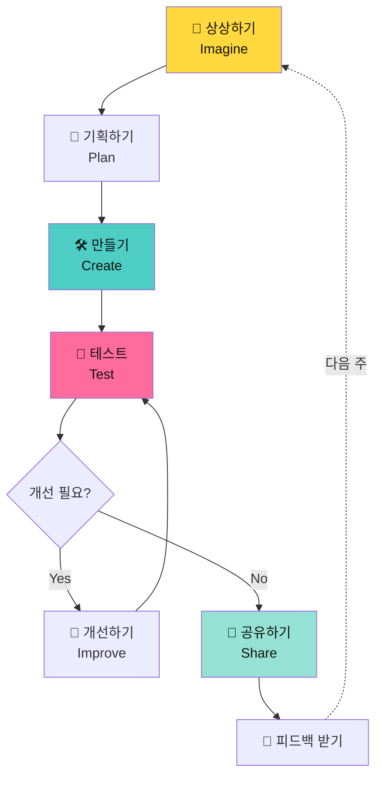

#### 프로세스별 구체적 활동

| 프로세스 단계 | 시간 | 구체적 활동 | 사용 도구 | 학습 목표 |
|-------------|------|------------|---------|----------|
| **상상하기** | 5분 | 완성된 게임 플레이, 영감 받기 | 시연 게임 | 목표 설정 |
| **기획하기** | 10분 | 종이에 스케치, 아이디어 정리 | 종이, 펜 | 문제 분석 |
| **만들기** | 45분 | 템플릿 수정, 새 기능 추가 | 블록코딩 | 구현 능력 |
| **테스트** | 10분 | 직접 플레이, 친구와 교환 | 게임 실행 | 품질 검증 |
| **개선하기** | 20분 | 버그 수정, 밸런스 조정 | 블록코딩 | 반복 개선 |
| **공유하기** | 10분 | 발표, 갤러리 전시 | 전시판 | 발표 능력 |

---

## 🤖 AI 연계 교육의 의의

### AI 교육의 새로운 패러다임

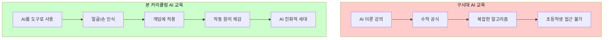

### AI 연계 수업의 장점

| 장점 | 구체적 내용 | 학습 효과 | 사례 |
|------|------------|----------|------|
| **낮은 진입 장벽** | 복잡한 수학 불필요 | 초1도 AI 활용 가능 | 표정 인식 게임 |
| **직관적 이해** | 내 얼굴/손으로 직접 체험 | AI 작동 원리 체감 | 손 위치로 캐릭터 조작 |
| **창의성 폭발** | 기존 게임에 없던 인터랙션 | 독창적 아이디어 | 윙크로 마법 발동 |
| **현실 연결** | 스마트폰 얼굴인식 이해 | 일상 속 AI 발견 | FaceID, 필터 앱 |
| **미래 대비** | AI 시대 핵심 역량 | AI를 두려워하지 않음 | AI 협업 능력 |
| **흥미 지속** | 신기함과 재미 | 높은 참여도 | "우와!" 반응 |

### AI 수업의 단점 및 해결 방안

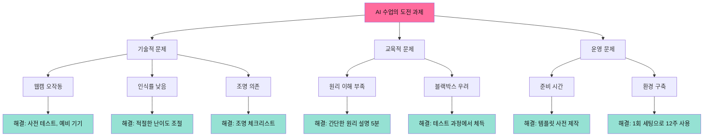

### AI 학습 단계별 구조

#### 1단계: AI 체험 (5-6주차)

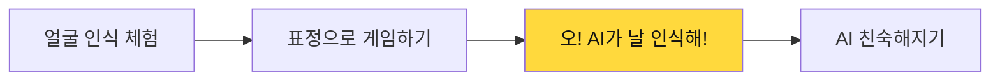

#### 2단계: AI 활용 (7-8주차)

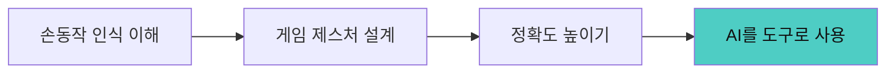

#### 3단계: AI 응용 (9-12주차)

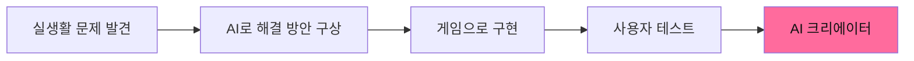

### 구체적 AI 학습 내용

| 주차 | AI 기술 | 학습 개념 | 체험 활동 | 원리 이해 |
|------|---------|----------|----------|----------|
| **5주** | Face AI | 표정 인식 | 웃으면 점수 증가 | 얼굴 특징점 감지 |
| **6주** | Hand AI | 손 위치 추적 | 손으로 과일 자르기 | 손 좌표 인식 |
| **7주** | Hand AI | 제스처 분류 | 가위바위보 판정 | 손 모양 구분 |
| **8주** | Face+Hand | 복합 인식 | 표정+손동작 조합 | 다중 입력 처리 |
| **9-12주** | AI 응용 | 문제 해결 | 실생활 문제를 AI 게임으로 | AI 활용 기획 |

---

## 📚 전체 커리큘럼 구조

### 12주 학습 로드맵

```mermaid
timeline
    title 12주 메이커 게임 제작 여정
    section 1단계: 디지털 메이커 (1-4주)
        1주 : 캐릭터 러닝 게임
             : 이동, 점프, 장애물
             : 메이커 사이클 체험
        2주 : 과일 받기 게임
             : 충돌 감지, 점수
             : 아날로그 기획 도입
        3주 : 코인 수집 게임
             : 4방향 이동, 변수
             : 밸런스 조정 경험
        4주 : 스페이스 슈팅
             : 발사, 복제, 적
             : 복잡한 시스템 이해
    section 2단계: AI 메이커 (5-8주)
        5주 : 표정 마스터 (Face AI)
             : 얼굴 인식 첫 경험
             : AI 입력 이해
        6주 : 과일 닌자 (Hand AI)
             : 손 위치 추적
             : 실시간 인터랙션
        7주 : 가위바위보 배틀
             : 제스처 분류
             : AI 정확도 개선
        8주 : AR 가면 메이커
             : Face + Hand 복합
             : 창의적 AI 활용
    section 3단계: 창작 메이커 (9-12주)
        9주 : AI 그림 그리기
             : 허공에 그리기
             : 새로운 도구 창조
        10주 : 몸으로 연주하기
              : 제스처 악기
              : 예술과 기술 융합
        11주 : 신체 활동 게임
              : 움직이며 배우기
              : 교육용 게임 설계
        12주 : 나만의 게임 + 메이커 페어
              : 완전 자유 창작
              : 발표 및 전시
```

### 단계별 학습 목표

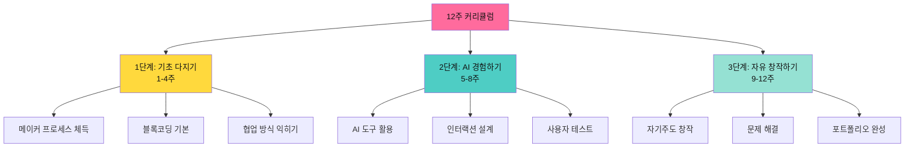

### 주차별 게임 목록 및 난이도

| 주차 | 게임 이름 | 핵심 기술 | 난이도 | 새로운 개념 | 메이커 요소 |
|------|----------|---------|--------|------------|-----------|
| **1주** | 🏃 캐릭터 러닝 | 키보드 입력 | ⭐ | 이동, 충돌 | 캐릭터 디자인 |
| **2주** | 🍎 과일 받기 | 랜덤 생성 | ⭐⭐ | 떨어지기, 점수 | 게임 밸런스 |
| **3주** | 💰 코인 수집 | 4방향 이동 | ⭐⭐ | 변수, 타이머 | 레벨 디자인 |
| **4주** | 🚀 스페이스 슈팅 | 발사 메커니즘 | ⭐⭐⭐ | 복제, 적 AI | 난이도 곡선 |
| **5주** | 😊 표정 마스터 | Face AI | ⭐⭐ | 얼굴 인식 | 표정 카드 제작 |
| **6주** | ✂️ 과일 닌자 | Hand AI | ⭐⭐ | 손 위치 추적 | 속도 조절 실험 |
| **7주** | ✌️ 가위바위보 배틀 | 제스처 인식 | ⭐⭐⭐ | 손 모양 분류 | 게임 규칙 변형 |
| **8주** | 🎭 AR 가면 메이커 | Face+Hand | ⭐⭐⭐⭐ | 복합 AI | 가면 디자인 |
| **9주** | 🎨 AI 그림 그리기 | 손 추적 응용 | ⭐⭐⭐ | 드로잉 로직 | 브러시 설계 |
| **10주** | 🎵 몸으로 연주 | 양손 인식 | ⭐⭐⭐ | 음계 매핑 | 악기 선택 |
| **11주** | 🏀 신체 활동 게임 | 동작 인식 | ⭐⭐⭐⭐ | 실시간 반응 | 스포츠 규칙 |
| **12주** | 🎉 나만의 게임 | 자유 선택 | 자유 | 종합 응용 | 완전 창작 |

---

## 🎓 수업 운영 방식

### 2인 1조 짝 프로그래밍

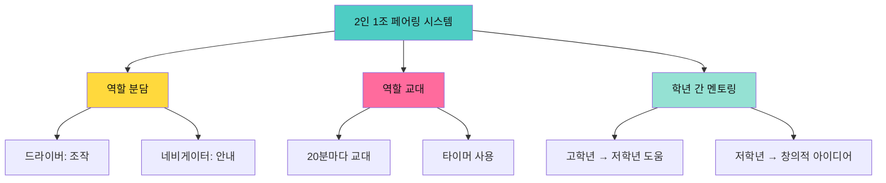

### 페어링 구성 전략

| 조합 | 장점 | 역할 분담 | 주의사항 | 추천 비율 |
|------|------|----------|----------|----------|
| **1학년 + 3학년** | 최대 학습 격차 활용 | 3학년 주도, 1학년 아이디어 | 3학년 독점 방지 | 30% |
| **1학년 + 2학년** | 적절한 도움 가능 | 2학년 친근한 멘토 | 둘 다 서툴 수 있음 | 40% |
| **2학년 + 3학년** | 비슷한 수준 협업 | 평등한 역할 교대 | 경쟁 구도 방지 | 30% |

### 80분 수업 구조 (1차시 + 2차시)

```mermaid
gantt
    title 메이커 수업 타임라인 (80분)
    dateFormat mm
    
    section 1차시 40분
    게임 체험 & 영감          :01, 05m
    아날로그 기획 (종이)       :06, 10m
    템플릿 탐색              :16, 10m
    메이킹 파트1 (저학년 주도) :26, 10m
    역할 교대 & 피어 리뷰     :36, 05m
    
    section 2차시 40분
    빠른 연결                :01, 03m
    메이킹 파트2 (고학년 주도) :04, 22m
    자유 교대 (협업)          :26, 05m
    사용자 테스트 (팀 교환)    :31, 05m
    메이커 갤러리 & 발표       :36, 05m
```

### 1차시 세부 계획 (40분)

| 시간 | 활동 | 교사 역할 | 학생 활동 (2인 1조) | 메이커 가치 |
|------|------|----------|-------------------|-----------|
| **0-5분** | 🎮 게임 체험 | 시연, "이거 해봐!" | 함께 플레이, 관찰 | 영감 받기 |
| **5-10분** | 📝 아날로그 기획 | 워크시트 배포 | 종이에 스케치, 아이디어 | 빠른 프로토타입 |
| **10-15분** | 🔍 템플릿 탐색 | 파일 열기 안내 | 코드 구조 파악 | 분석 능력 |
| **15-20분** | 🎨 메이킹 1 (저학년) | 순회 도움 | 저학년 드라이버, 고학년 안내 | 협업 |
| **20-25분** | 🎨 메이킹 2 (고학년) | ⏰ 역할 교대 알림 | 고학년 드라이버, 저학년 아이디어 | 역할 교대 |
| **25-30분** | 🧪 중간 테스트 | 격려 | 작동 확인, 수정 | 반복 개선 |
| **30-35분** | 💬 짝 간 공유 | 2-3팀 발표 지정 | 옆 팀에게 설명 | 공유 문화 |
| **35-40분** | 🏆 빠른 발표 | 박수, 칭찬 | 자랑하기 | 성취감 |

### 2차시 세부 계획 (40분)

| 시간 | 활동 | 교사 역할 | 학생 활동 (2인 1조) | 메이커 가치 |
|------|------|----------|-------------------|-----------|
| **0-3분** | 🔄 연결 | "지난 시간 열어봐!" | 파일 열기, 실행 | 지속성 |
| **3-25분** | 🚀 자유 메이킹 | 최소 개입, 관찰 | 자유롭게 창작, 역할 교대 | 자기주도 |
| **25-30분** | 🧪 사용자 테스트 | "옆 팀 게임 해봐!" | 다른 팀 플레이, 피드백 | 사용자 경험 |
| **30-35분** | 🔧 최종 수정 | 피드백 반영 독려 | 받은 의견 반영 | 반복 개선 |
| **35-40분** | 🎉 메이커 갤러리 | 전시판 정리 | 스크린샷 공유, 발표 | 전시 & 공유 |

### 메이커 프로세스 실천 방법

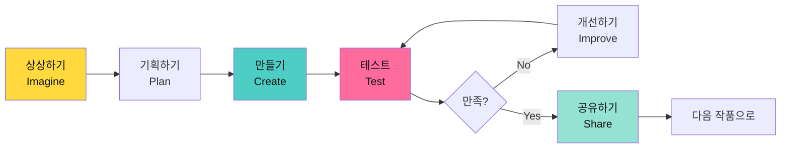

---

## 📊 기대 효과

### 정량적 성과

| 성과 지표 | 목표 | 측정 방법 |
|----------|------|----------|
| **완성 작품 수** | 12개 | 포트폴리오 확인 |
| **AI 프로젝트** | 4개 이상 | Face/Hand AI 사용 확인 |
| **협업 프로젝트** | 2개 이상 | 팀 작업 완성 |
| **아날로그 창작물** | 12개 | 스케치, 기획서 제출 |
| **피어 리뷰 참여** | 12회 이상 | 매주 피드백 활동 |
| **메이커 갤러리** | 매주 1회 | 전시 참여율 |
| **최종 발표회** | 100% 참여 | 메이커 페어 발표 |

### 정성적 성과

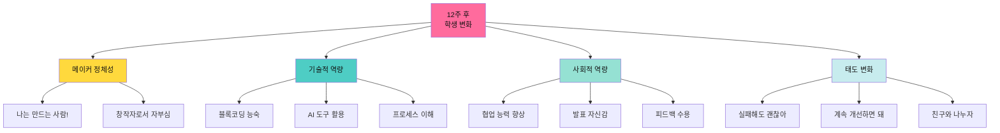

### 학습자 역량 발달 경로

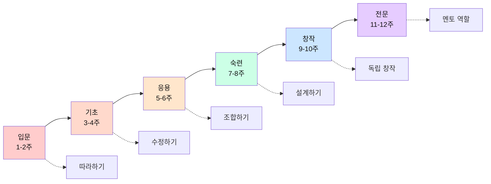

---

## 📁 폴더 구조

```
1_3_class_curriculum/
├── README.md (본 문서)
├── 운영계획서.md (상세 운영 가이드)
├── AI게임_아이디어_모음.md (17개 게임 아이디어)
└── 주차별_수업계획/ (각 주차 상세 수업안)
    ├── 1주차_캐릭터러닝게임.md
    ├── 2주차_과일받기게임.md
    ├── 3주차_코인수집게임.md
    ├── 4주차_스페이스슈팅.md
    ├── 5주차_표정캐치게임.md
    ├── 6주차_손동작컨트롤.md
    ├── 7주차_가위바위보배틀.md
    ├── 8주차_복합AI게임.md
    ├── 9주차_LED반응게임.md
    ├── 10주차_흔들어게임.md
    ├── 11주차_환경인터랙션.md
    └── 12주차_최종프로젝트.md
```

---

## 🔗 관련 문서

- [📋 운영계획서](./운영계획서.md) - 2인 1조 운영, 평가 계획, 준비물 등
- [🎮 AI 게임 아이디어 모음](./AI게임_아이디어_모음.md) - 17개 게임 상세 설명
- [📚 전체 커리큘럼 개요](../curriculum/(기본)_전체_커리큘럼_개요.md)
- [🎯 1-4주차 게임 기획 입문](../curriculum/(기본)_1-4주차_게임기획입문.md)

---

## 📞 문의 및 지원

**메이커 교육 커뮤니티**
- 함께 만들어가는 교육입니다!
- 질문, 아이디어 공유, 성공/실패 사례 환영

**참고 자료**
- MIT Dancing with AI: https://dancingwithai.media.mit.edu/
- MIT Media Lab - Lifelong Kindergarten
- Maker Ed: 메이커 교육 자료

---

**버전**: 2.0.0  
**최종 수정**: 2026-01-15  
**작성자**: 코딩엔메이커 교육팀

> 🎨 **메이커 교육 핵심**: "만들면서 배우고, 공유하면서 성장하고, 실패하면서 개선한다"

> 💡 **수업 모토**: "매주 1개 완성, 매주 1번 공유, 12주 후 메이커로!"
