# 🎮 코딩엔메이커 방과후 수업 운영계획서

## 📋 1. 프로그램 개요

| 구분 | 내용 |
|------|------|
| **프로그램명** | 메이커와 함께하는 AI 게임 제작소 |
| **대상** | 초등학교 1~3학년 |
| **수업 방식** | 🤝 **2인 1조 짝 프로그래밍** (저학년 + 고학년 페어링) |
| **기간** | 12주 (3개월) |
| **수업 시간** | 매주 1회, 80분 (40분 × 2차시) |
| **총 차시** | 12차시 (각 80분) |
| **장소** | 컴퓨터실 (웹캠 필수, 컴퓨터 학생 수 ÷ 2대) |
| **교육 도구** | DWAI 블록코딩, 종이/펜/가위, 프린터 |
| **핵심 기술** | 👤 페이스 AI, ✋ 핸드 AI |
| **메이커 정신** | 🎨 창작 → 🧪 테스트 → 🔄 개선 → 🤝 공유 |

## 🎯 2. 교육 목표 (메이커 중심)

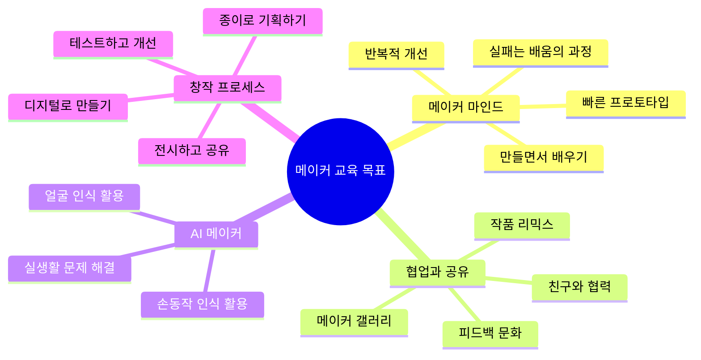

### 🎓 세부 목표
1. **메이커 프로세스 체험**: 기획(종이) → 제작(코딩) → 테스트 → 개선 → 공유
2. **매주 완성 작품 1개**: 포트폴리오 12개 (디지털 + 아날로그)
3. **AI 기술 활용**: 얼굴, 손동작을 창작 도구로 사용
4. **짝 프로그래밍 협업**: 2인 1조로 서로 가르치고 배우기
5. **학년 간 멘토링**: 고학년이 저학년을 돕고, 함께 성장
6. **실생활 문제 해결**: 게임으로 배우고, 메이커로 해결

## 👥 3. 2인 1조 짝 프로그래밍 전략

### 🤝 페어링 원칙

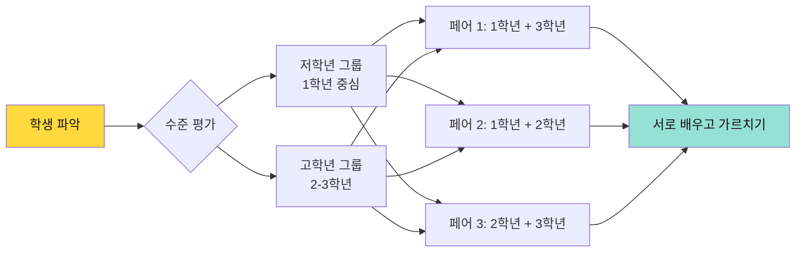

### 🎯 페어 구성 가이드

| 조합 | 장점 | 역할 분담 | 주의사항 |
|------|------|----------|----------|
| **1학년 + 3학년** | 가장 큰 학습 격차 활용 | 3학년: 주도적 제작<br>1학년: 아이디어 제공 | 3학년이 독점하지 않도록 |
| **1학년 + 2학년** | 적절한 도움 가능 | 2학년: 친근한 도움<br>1학년: 따라하며 배우기 | 둘 다 서툴 수 있음 주의 |
| **2학년 + 3학년** | 비슷한 수준으로 협업 | 역할 자주 교대<br>평등한 협업 | 경쟁 구도 방지 |

### 🔄 역할 교대 시스템

**드라이버(Driver)**: 실제로 마우스/키보드 조작  
**네비게이터(Navigator)**: 아이디어 제시, 방향 안내

```mermaid
gantt
    title 40분 수업 내 역할 교대
    dateFormat mm
    section 1차시
    A학생 드라이버      :01, 20m
    B학생 드라이버      :21, 20m
    
    section 2차시
    B학생 드라이버      :01, 20m
    A학생 드라이버      :21, 20m
```

**교대 규칙**
- ⏰ **20분마다 역할 교대** (타이머 사용)
- 🎮 저학년이 먼저 드라이버 (자신감 향상)
- 💡 네비게이터는 옆에서 응원하고 아이디어 제공
- 🤝 막히면 언제든 역할 바꿔도 OK

### 📋 짝 활동 예시

**1차시 (40분)**
```
0-20분: 저학년이 드라이버
- 고학년: "여기 클릭해봐!" "이 색 어때?"
- 저학년: 직접 조작하며 배우기

20-40분: 고학년이 드라이버
- 저학년: "저거 바꿔봐!" "더 빠르게!"
- 고학년: 빠르게 구현하는 모습 보여주기
```

**2차시 (40분)**
```
0-20분: 역할 반대로 시작
20-40분: 자유롭게 교대 (협의)
```

### 🎓 학년별 맞춤 수정 사항

각 프로젝트마다 **초급/중급/고급** 수정 옵션 제공!

## 📊 4. 전체 커리큘럼 구조 (메이커 통합)

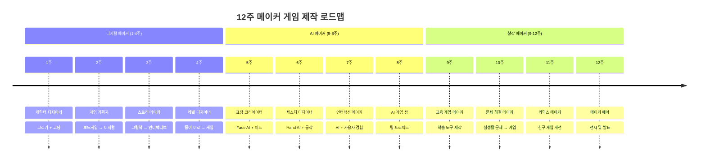

## 📅 5. 주차별 메이커 프로젝트 (학년별 수정 사항 포함)

### 🎮 1단계: 블록코딩 게임 워밍업 (1-4주)

> **수업 방식**: 완성된 게임 플레이(5분) → 바로 만들기(30분) → 친구와 플레이(5분)

#### 📘 1주차: 🏃 달려라 캐릭터

**게임**: 키보드로 점프하며 장애물 피하기

| 난이도 | 대상 | 수정 사항 | 블록 예시 |
|--------|------|----------|----------|
| **⭐ 초급** | 1학년 | ✅ 캐릭터 색 바꾸기<br>✅ 배경 색 바꾸기<br>✅ 크기 조절 | `캐릭터 색 = "빨강"`<br>`크기 = 50` |
| **⭐⭐ 중급** | 2학년 | ✅ 초급 + <br>✅ 장애물 모양 바꾸기<br>✅ 속도 조절<br>✅ 점프 높이 | `속도 = 5`<br>`점프력 = 100` |
| **⭐⭐⭐ 고급** | 3학년 | ✅ 중급 + <br>✅ 새 장애물 추가<br>✅ 파워업 아이템<br>✅ 배경 음악 | `새 장애물 만들기`<br>`아이템 효과` |

**짝 활동 예시**
- 1학년+3학년 조: 1학년이 색 고르고, 3학년이 새 장애물 추가
- 2학년+3학년 조: 함께 속도와 난이도 조절하며 테스트

---

#### 📘 2주차: 🍎 과일 떨어뜨리기

**게임**: 바구니 움직여서 과일 받기

| 난이도 | 대상 | 수정 사항 | 블록 예시 |
|--------|------|----------|----------|
| **⭐ 초급** | 1학년 | ✅ 과일 종류 바꾸기<br>✅ 바구니 색 바꾸기<br>✅ 떨어지는 속도 | `과일 = "딸기"`<br>`속도 = 느림` |
| **⭐⭐ 중급** | 2학년 | ✅ 초급 + <br>✅ 폭탄 추가 (피해야 함)<br>✅ 점수 규칙 변경<br>✅ 특수 과일 | `폭탄 등장`<br>`딸기 = 10점` |
| **⭐⭐⭐ 고급** | 3학년 | ✅ 중급 + <br>✅ 레벨 시스템<br>✅ 콤보 보너스<br>✅ 생명 시스템 | `레벨 1: 느림`<br>`레벨 2: 빠름` |

**짝 활동 예시**
- 저학년이 좋아하는 과일 선택
- 고학년이 게임 밸런스 조정

---

#### 📘 3주차: 👾 괴물 잡기

**게임**: 클릭해서 나타나는 괴물 잡기

| 난이도 | 대상 | 수정 사항 | 블록 예시 |
|--------|------|----------|----------|
| **⭐ 초급** | 1학년 | ✅ 괴물 모양 바꾸기<br>✅ 배경 바꾸기<br>✅ 제한 시간 늘리기 | `괴물 = "👻"`<br>`시간 = 60초` |
| **⭐⭐ 중급** | 2학년 | ✅ 초급 + <br>✅ 괴물별 점수 다르게<br>✅ 나타나는 속도 조절<br>✅ 효과음 추가 | `유령 = 10점`<br>`박쥐 = 20점` |
| **⭐⭐⭐ 고급** | 3학년 | ✅ 중급 + <br>✅ 보스 괴물 등장<br>✅ 특수 능력 괴물<br>✅ 난이도 증가 시스템 | `보스 = 100점`<br>`10초마다 빨라짐` |

**짝 활동 예시**
- 두 명이 교대로 드라이버
- 네비게이터가 "거기! 저거!" 아이디어 제공

---

#### 📘 4주차: 🎯 슈팅 게임

**게임**: 스페이스바로 발사!

| 난이도 | 대상 | 수정 사항 | 블록 예시 |
|--------|------|----------|----------|
| **⭐ 초급** | 1학년 | ✅ 우주선 모양/색<br>✅ 탄알 색 바꾸기<br>✅ 적 모양 바꾸기 | `우주선 = "🚀"`<br>`탄알 = 빨강` |
| **⭐⭐ 중급** | 2학년 | ✅ 초급 + <br>✅ 적 종류 추가<br>✅ 발사 속도 조절<br>✅ 폭발 효과 | `발사 속도 = 빠름`<br>`적 3종류` |
| **⭐⭐⭐ 고급** | 3학년 | ✅ 중급 + <br>✅ 파워업 무기<br>✅ 보스전<br>✅ 생명 시스템 | `특수 무기 획득`<br>`보스 체력` |

**짝 활동 예시**
- 함께 게임 밸런스 테스트
- 누가 더 높은 점수 내나 경쟁

### 🤖 2단계: AI 신체 게임 (Face & Hand AI) (5-8주)

> **수업 방식**: AI 마법 체험(5분) → 내 얼굴/손으로 게임하기(30분) → 최고 점수 대결(5분)

#### 📘 5주차: 😊 표정 마스터 (Face AI)

**게임**: 화면에 나오는 표정 따라하기! "😊 웃어봐!" → 웃으면 득점

| 난이도 | 대상 | 수정 사항 | 블록 예시 |
|--------|------|----------|----------|
| **⭐ 초급** | 1학년 | ✅ 표정별 점수 바꾸기<br>✅ 배경 색 바꾸기<br>✅ 제한 시간 늘리기 | `웃음 = 10점`<br>`시간 = 60초` |
| **⭐⭐ 중급** | 2학년 | ✅ 초급 + <br>✅ 어려운 표정 추가<br>✅ 콤보 시스템<br>✅ 효과음 | `연속 3번 = +50점`<br>`윙크 추가` |
| **⭐⭐⭐ 고급** | 3학년 | ✅ 중급 + <br>✅ 랜덤 표정 모드<br>✅ 난이도 조절<br>✅ 2인 대전 | `랜덤 등장`<br>`쉬움/보통/어려움` |

**짝 활동**: 한 명씩 표정 테스트, 상대방이 응원!

---

#### 📘 6주차: ✂️ 과일 닌자 (Hand AI)

**게임**: 손을 움직여서 날아오는 과일 자르기!

| 난이도 | 대상 | 수정 사항 | 블록 예시 |
|--------|------|----------|----------|
| **⭐ 초급** | 1학년 | ✅ 과일 종류 선택<br>✅ 날아오는 속도 느리게<br>✅ 큰 과일 | `과일 = "🍎🍌🍉"`<br>`속도 = 느림` |
| **⭐⭐ 중급** | 2학년 | ✅ 초급 + <br>✅ 폭탄 추가 (피하기)<br>✅ 콤보 시스템<br>✅ 특수 과일 | `폭탄 = -10점`<br>`골드 과일 = 50점` |
| **⭐⭐⭐ 고급** | 3학년 | ✅ 중급 + <br>✅ 양손 사용<br>✅ 스페셜 모드<br>✅ 타임어택 | `오른손/왼손 구분`<br>`30초 챌린지` |

**짝 활동**: 교대로 플레이, 최고 점수 경쟁!

---

#### 📘 7주차: 🐦 플래피 페이스 (Face AI)

**게임**: 입을 벌리면 새가 날아올라! 입 벌림 정도로 높이 조절

| 난이도 | 대상 | 수정 사항 | 블록 예시 |
|--------|------|----------|----------|
| **⭐ 초급** | 1학년 | ✅ 새 모양 바꾸기<br>✅ 장애물 간격 넓게<br>✅ 느린 속도 | `새 = "🐤"`<br>`장애물 간격 = 넓음` |
| **⭐⭐ 중급** | 2학년 | ✅ 초급 + <br>✅ 장애물 종류 추가<br>✅ 점수 아이템<br>✅ 배경 변경 | `구름, 나무 등`<br>`코인 = +5점` |
| **⭐⭐⭐ 고급** | 3학년 | ✅ 중급 + <br>✅ 입 크기로 속도 조절<br>✅ 장애물 움직임<br>✅ 하드 모드 | `작게 = 천천히`<br>`크게 = 빠르게` |

**짝 활동**: 한 명이 플레이, 한 명이 응원! "아~ 해! 아~!"

---

#### 📘 8주차: 🎭 AR 가면 메이커 (Face AI)

**게임**: 내 얼굴에 실시간으로 가면 씌우기! 웃으면 색 변경, 윙크하면 반짝

| 난이도 | 대상 | 수정 사항 | 블록 예시 |
|--------|------|----------|----------|
| **⭐ 초급** | 1학년 | ✅ 가면 종류 선택<br>✅ 색상 바꾸기<br>✅ 스티커 추가 | `가면 = "고양이"`<br>`색 = 분홍` |
| **⭐⭐ 중급** | 2학년 | ✅ 초급 + <br>✅ 표정별 효과 추가<br>✅ 액세서리 조합<br>✅ 사진 저장 | `웃음 = 반짝`<br>`모자+안경+수염` |
| **⭐⭐⭐ 고급** | 3학년 | ✅ 중급 + <br>✅ 움직이는 효과<br>✅ 소리 반응<br>✅ 친구 얼굴 합성 | `애니메이션 효과`<br>`2명 함께` |

**짝 활동**: 함께 가면 디자인, 사진 찍어서 자랑!

### 🌟 3단계: AI 크리에이터 (고급 & 창작) (9-12주)

> **수업 방식**: 영감 받기(5분) → 자유롭게 만들기(30분) → 친구와 공유(5분)

| 주차 | 완성 게임 | 게임 플레이 방식 | AI 기술 | 학생이 바꾸는 것 | 창작 포인트 |
|------|-----------|-----------------|---------|----------------|-----------|
| **9주** | 🎨 AI 그림 그리기 | 손으로 공중에 그리면 화면에 그림!<br>표정으로 색 바꾸기 | **Face + Hand**<br>복합 인식 | - 브러시 종류<br>- 색상 규칙<br>- 특수 효과<br>- 저장 기능 | "허공에 그린다!" |
| **10주** | 🎵 몸으로 연주하기 | 손 위치로 음계 연주!<br>왼손-낮은음, 오른손-높은음 | **Hand AI**<br>양손 추적 | - 악기 선택<br>- 음계 배치<br>- 녹음 기능<br>- 반주 추가 | "나는 음악가!" |
| **11주** | 🏀 신체 활동 게임 | 손을 올리면 골대 위치 변경!<br>팔을 뻗어서 공 막기 | **Hand AI**<br>동작 인식 | - 스포츠 종류<br>- 난이도<br>- 2인 대전<br>- 득점 규칙 | "진짜 운동하는 느낌!" |
| **12주** | 🎉 나만의 AI 게임 | **자유 창작!**<br>11주간 배운 모든 기술 활용<br>원하는 게임 만들기 | **학생 선택**<br>Face/Hand 자유 | - **전부 자유**<br>- 장르 선택<br>- 규칙 제작<br>- 완전 창작 | "내가 게임 개발자!" |

### 🎊 12주차 특별: 메이커 페어 & 게임 대회
- 오전: 자유 제작
- 오후: 메이커 페어 (부모님 초대)
  - 게임 플레이 부스
  - 베스트 게임 투표
  - 시상식 & 수료식

## 🎯 6. 메이커 수업 운영 방식 (2인 1조)

### 📖 메이커 프로세스 기반 수업 구조 (80분)

```mermaid
gantt
    title 메이커 수업 구조 (80분)
    dateFormat mm
    section 1차시 (40분)
    영감 & 관찰 5분         :01, 05m
    아날로그 기획 10분      :06, 10m
    디지털 탐색 10분        :16, 10m
    빠른 프로토타입 10분    :26, 10m
    피어 리뷰 5분           :36, 05m
    
    section 2차시 (40분)
    반복 개선 시작 3분      :01, 03m
    자유 메이킹 22분        :04, 22m
    사용자 테스트 10분      :26, 10m
    메이커 갤러리 5분       :36, 05m
```

### 🔄 메이커 사이클 (매주 반복)

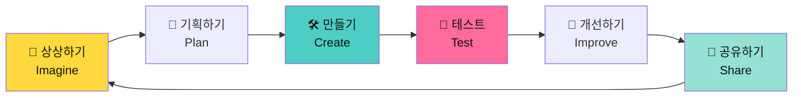

### 🎮 1차시 세부 내용 (2인 1조 플레이 & 메이킹 - 40분)

| 시간 | 활동 | 교사 | 짝 활동 (2인 1조) | 역할 |
|------|------|------|-----------------|------|
| **5분** | 🎮 **게임 플레이!** | - "이거 해봐!" 게임 실행<br>- 시연 | - 함께 게임 보기<br>- "우리도 만들자!" | 둘 다 관찰 |
| **3분** | 💡 **오늘의 미션** | - 초급/중급/고급 제시<br>- "각자 선택!" | - 짝과 상의<br>- "우리 뭐 할까?" | 함께 기획 |
| **2분** | 🚀 **템플릿 실행** | - 파일 열기 안내 | - 한 컴퓨터에 모이기<br>- 역할 정하기 | 역할 분담 |
| **20분** | 🎨 **파트 1 메이킹** | - 순회하며 도움<br>- ⏰ 20분 타이머 | - **저학년이 드라이버**<br>- 고학년이 옆에서 안내<br>- "이거 해봐!" | 🖱️ 저학년<br>💡 고학년 |
| **5분** | 🔄 **역할 교대** | - "바꿔!"<br>- 간식/화장실 | - 자리 교대<br>- 지금까지 확인 | 교대 시간 |
| **5분** | 🏆 **빠른 공유** | - 2-3팀 발표<br>- 박수! | - 함께 발표<br>- 역할 설명 | 함께 자랑 |

**핵심 철학**: 
- 이론 0%, 설명 5%, 직접 하기 95%!
- 혼자보다 함께가 더 재미있다!
- 가르치면서 더 배운다!

### 🎮 2차시 세부 내용 (2인 1조 완성하기 - 40분)

| 시간 | 활동 | 교사 | 짝 활동 (2인 1조) | 역할 |
|------|------|------|-----------------|------|
| **2분** | 🔄 **빠른 연결** | - "지난 시간 거 열어봐!" | - 파일 열기<br>- 게임 실행 | 함께 확인 |
| **3분** | 💡 **도전 과제** | - 심화 옵션 제시<br>- "선택!" | - 짝과 상의<br>- 난이도 선택 | 함께 계획 |
| **20분** | 🚀 **파트 2 메이킹** | - 최소 개입<br>- ⏰ 20분 타이머 | - **고학년이 드라이버**<br>- 저학년이 아이디어 제공<br>- "저거 해봐!" | 🖱️ 고학년<br>💡 저학년 |
| **5분** | 🔄 **자유 교대** | - "필요하면 바꿔도 돼" | - 원하면 교대<br>- 또는 협업 | 자유 선택 |
| **5분** | 🧪 **다른 팀 테스트** | - "옆 팀 게임 해봐!" | - 다른 팀 게임 플레이<br>- 피드백 포스트잇 | 팀 간 교류 |
| **5분** | 🎉 **게임 대회!** | - 팀 대항전<br>- 우승팀 박수 | - 팀별 최고 점수<br>- 함께 축하 | 함께 즐기기 |

**2차시 포인트**:
- 역할 바꿔서 양쪽 다 경험
- 막히면 역할 자유롭게 교대
- 가장 중요한 건 **함께 완성!**

### 🎓 짝 프로그래밍 성공 팁

#### ✅ 잘 작동하는 짝

- 🤝 서로 아이디어를 존중
- 💬 많이 대화하고 상의
- 🔄 역할을 자연스럽게 교대
- 🎉 함께 성공을 축하

#### ⚠️ 교사 개입이 필요한 경우

- 😢 한 명이 소외되는 경우
- 🗣️ 한 명이 독점하는 경우
- 😠 의견 충돌이 심한 경우
- 🆘 둘 다 너무 어려워하는 경우

**해결책**: 
1. 잠깐 역할 교대 시키기
2. 각자 역할 명확히 정해주기
3. 페어 재배치 (단, 조심스럽게)
4. 선생님이 함께 앉아서 중재

#### 📊 페어 점검 체크리스트

매주 관찰하며 체크:

| 체크 항목 | 잘 됨 | 보통 | 개선 필요 |
|----------|------|------|----------|
| 두 명 다 참여하는가? | ✅ | △ | ❌ |
| 역할 교대가 자연스러운가? | ✅ | △ | ❌ |
| 대화를 많이 하는가? | ✅ | △ | ❌ |
| 함께 문제를 해결하는가? | ✅ | △ | ❌ |
| 서로를 존중하는가? | ✅ | △ | ❌ |

## 🎯 7. 메이커 친화적 템플릿 설계

### 📦 템플릿 구조 (메이커 철학 반영)

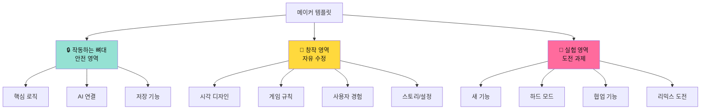

### 🛠️ 메이커를 위한 설계 원칙

**1. 실패해도 괜찮은 구조**
- 원본 템플릿 항상 접근 가능
- "되돌리기" 버튼 강조
- 실험 공간 제공

**2. 점진적 복잡도**
- 1단계: 값만 변경 (색, 속도)
- 2단계: 요소 추가/삭제
- 3단계: 새로운 기능 창작

**3. 아날로그 → 디지털 연결**
- 종이 스케치 → 디지털 구현
- 보드게임 → 컴퓨터 게임
- 손그림 → 업로드 기능

### ✅ 좋은 템플릿 체크리스트

- [ ] **즉시 실행 가능**: 열자마자 플레이 가능
- [ ] **명확한 수정 포인트**: 주석으로 "여기를 바꿔보세요!" 표시
- [ ] **안전한 구조**: 핵심 코드는 건드리지 않아도 됨
- [ ] **확장 가능**: 새로운 요소 추가 가능
- [ ] **재미 요소**: 그냥 플레이해도 재미있음

### 📝 템플릿 주석 예시

```python
# 🎨 여기를 바꿔보세요! 
캐릭터_색깔 = "빨강"  # 다른 색: 파랑, 초록, 노랑

# ⚡ 도전! 속도를 조절해보세요
캐릭터_속도 = 5  # 1(느림) ~ 10(빠름)

# 🔒 이 아래는 건드리지 마세요! (게임이 작동하는 코드)
게임_시작()
```

## 🎮 7. 개발 프로세스 학습 전략

### 🔄 실습으로 배우는 게임 개발

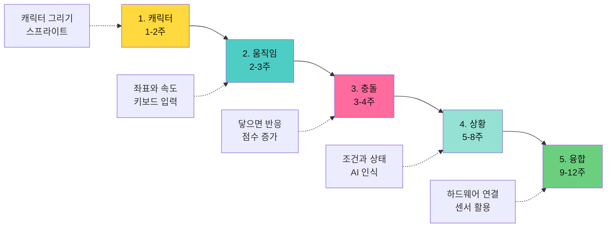

### 📚 주차별 학습 개념 (자연스럽게 습득)

| 게임 요소 | 학습 주차 | 구체적 경험 | 블록코딩 개념 |
|-----------|----------|-------------|---------------|
| **캐릭터** | 1주, 2주 | - 캐릭터 그리기/선택<br>- 크기 조절<br>- 여러 개 만들기 | 스프라이트, 속성 |
| **움직임** | 1-3주 | - 키보드로 이동<br>- 자동으로 떨어지기<br>- 부드럽게 움직이기 | 좌표, 속도, 이벤트 |
| **충돌** | 2-4주 | - 과일 받으면 점수<br>- 적 맞으면 게임오버<br>- 벽에 닿으면 튕기기 | 충돌 감지, 조건문 |
| **상황** | 5-8주 | - 표정에 따라 반응<br>- 손 위치로 조작<br>- AI가 판단하기 | AI 블록, 분류, 인식 |
| **융합** | 9-12주 | - 센서 값 읽기<br>- LED 제어하기<br>- 화면과 연동 | 하드웨어 통신, 센서 |

## 📋 8. 준비물 및 메이커 환경 구성

### 🖥️ 디지털 환경

| 항목 | 사양 | 수량 | 비고 |
|------|------|------|------|
| **컴퓨터** | 웹캠 내장 필수 | **학생 수 ÷ 2** | 2인 1조 |
| **인터넷** | 안정적 연결 | - | 실시간 AI 처리 |
| **브라우저** | Chrome 권장 | - | DWAI 호환성 |
| **프린터** | 컬러 권장 | 1대 | 워크시트, 포트폴리오 |
| **타이머** | 시각적 타이머 | 1개 | 20분 역할 교대용 |

### 🎨 메이커 도구 (최소화)

| 항목 | 용도 | 수량 | 비고 |
|------|------|------|------|
| **메모지** | 빠른 아이디어 스케치 | 학생당 몇 장 | 5분 스케치용 |
| **색연필** | 캐릭터 간단 그리기 | 공용 세트 | 선택사항 |
| **칭찬 스티커** | 친구 작품 칭찬 | 많이 | 갤러리 워크용 |
| **포트폴리오 폴더** | 작품 정리 | 학생당 1개 | 스크린샷 모음 |

**메이커 철학**: 종이는 최소화, 디지털에서 바로 만들기!
- 종이 스케치: 5분 이내
- 나머지 35분: 컴퓨터로 만들기

### 📚 교사 준비 자료

**매주 준비 (디지털)**
- [ ] 해당 주차 템플릿 파일
- [ ] 예시 완성본 2-3개
- [ ] 온라인 갤러리 세팅

**매주 준비 (아날로그)**
- [ ] 워크시트 인쇄 (학생 수)
- [ ] 기획서 양식 출력
- [ ] 평가 체크리스트
- [ ] 스티커/스탬프 (칭찬용)

**학기 초 준비**
- [ ] 학생 계정 생성
- [ ] 웹캠 테스트 (전체 컴퓨터)
- [ ] 메이커 스페이스 환경 구성
- [ ] 포트폴리오 폴더 준비

### 🏫 메이커 스페이스 환경 구성 (2인 1조 특화)

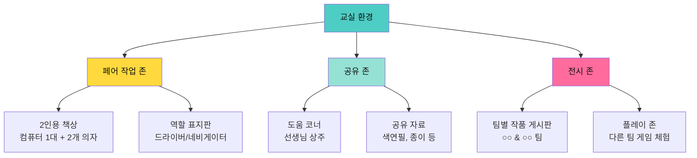

### 🪑 2인 1조 좌석 배치 예시

```
┌─────────────── 화이트보드 ──────────────────┐
│                                              │
│   👨‍💻👦    👨‍💻👦    👨‍💻👦    👨‍💻👦       │
│  페어1    페어2    페어3    페어4            │
│                                              │
│   👨‍💻👦    👨‍💻👦    👨‍💻👦    👨‍💻👦       │
│  페어5    페어6    페어7    페어8            │
│                                              │
│        🎨 공유 자료 테이블                     │
│                                              │
│  [전시판] [전시판] [전시판] [전시판]            │
└──────────────────────────────────────────────┘

각 페어: 의자 2개 + 컴퓨터 1대
간격: 페어끼리 대화하기 좋게 배치
```

## 📊 9. 메이커 평가 계획

### 🎯 메이커 중심 평가 방식

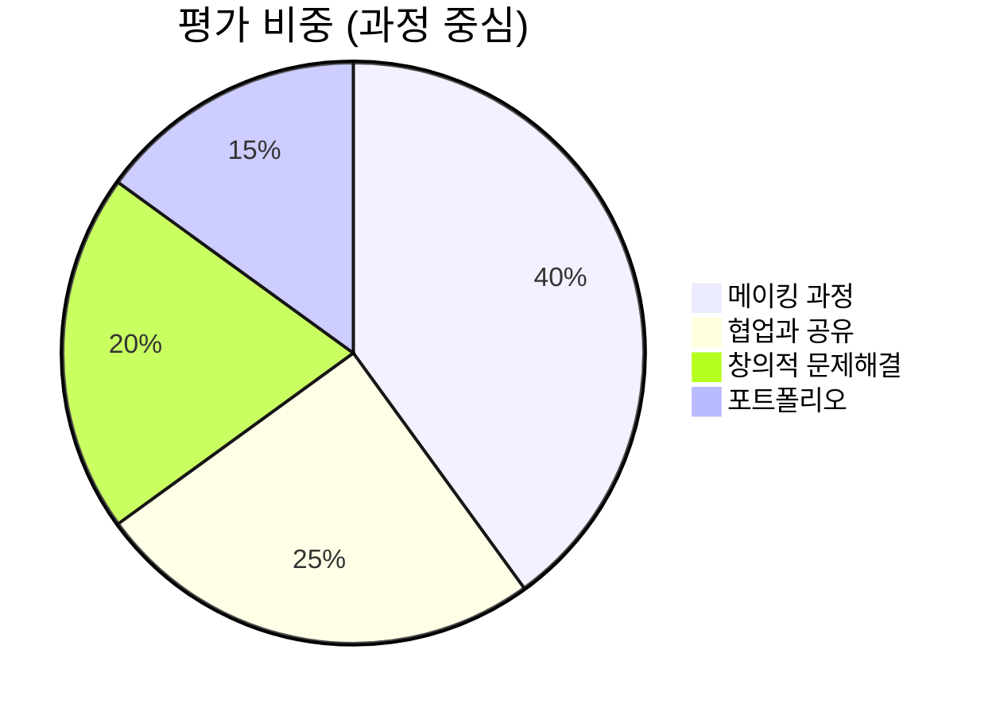

### 🌟 메이커 마인드 평가 기준

**"완벽한 결과"보다 "시도와 개선"을 평가**

| 메이커 가치 | 평가 항목 | 관찰 방법 |
|------------|----------|----------|
| **만들면서 배우기** | 적극적 실험 | 다양한 시도를 하는가? |
| **실패를 배움으로** | 문제 해결 태도 | 막혔을 때 재시도하는가? |
| **공유와 협업** | 오픈소스 정신 | 아이디어를 나누는가? |
| **반복적 개선** | 피드백 수용 | 피드백을 반영하는가? |
| **사용자 중심** | 테스트 참여 | 친구에게 테스트하는가? |

### ✅ 주차별 메이커 체크리스트 (교사용)

| 평가 항목 | 1-4주 (디지털 메이커) | 5-8주 (AI 메이커) | 9-12주 (창작 메이커) |
|----------|---------------------|------------------|-------------------|
| **프로토타이핑** | 종이→디지털 전환 | 아날로그 기획 | 문제 발견→해결 |
| **메이킹 과정** | 템플릿 수정 성공 | AI 활용 실험 | 독립적 제작 |
| **창의적 사고** | 캐릭터/규칙 변경 | 독특한 인터랙션 | 문제 해결 아이디어 |
| **협업** | 아이디어 공유 | 사용자 테스트 | 팀 프로젝트 |
| **개선 능력** | 피드백 반영 | 반복 개선 | 리믹스 제작 |
| **공유 문화** | 작품 설명 | 메이커 갤러리 | 메이커 페어 발표 |

### 📁 메이커 포트폴리오 구성

**12주 메이커 포트폴리오 (디지털 + 아날로그)**

```markdown
[학생 이름]의 메이커 포트폴리오
================================

📅 기간: ____년 __월 ~ __월
🎯 메이커 모토: "________________"

━━━━━━━━━━━━━━━━━━━━━━━━━━━━━━

[ 1주차: 캐릭터 디자이너 ]
📱 디지털 게임: [스크린샷]
🎨 아날로그 작업: [캐릭터 스케치 사진]
💭 메이킹 과정: ___________
⭐ 배운 점: ___________

[ 5주차: 표정 인식 게임 ]
📱 AI 게임: [스크린샷]
🎨 표정 카드: [사진]
🤖 AI 활용: Face Recognition
💭 어려웠던 점: ___________
💡 해결 방법: ___________

...

[ 12주차: 메이커 페어 ]
🏆 최종 작품: ___________
📊 사용 기술: Face AI ☑ Hand AI ☑ 
📝 프로젝트 설명: ___________
👥 테스터 피드백: ___________
🌟 가장 뿌듯했던 순간: ___________

━━━━━━━━━━━━━━━━━━━━━━━━━━━━━━

📈 나의 메이커 성장 그래프
[1주차] ▁▁▁▁▁
[6주차] ▁▁▁▁▁▁▁▁
[12주차] ▁▁▁▁▁▁▁▁▁▁▁▁
```

### 🎨 포트폴리오 전시 형태

1. **디지털 갤러리**: 온라인 웹사이트
2. **물리적 전시**: 인쇄물 + QR코드
3. **발표 자료**: PPT 또는 포스터
4. **작품집**: 제본된 포트폴리오북

## 🎓 10. 기대 효과 (메이커 관점)

### 🌟 메이커로 성장하는 학생

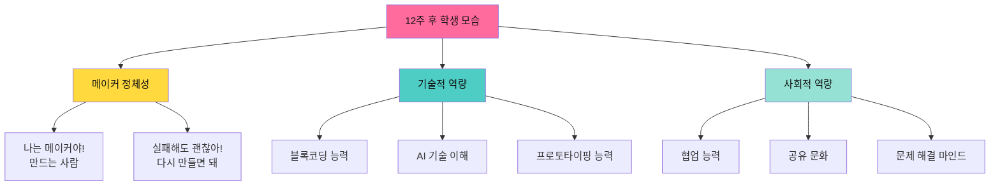

### 📈 정량적 목표

- ✅ **완성 작품**: 12개 (매주 1개)
- ✅ **AI 프로젝트**: 4개 (Face/Hand AI)
- ✅ **협업 프로젝트**: 2개 (팀 작업)
- ✅ **아날로그 창작물**: 12개 (스케치, 기획서 등)
- ✅ **피어 리뷰 경험**: 12회 이상
- ✅ **메이커 갤러리 참여**: 매주
- ✅ **최종 메이커 페어**: 1회

### 💡 정성적 목표 (메이커 마인드)

- 🎨 **메이커 정체성**: "나는 무언가를 만드는 사람이야!"
- 🔄 **반복 개선 태도**: "더 좋게 만들 수 있어!"
- 🤝 **공유와 협업**: "친구 아이디어도 좋은데? 같이 해보자!"
- 🧪 **실험 정신**: "이렇게 하면 어떻게 될까?"
- 💪 **실패 긍정**: "안 되네? 다른 방법을 시도해보자!"
- 🤖 **AI 도구화**: "AI를 내 창작 도구로 사용할 수 있어!"
- 🌍 **문제 해결 의식**: "이 문제를 게임으로 해결할 수 있을까?"

## 📞 11. 학부모 소통 계획

### 📧 소통 채널

| 시기 | 방법 | 내용 |
|------|------|------|
| **오리엔테이션** | 가정통신문 | 전체 커리큘럼 소개, 준비물 안내 |
| **매주** | 사진 공유 | 이번 주 게임 스크린샷, 작품 공유 |
| **월 1회** | 뉴스레터 | 학습 내용 정리, 우수 작품 소개 |
| **최종** | 발표회 초대 | 학부모 참관, 포트폴리오 전시 |

### 🎉 최종 메이커 페어 (12주차 + 연장)

**메이커 페어 구성**
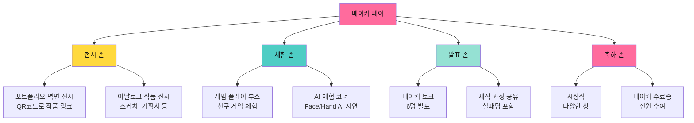

### 🏅 메이커 페어 시상 (모든 학생 수상)

- 🎨 **크리에이티브 메이커**: 가장 창의적인 아이디어
- 🤝 **협업 메이커**: 친구를 많이 도와준 학생
- 🔄 **리믹스 메이커**: 개선을 가장 많이 한 학생
- 🧪 **익스페리먼탈 메이커**: 다양한 시도를 한 학생
- ⚡ **스피드 메이커**: 빠르게 프로토타입을 만드는 학생
- 💡 **프라블럼 솔버**: 문제 해결 능력이 뛰어난 학생
- 🎯 **AI 메이커**: AI 기술을 잘 활용한 학생
- 🌟 **슈퍼 메이커**: 종합적으로 뛰어난 학생

## 📚 12. 참고 자료

### 🌐 온라인 리소스

**메이커 교육 참고**
- **MIT Media Lab - Lifelong Kindergarten**: 메이커 교육 철학
- **Maker Ed**: 메이커 교육 자료 및 사례
- **Scratch 커뮤니티**: 리믹스 문화 참고

**AI 교육 참고**
- **MIT Dancing with AI**: https://dancingwithai.media.mit.edu/
  - PoseBlocks 예제 참고
  - Hand/Face Sensing 프로젝트 아이디어
  - 메이커 스타일 교육 사례

**블록코딩 플랫폼**  
- **DWAI 블록코딩**: 공식 튜토리얼, 템플릿

### 📖 교사 연수 권장

**기술 연수**
- AI 블록코딩 기초 (2시간)
- Face/Hand AI 활용법 (1시간)
- 템플릿 제작 실습 (1시간)

**메이커 교육 연수**
- 메이커 교육 철학과 실천 (2시간)
- 프로토타이핑 워크숍 (2시간)
- 피드백과 평가 방법 (1시간)

---

## ✅ 운영 체크리스트

### 📅 수업 시작 2주 전
- [ ] 전체 템플릿 12개 제작 완료
- [ ] 컴퓨터실 웹캠 작동 확인
- [ ] DWAI 플랫폼 학생 계정 생성
- [ ] 학부모 안내문 발송

### 📅 수업 시작 1주 전
- [ ] 1주차 템플릿 최종 테스트
- [ ] 예시 작품 2-3개 제작
- [ ] 수업 PPT/가이드 준비
- [ ] 마이크로비트 구매/점검 (9주차용)

### 📅 매주 수업 전날
- [ ] 해당 주차 템플릿 재점검
- [ ] 웹캠/AI 기능 테스트 (5주차부터)
- [ ] 이전 주차 학생 작품 백업
- [ ] 발표자 미리 선정 (자원자 우선)

### 📅 매주 수업 후
- [ ] 학생 작품 저장 및 백업
- [ ] 사진 촬영 (포트폴리오용)
- [ ] 학부모 공유용 자료 정리
- [ ] 다음 주 준비사항 점검

---

**작성일**: 2026-01-15  
**작성자**: [교사명]  
**문의**: [이메일]

> 🎨 **메이커 교육 핵심**: "만들면서 배우고, 공유하면서 성장하고, 실패하면서 개선한다"

> 💡 **수업 모토**: "매주 1개 완성, 매주 1번 공유, 12주 후 메이커로!"

## 📎 부록: 메이커 수업 vs 전통 수업 비교

| 구분 | 전통적 코딩 수업 | 메이커 수업 (본 커리큘럼) |
|------|----------------|------------------------|
| **시작** | 이론 설명 → 실습 | 작품 체험 → 만들기 |
| **제작** | 완벽한 결과 추구 | 빠른 프로토타입 |
| **오류** | 오류 = 실패 | 오류 = 학습 기회 |
| **과정** | 혼자 작업 | 협업과 공유 |
| **평가** | 정답 여부 | 시도와 개선 과정 |
| **결과** | 디지털만 | 디지털 + 아날로그 |
| **태도** | 코드 작성자 | 창작자/메이커 |

## 🎯 메이커 교육 성공 포인트

1. **실패를 축하하기**: "실패 = 배움의 시작"
2. **과정 전시하기**: 완성작뿐 아니라 스케치도 전시
3. **리믹스 문화**: 친구 작품 개선하기를 장려
4. **빠른 피드백**: 만들고 → 테스트 → 개선 반복
5. **메이커 정체성**: "나는 만드는 사람"이라는 자부심

---

**메이커 커뮤니티 문의환영!** 함께 만들어가요! 🚀
