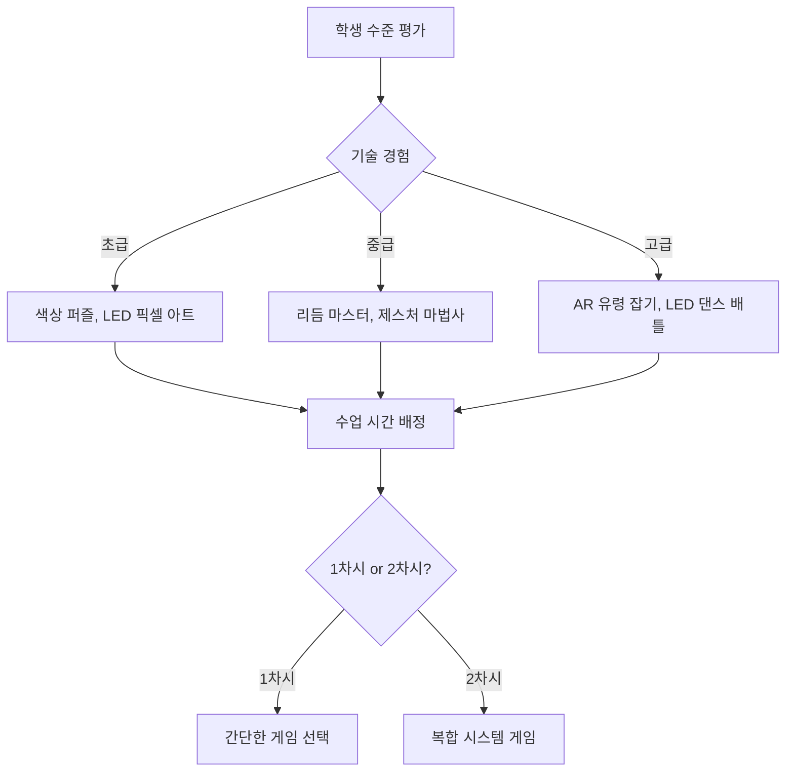

# 🎮 3-6학년 게임 아이디어 모음집

> **DWAI + Teachable Machine + 마이크로비트로 만드는 12주 게임**  
> 매주 1개 완성, 템플릿 수정 방식, 카카오톡 공유

## 📖 목차

- [1단계: DWAI 게임 (1-4주)](#1단계-dwai-게임-1-4주)
- [2단계: Teachable Machine AI 게임 (5-8주)](#2단계-teachable-machine-ai-게임-5-8주)
- [3단계: 마이크로비트 게임 (9-12주)](#3단계-마이크로비트-게임-9-12주)

---

## 🎮 1단계: DWAI 게임 (1-4주)

### 1주차: 🍔 햄버거 먹방 게임

**템플릿 기반**: 완성된 게임에서 시작

**수정 가능한 부분**
```python
# 음식 종류 바꾸기
음식 = ["🍔", "🍕", "🍗", "🍟"]

# 떨어지는 속도
속도 = 5  # 1~10

# 목표 점수
목표 = 20

# 제한 시간
시간 = 30초
```

**재미있는 인터페이스**
- 먹으면 "냠냠" 소리
- 햄버거가 점점 커짐
- 콤보 시스템: 연속으로 먹으면 보너스!
- 폭탄 피하기: 💣 먹으면 -5점

**카카오톡 공유**
```
"🍔 내가 만든 햄버거 게임!
최고 기록: 35개

너는 몇 개 먹을 수 있어?
[게임 하기 ▶️]"
```

---

### 2주차: 🎯 타겟 슈팅 게임

**템플릿**: 움직이는 과녁 맞추기

**수정 요소**
```python
# 과녁 모양
과녁 = ["🎯", "🎈", "⚽", "👾"]

# 과녁 크기 (점수)
큰과녁 = 10점  # 쉬움
중간과녁 = 50점  # 보통
작은과녁 = 100점  # 어려움

# 움직임 패턴
패턴 = "지그재그", "원형", "랜덤"
```

**재미있는 요소**
- 조준선 커스터마이징
- 폭발 효과 애니메이션
- 특수 과녁: 💎 (보너스 200점)
- 연속 명중 콤보

**카카오톡 대결**
```
"🎯 슈팅 대결!
내 최고: 1500점

리더보드:
1위: 민수 2000점
2위: 너 ???

[도전하기]"
```

---

### 3주차: 🏃 달리기 챔피언

**템플릿**: 러닝 게임

**수정 요소**
```python
# 캐릭터
캐릭터 = ["🏃", "🐱", "🦁", "🚗"]

# 장애물
장애물 = ["🪨", "🌳", "🚧"]

# 난이도
속도_증가 = True  # 시간이 지날수록 빨라짐
생명 = 3
```

**재미있는 요소**
- 파워업: ⚡ (무적 5초)
- 코인: 💰 (보너스 점수)
- 2단 점프
- 슬라이딩

**개발 프로세스 학습**
```
문제: "너무 어려워!"
해결: 속도 조절, 생명 추가
테스트: 짝과 함께 플레이
개선: 밸런스 조정
```

---

### 4주차: 🎮 게임 센터 (리믹스!)

**템플릿**: 3개 게임 통합

**구성**
```python
게임_목록 = [
    "햄버거 게임",
    "슈팅 게임",
    "달리기 게임"
]

메뉴_시스템 = {
    선택: "버튼 클릭",
    이동: "방향키",
    종료: "ESC"
}
```

**카카오톡 소셜 기능 (핵심!)**

```
┌─────────────────────────────────┐
│   💬 게임방: 우리 반 3-2        │
│                                 │
│   참여자: 12명                  │
│                                 │
│   [리더보드]                    │
│   1위: 민수 2500점 👑          │
│   2위: 지은 2200점             │
│   3위: 준호 2000점             │
│                                 │
│   [채팅]                        │
│   민수: "슈팅 게임 ㄹㅇ 재밌음"  │
│   지은: "내 기록 깨봐 ㅋㅋ"     │
│                                 │
│   [친구 게임 추가]              │
│   지은이의 햄버거 게임 ✨       │
│   준호의 슈팅 게임 🎯          │
└─────────────────────────────────┘
```

**소셜 기능 상세**

1. **게임방 생성**
   - "우리 반 게임방" 개설
   - 초대 코드 공유
   - 친구들 자동 입장

2. **실시간 랭킹**
   - 점수 자동 업데이트
   - 1위 알림

3. **게임 교환**
   - 친구 게임 → 내 게임방 추가
   - "민수의 게임 플레이 가능!"

4. **채팅**
   - 게임 내 채팅
   - 피드백 & 응원

---

## 🤖 2단계: Teachable Machine AI 게임 (5-8주)

### 5주차: 📸 포즈 마스터 댄스 게임

**Teachable Machine 학습**

```
┌─────────────────────────────────┐
│   🤖 AI 학습 프로세스            │
│                                 │
│   1단계: 데이터 수집            │
│   ├─ 포즈 1: 만세 (30장)       │
│   ├─ 포즈 2: 브이 (30장)       │
│   └─ 포즈 3: 하트 (30장)       │
│                                 │
│   2단계: AI 학습                │
│   → 버튼 클릭 → 30초 대기       │
│                                 │
│   3단계: 테스트                 │
│   → 웹캠에서 포즈 인식 확인     │
│                                 │
│   4단계: 내보내기               │
│   → my_pose.json 다운로드       │
│                                 │
│   5단계: 게임 연결              │
│   → 게임 템플릿에 업로드!       │
└─────────────────────────────────┘
```

**게임 화면**
```
┌─────────────────────────────────┐
│   💃 포즈 마스터!                │
│                                 │
│   다음 포즈: 🙌 만세!           │
│   ⏰ 3초 안에!                  │
│                                 │
│   [웹캠 화면]                   │
│   AI 인식: 만세 ✓ 95%           │
│                                 │
│   ✅ 성공: 8/10                 │
│   💯 점수: 800점                │
└─────────────────────────────────┘
```

**2인 1조 AI 학습**
```
저학년: 포즈 모델 (30장씩 찍기)
고학년: Teachable Machine 조작

함께: AI 테스트
"제대로 인식해?"
"각도를 바꿔봐!"
```

**재미있는 요소**
- 랜덤 포즈 등장
- 콤보 시스템
- 스토리 모드: "댄스 배틀"
- 친구 포즈 추가 가능

**카카오톡 AI 공유**
```
"💃 내가 만든 AI 포즈 게임!

AI 모델 포함:
- 만세, 브이, 하트, 공격, 방어

[게임 하기]
[AI 모델 받기] ← 친구도 사용 가능!

#AI학습 #TeachableMachine"
```

---

### 6주차: 🎤 소리 인식 게임

**Teachable Machine (오디오)**

```
클래스 1: 배경 소음 (조용함)
클래스 2: 박수 👏
클래스 3: 휘파람 🎵
클래스 4: "고!" (목소리)

각 2초 × 10회 녹음
→ AI 학습!
```

**게임 화면**
```
┌─────────────────────────────────┐
│   🎤 소리 컨트롤!                │
│                                 │
│        🏃 캐릭터                │
│   ━━━━━━━━━━━━━━━━━━━━━        │
│                                 │
│   박수 → 점프!                  │
│   휘파람 → 슬라이드!            │
│   "고!" → 공격!                 │
│                                 │
│   AI 인식: 박수 ✓ 92%           │
└─────────────────────────────────┘
```

**재미있는 요소**
- 다양한 소리 조합
- 리듬 게임 모드
- 소리 크기로 강도 조절
- 친구 목소리 학습 가능

**2인 1조 활동**
```
저학년: 소리 내기 (박수, 휘파람)
고학년: 녹음 버튼 조작

함께: 민감도 조절
"박수가 너무 민감해!"
"휘파람이 안 들려!"
```

---

### 7주차: 🍔 햄버거 주문 게임 (이미지 AI)

**Teachable Machine (이미지 - 실물)**

```
준비물:
- 햄버거 재료 그림/사진
- 또는 실제 장난감 음식

학습:
클래스 1: 토마토 🍅 (30장)
클래스 2: 양상추 🥬 (30장)
클래스 3: 치즈 🧀 (30장)
클래스 4: 패티 🍖 (30장)
클래스 5: 빵 🍞 (30장)

촬영: 다양한 각도, 거리, 조명
```

**게임 화면**
```
┌─────────────────────────────────┐
│   🍔 햄버거 주문!                │
│                                 │
│   손님: "토마토 햄버거 주세요!"  │
│                                 │
│   [웹캠에 토마토 보여주기]       │
│   AI 인식: 토마토 ✓ 95%         │
│                                 │
│   만들어진 햄버거:              │
│   🍞 (빵)                       │
│   🍅 (토마토) ← 방금 추가!      │
│   🍞 (빵)                       │
│                                 │
│   ✅ 완성: 3개                  │
│   ⏰ 남은 시간: 20초            │
└─────────────────────────────────┘
```

**재미있는 인터페이스!**

**햄버거 쌓기 애니메이션**
```
AI가 재료 인식하면
→ 재료가 위에서 떨어짐
→ 햄버거에 쌓임
→ "쌓기 성공!" 효과음

잘못된 재료
→ 햄버거가 흔들림
→ "틀렸어요!" 소리
```

**레시피 시스템**
```
손님별 주문:
손님 1: 🍞🍅🍖🍞 (클래식)
손님 2: 🍞🥬🍅🧀🍖🍞 (디럭스)
손님 3: 🍞🍖🍖🍖🍞 (미트 러버)

순서대로 보여줘야 함!
```

**2인 1조 활동**
```
저학년: 재료 그림 준비, 웹캠에 보여주기
고학년: Teachable Machine 조작

함께: 레시피 디자인
"우리만의 특별 햄버거!"
"무지개 햄버거 만들자!"
```

**카카오톡 공유**
```
"🍔 햄버거 주문 게임!
실제 재료 보여주면 AI가 인식!

내 AI가 학습한 재료: 10가지
최고 기록: 15개 완성

[게임 하기]
[내 AI 모델 받기]"
```

---

### 8주차: 🤖 AI 슈퍼 게임 (포즈+소리+이미지 통합!)

**3가지 AI 모델 융합**

```python
# 내가 만든 AI 3개를 하나의 게임에!
포즈_모델 = "5주차_pose.json"
소리_모델 = "6주차_audio.json"
이미지_모델 = "7주차_image.json"

→ 슈퍼 AI 게임 완성!
```

**게임 예시: AI 어드벤처**

```
┌─────────────────────────────────┐
│   🤖 AI 어드벤처!                │
│                                 │
│   🏃 캐릭터 (레벨 3)            │
│                                 │
│   ━━━━━━━━━━━━━━━━━━━━━        │
│                                 │
│   조작법:                       │
│   📸 포즈로 이동                │
│   🎤 소리로 공격/방어           │
│   🖼️ 아이템 보여주면 획득       │
│                                 │
│   AI 인식 중:                   │
│   포즈: 왼쪽 ✓                  │
│   소리: 대기 중                 │
│   아이템: 열쇠 ✓                │
└─────────────────────────────────┘
```

**통합 방법**
```
포즈 AI → 캐릭터 이동
├─ 왼쪽 포즈: 왼쪽 이동
├─ 오른쪽 포즈: 오른쪽 이동
└─ 점프 포즈: 점프

소리 AI → 액션
├─ 박수: 공격
├─ 휘파람: 방어
└─ 목소리: 특수 기술

이미지 AI → 아이템
├─ 열쇠 보여주면: 문 열림
├─ 포션 보여주면: 체력 회복
└─ 코인 보여주면: 점수 증가
```

**재미있는 요소**
- 스토리 모드: "AI 마법사"
- 보스전: 3가지 AI 모두 사용
- 멀티플레이: 친구와 협동
- 레벨 에디터: 직접 스테이지 제작

**카카오톡 AI 모델 장터!**
```
┌─────────────────────────────────┐
│   🛒 AI 모델 장터                │
│                                 │
│   [민수의 포즈 모델]            │
│   - 5가지 포즈                  │
│   - 정확도: 95%                 │
│   - 다운로드: 12회              │
│   [모델 받기]                   │
│                                 │
│   [지은의 소리 모델]            │
│   - 박수, 휘파람, 노래         │
│   - 정확도: 90%                 │
│   [모델 받기]                   │
│                                 │
│   [준호의 햄버거 모델]          │
│   - 10가지 재료                 │
│   - 정확도: 93%                 │
│   [모델 받기]                   │
│                                 │
│   내 모델 공유하기 →            │
└─────────────────────────────────┘
```

**AI 모델 교환**
```
"내 포즈 모델이랑 네 소리 모델 바꿀래?"
→ 친구 AI를 조합
→ 더 다양한 게임!

믹스 앤 매치:
민수 포즈 + 지은 소리 + 준호 이미지
= 최강 AI 게임!
```

---

## 🔧 3단계: 마이크로비트 게임 (9-12주)

### 9주차: 💡 LED 버튼 게임

**마이크로비트 입문!**

```
┌─────────────────────────────────┐
│   마이크로비트란?               │
│                                 │
│   📱 손바닥만한 컴퓨터          │
│   💡 LED 25개 (5×5)            │
│   🔘 버튼 A, B                  │
│   📊 센서: 가속도, 나침반       │
│   📡 무선 통신                  │
│   🔋 배터리로 휴대 가능         │
└─────────────────────────────────┘
```

**게임: LED 두더지 잡기**

```
마이크로비트 LED:

[●][○][○][○][○]
[○][○][●][○][○]
[○][○][○][○][○]
[○][●][○][○][○]
[○][○][○][○][○]

버튼 A: 왼쪽 불빛 잡기
버튼 B: 오른쪽 불빛 잡기
```

**템플릿 (MakeCode)**
```python
# 변수
점수 = 0
불빛_X = 랜덤(0, 4)
불빛_Y = 랜덤(0, 4)

# 무한 반복
while True:
    LED.plot(불빛_X, 불빛_Y)
    시간.sleep(1000)
    LED.unplot(불빛_X, 불빛_Y)
    
# 버튼 A
if 버튼_A_눌림:
    if 불빛_X < 2:
        점수 += 1
        display.show(Icon.YES)
```

**2인 1조 수정**
```
저학년: LED 패턴 디자인
고학년: 속도, 난이도 조절

함께: 테스트하며 밸런스 조정
```

**카카오톡 공유**
```
"💡 마이크로비트 게임!
실제 하드웨어로 플레이!

.hex 파일 공유
→ 친구 마이크로비트에 업로드!"
```

---

### 10주차: 🏃 움직임 센서 게임

**센서 활용!**

**게임 1: 주사위**
```
마이크로비트 흔들기
→ LED에 1~6 표시
→ "나 3 나왔어!"
```

**게임 2: 미로 탈출**
```
마이크로비트 기울이기
→ LED의 공이 이동
→ 목표 지점 도착
```

**게임 3: 운동 카운터**
```
팔 흔들기
→ 횟수 측정
→ "50개 완성!"
```

**템플릿**
```python
# 가속도 센서
x = input.acceleration(X축)
y = input.acceleration(Y축)

if x > 200:  # 오른쪽
    플레이어_x += 1
elif x < -200:  # 왼쪽
    플레이어_x -= 1
```

---

### 11주차: 📡 무선 대전 게임

**2개 마이크로비트 무선 통신!**

```
[마이크로비트 1]  무선통신  [마이크로비트 2]
   HP: ♥♥♥                    HP: ♥♥

버튼 A → "attack" 송신
        → 상대 HP 감소
```

**템플릿**
```python
# 무선 설정
radio.set_group(1)

# 공격
def on_button_a():
    radio.send_string("attack")
    
# 수신
def on_radio_received(msg):
    if msg == "attack":
        HP -= 1
```

**2팀 대결**
```
팀1 (저학년+고학년)  vs  팀2
→ 전략 짜기
→ 실시간 배틀!
```

**카카오톡 토너먼트**
```
"📡 무선 배틀 대회!
8강 → 4강 → 결승

실시간 중계!
[대회 참가]"
```

---

### 12주차: 🎉 최종 게임 대회 & 메이커 페어

**융합 프로젝트 예시**

**1. AI + 마이크로비트**
```
Teachable Machine 포즈 인식
    ↓
DWAI에서 처리
    ↓
마이크로비트로 신호 전송
    ↓
LED 제어!

예: 포즈에 따라 LED 색상 변경
```

**2. 마이크로비트 컨트롤러**
```
마이크로비트를 게임 컨트롤러로!
→ 버튼으로 DWAI 게임 조작
→ LED로 게임 상태 표시
```

**메이커 페어**
```
1부: 게임 전시 (40분)
- 12개 게임 부스
- QR코드로 게임 다운로드
- AI 모델 체험

2부: 최종 대회 (40분)
- 각 주차 챔피언
- 최고 점수 경쟁
- 시상식

3부: 소셜 파티
- 카카오톡 게임방
- AI 모델 교환
- 내년 아이디어
```

**포트폴리오 완성**
```
🎉 12주 완주!

DWAI 게임: 4개
AI 모델: 8개 (포즈, 소리, 이미지 각 2~3개)
마이크로비트: 4개

총 플레이: 1,234회
공유: 56명
카카오톡 게임방: 3개

[포트폴리오 PDF]
[친구들과 게임]
```

---

## 💡 교사를 위한 가이드

### 템플릿 제작 팁

**1. DWAI 템플릿**
```python
# 🔒 안전 영역 (학생이 안 건드려도 됨)
게임_엔진()
충돌_감지()
점수_시스템()

# 🎨 수정 영역 (여기만 수정!)
캐릭터 = "🏃"
속도 = 5
배경_색 = "하늘색"

# 🚀 도전 영역 (선택!)
특수_기능 = True
```

**2. Teachable Machine 연동**
```
템플릿에 AI 업로드 기능 포함
→ 학생이 쉽게 연결
```

**3. 마이크로비트**
```
MakeCode 블록 코딩
→ 주석으로 수정 부분 표시
```

### 카카오톡 연동 가이드

**1. 게임 링크 공유**
```javascript
// DWAI에 공유 버튼 추가
function shareGame() {
    const url = getGameURL();
    Kakao.Link.sendDefault({
        objectType: 'feed',
        content: {
            title: '내 게임!',
            imageUrl: screenshot,
            link: {
                webUrl: url
            }
        }
    });
}
```

**2. 리더보드**
```
Firebase 또는 간단한 백엔드
→ 점수 자동 업데이트
```

**3. 게임방**
```
방 코드 시스템
→ 같은 코드 입력한 학생끼리 그룹
```

---

## 📊 학습 목표 총정리

### DWAI (1-4주)
- ✅ 블록코딩 기초
- ✅ 게임 메커니즘 이해
- ✅ 변수와 조건문
- ✅ 템플릿 수정 방법

### Teachable Machine (5-8주)
- ✅ AI 학습 원리
- ✅ 데이터 수집 중요성
- ✅ 모델 훈련 및 테스트
- ✅ AI를 게임에 적용

### 마이크로비트 (9-12주)
- ✅ 피지컬 컴퓨팅
- ✅ 센서 활용
- ✅ 무선 통신
- ✅ 디지털-물리 연결

### 소셜 스킬
- ✅ 2인 1조 협업
- ✅ 카카오톡으로 공유
- ✅ 친구들과 경쟁/협동
- ✅ 피드백 주고받기

---

## 🎨 4단계: 고급 인터페이스 게임 (확장편)

> **다양한 입력 방식과 센서를 활용한 창의적인 게임 10선**

---

### 🖱️ 인터페이스 기반 게임

#### 1. 👁️ 시선 추적 타겟 게임

**컨셉**: 웹캠으로 눈동자 위치를 추적하여 과녁 맞추기!

**컴퓨터 비전 + 인터페이스 융합**

```
┌─────────────────────────────────┐
│   👁️ 눈으로 조준하라!           │
│                                 │
│   [웹캠 화면]                   │
│   AI 분석: 시선 방향            │
│   → 오른쪽 위 (85%)             │
│                                 │
│        ●  🎯                   │
│    ●        ●                  │
│                                 │
│   💯 명중: 15/20                │
│   ⏰ 제한 시간: 30초            │
│   🏆 최고 연속: 8콤보           │
└─────────────────────────────────┘
```

**Teachable Machine 학습 (얼굴 인식)**

```python
# AI 학습 - 시선 방향
클래스1 = "위쪽 보기" (눈동자 위)
클래스2 = "아래쪽 보기" (눈동자 아래)
클래스3 = "왼쪽 보기" (눈동자 왼쪽)
클래스4 = "오른쪽 보기" (눈동자 오른쪽)
클래스5 = "정면 보기" (중앙 응시)

각 30장 촬영 → AI 학습
```

**게임 메커니즘**

```python
# 수정 영역
과녁_크기 = ["대형", "중형", "소형"]
과녁_속도 = 3  # 1~10
명중_판정_시간 = 1.5초  # 시선 유지 시간

# 점수 시스템
대형_과녁 = 10점
중형_과녁 = 30점
소형_과녁 = 50점
연속_명중 = +5점 (콤보)

# 특수 기능
깜빡임_감지 = True  # 깜빡이면 발사!
고개_움직임 = False  # 얼굴만 고정
```

**재미있는 요소**

- 🎯 **눈으로만 조작**: 손을 쓰지 않고 플레이
- ⚡ **깜빡임 슈팅**: 윙크하면 미사일 발사
- 🎮 **난이도 조절**: 시선 유지 시간으로 난이도 변경
- 👥 **2인 협동**: 두 사람 시선이 같은 곳을 보면 특수 공격

**2인 1조 활동**

```
저학년: 시선 모델 (다양한 방향으로 눈동자 움직이기)
고학년: Teachable Machine 촬영 및 학습

함께: 민감도 조절
"너무 빨리 움직여!"
"시선 유지가 어려워!"
```

**학습 목표**

- ✅ 얼굴 추적 기술 이해
- ✅ 시선 인터페이스 체험
- ✅ 접근성 게임 설계 (장애인도 플레이 가능)
- ✅ 컴퓨터 비전 정밀 제어

---

#### 2. 🤲 제스처 마법사 게임

**컨셉**: 손 모양으로 마법 주문을 외워 몬스터 처치!

**컴퓨터 비전 + 인터페이스**

```
┌─────────────────────────────────┐
│   🤲 제스처 마법사!              │
│                                 │
│   🧙‍♂️ (마법사)                 │
│                                 │
│   몬스터: 👹 HP: ♥♥♥            │
│                                 │
│   다음 주문: ✋ (손바닥)         │
│   [웹캠 - 손 인식]              │
│   AI 인식: 손바닥 ✓ 93%         │
│                                 │
│   ⚡ 공격 성공! -1 HP           │
│   🔥 콤보: 3연속                │
│   💯 점수: 850점                │
└─────────────────────────────────┘
```

**Teachable Machine (손 제스처)**

```python
# AI 학습 - 손 모양
클래스1 = "주먹" ✊ (공격 마법)
클래스2 = "손바닥" ✋ (방어 마법)
클래스3 = "브이" ✌️ (치유 마법)
클래스4 = "검지" ☝️ (화염 마법)
클래스5 = "엄지" 👍 (버프 마법)
클래스6 = "하트" 🤟 (궁극기)

각 제스처 30장 → AI 학습
```

**게임 시스템**

```python
# 마법 조합 시스템
단일_마법 = 1개 제스처 (10 데미지)
연속_마법 = 2개 제스처 (30 데미지)
콤보_마법 = 3개 제스처 (100 데미지)

# 예: 연속 주문
주먹 → 손바닥 → 브이 = "트리플 어택!"

# 몬스터 종류
슬라임 = HP 30 (쉬움)
드래곤 = HP 100 (어려움)
보스 = HP 300 (특정 패턴 필요)

# 특수 기능
양손_인식 = True  # 두 손 모두 사용
제스처_속도 = "빠름"  # 빠를수록 강력
```

**스토리 모드**

```
┌─────────────────────────────────┐
│   📖 스토리: 마법 학교           │
│                                 │
│   챕터 1: 기본 마법 배우기      │
│   → 단일 제스처 5개             │
│                                 │
│   챕터 2: 콤보 마법 수련        │
│   → 2개 제스처 조합             │
│                                 │
│   챕터 3: 최종 보스전           │
│   → 복잡한 패턴 필요            │
│   → 3개 제스처 + 타이밍         │
└─────────────────────────────────┘
```

**재미있는 요소**

- 🎭 **마법 도감**: 새로운 제스처 발견
- ⚡ **주문 속도**: 빠르게 제스처하면 데미지 증가
- 👥 **협동 모드**: 친구와 동시에 주문
- 🎨 **커스텀 마법**: 나만의 제스처 추가

**학습 목표**

- ✅ 손 인식 AI 활용
- ✅ 패턴 매칭 이해
- ✅ 조합 시스템 설계
- ✅ 게임 밸런스 조정

---

#### 3. 🎨 색상 퍼즐 인터페이스 게임

**컨셉**: 실물 색종이나 물건을 웹캠에 보여주면 색상 인식하여 퍼즐 풀기!

**컴퓨터 비전 + 색상 인식**

```
┌─────────────────────────────────┐
│   🎨 색상 마법 퍼즐!             │
│                                 │
│   목표: 무지개 만들기           │
│   🟥 🟧 🟨 🟩 🟦 🟪           │
│                                 │
│   [웹캠에 색종이 보여주기]       │
│   AI 인식: 빨강 ✓ 95%           │
│                                 │
│   완성: 🟥 ✓ 🟧 ✓ 🟨 ⏳       │
│                                 │
│   ⏰ 시간: 45초                 │
│   🎯 완성도: 3/7                │
└─────────────────────────────────┘
```

**Teachable Machine (색상 인식)**

```python
# AI 학습 - 색상 분류
준비물: 색종이, 레고 블록, 색연필 등

클래스1 = "빨강" 🟥
클래스2 = "주황" 🟧
클래스3 = "노랑" 🟨
클래스4 = "초록" 🟩
클래스5 = "파랑" 🟦
클래스6 = "보라" 🟪
클래스7 = "분홍" 🌸

# 각 색상 30장 촬영
# 다양한 조명, 각도, 물체로 촬영
```

**퍼즐 종류**

```python
# 1. 무지개 만들기
빨강 → 주황 → 노랑 → 초록 → 파랑 → 남색 → 보라
순서대로 보여주기!

# 2. 색상 믹스
빨강 + 노랑 = 주황 ✓
파랑 + 노랑 = 초록 ✓
빨강 + 파랑 = 보라 ✓

# 3. 패턴 따라하기
🟥 🟦 🟥 🟦 → 다음은? 🟥!

# 4. 색상 메모리
3초 동안 색상 순서 기억
→ 똑같이 재현
```

**교육적 요소**

```
┌─────────────────────────────────┐
│   🎓 색상 과학 배우기            │
│                                 │
│   빨강 + 노랑 = ?               │
│   [빨강 색종이 보여주기]         │
│   [노랑 색종이 보여주기]         │
│                                 │
│   정답: 주황! 🟧                │
│   💡 설명: 빛의 혼합 원리       │
└─────────────────────────────────┘
```

**2인 1조 활동**

```
저학년: 색종이 찾기, 웹캠에 보여주기
고학년: AI 학습, 게임 난이도 조절

함께: 색상 실험
"빨강이랑 파랑 섞으면?"
"무지개는 어떤 순서지?"
```

**학습 목표**

- ✅ 색상 인식 AI
- ✅ 색상 과학 (혼합, 보색)
- ✅ 패턴 인식 능력
- ✅ 순서 기억력

---

### 🎵 소리/음악 기반 게임

#### 4. 🎼 리듬 마스터 AI 게임

**컨셉**: 소리 패턴을 따라 하는 리듬 게임! AI가 리듬 정확도 판정!

**소리 인식 + 리듬**

```
┌─────────────────────────────────┐
│   🎼 리듬 마스터!                │
│                                 │
│   ♪ ♫ ♩ ♬                      │
│   👏 👏 🎤 👏                   │
│                                 │
│   [마이크 입력]                 │
│   AI 인식: 박수 ✓ 95%           │
│   타이밍: Perfect! ⭐          │
│                                 │
│   콤보: 15연속 🔥               │
│   점수: 2,450점                 │
│   정확도: 98%                   │
└─────────────────────────────────┘
```

**Teachable Machine (리듬 소리)**

```python
# AI 학습 - 다양한 리듬 소리
클래스1 = "박수" 👏 (짧고 강한 소리)
클래스2 = "손뼉 탁" 🤲 (부드러운 소리)
클래스3 = "책상 두드리기" 🔨 (낮은 소리)
클래스4 = "손가락 튕기기" 🫰 (높은 소리)
클래스5 = "발 구르기" 👞 (둔탁한 소리)
클래스6 = "입으로 비트박스" 🎤

# 각 소리 10회 × 2초 녹음
# 조용한 환경에서 녹음 권장
```

**리듬 게임 모드**

```python
# 1. 따라하기 모드
컴퓨터: 👏 👏 🔨 👏
학생: 똑같이 따라하기
AI 판정: Perfect / Good / Miss

# 2. 자유 연주 모드
자유롭게 리듬 만들기
AI가 박자 분석
점수 = 리듬감 + 창의성

# 3. 배틀 모드
친구와 리듬 대결
더 정확한 타이밍 승리

# 4. 작곡 모드
8박자 리듬 만들기
저장 후 친구와 공유
```

**난이도 시스템**

```
┌─────────────────────────────────┐
│   ⭐ 초급: 2박자 패턴           │
│   → 👏 👏                       │
│                                 │
│   ⭐⭐ 중급: 4박자 패턴         │
│   → 👏 🔨 👏 👏                │
│                                 │
│   ⭐⭐⭐ 고급: 8박자 복합       │
│   → 👏 🔨 👏 🎤 👏 👏 🔨 🎤  │
│                                 │
│   ⭐⭐⭐⭐ 마스터: 즉흥 연주   │
│   → 실시간 리듬 생성            │
└─────────────────────────────────┘
```

**시각적 피드백**

```
타이밍 판정:
━━━━━━━━━━━━━━━━━━━━━
        ▼
     [타겟존]
        ↑
        노트

Perfect: ±0.05초 (100점)
Great: ±0.1초 (80점)
Good: ±0.2초 (50점)
Miss: 그 이상 (0점)
```

**재미있는 요소**

- 🎵 **악보 생성**: 내 리듬이 악보로 변환
- 🔊 **음량 조절**: 크게 치면 강한 소리 표현
- 🎶 **BGM 연동**: 배경음악에 맞춰 연주
- 🏆 **명예의 전당**: 최고 콤보 기록

**2인 1조 협동**

```
협동 연주 모드:
저학년: 앞 4박자 담당
고학년: 뒤 4박자 담당

함께: 8박자 완성!
→ 타이밍 맞추기 연습
→ 호흡 맞추기
```

**학습 목표**

- ✅ 리듬감 향상
- ✅ 소리 분류 AI
- ✅ 타이밍 정확도
- ✅ 음악적 표현력
- ✅ 협동 연주

---

#### 5. 🗣️ 음성 어드벤처 RPG

**컨셉**: 목소리로 명령을 내려 캐릭터 조종! "앞으로!", "공격!", "회피!"

**음성 인식 + RPG**

```
┌─────────────────────────────────┐
│   🗣️ 음성 어드벤처!             │
│                                 │
│        🧙‍♂️                      │
│   (캐릭터)                      │
│                                 │
│            👹                   │
│         (몬스터)                │
│                                 │
│   [마이크 대기 중...]           │
│   🎤 "공격!" 외쳐보세요!        │
│                                 │
│   AI 인식: "공격" ✓ 96%         │
│   ⚔️ 검 휘두르기!               │
│                                 │
│   HP: ♥♥♥♥♥                   │
│   MP: ★★★☆☆                   │
└─────────────────────────────────┘
```

**Teachable Machine (음성 명령)**

```python
# AI 학습 - 음성 명령어
클래스1 = "앞으로" (이동)
클래스2 = "뒤로" (후퇴)
클래스3 = "공격" (공격)
클래스4 = "방어" (방어 자세)
클래스5 = "마법" (마법 시전)
클래스6 = "회피" (구르기)
클래스7 = "아이템" (아이템 사용)
클래스8 = "조용함" (배경 소음)

# 각 명령어 10회 × 2초 녹음
# 다양한 톤으로 녹음 (크게, 작게, 빠르게)
```

**RPG 시스템**

```python
# 전투 시스템
몬스터_등장()
→ 음성 명령으로 조작
→ "공격!" → 데미지 10
→ "마법!" → MP 소모, 데미지 30
→ "방어!" → 데미지 50% 감소

# 전략 요소
몬스터_패턴_분석()
→ 공격 전조: "방어!" 외치기
→ 약점 노출: "공격!" 연속
→ 원거리: "마법!" 사용

# 레벨 시스템
경험치_획득 = 몬스터 처치
레벨업 → 새로운 명령어 해금
"화염!", "빙결!", "치유!"
```

**스토리 모드 구조**

```
┌─────────────────────────────────┐
│   📖 챕터 1: 숲의 슬라임        │
│   목표: 기본 명령어 익히기      │
│   - 앞으로, 공격, 방어          │
│                                 │
│   📖 챕터 2: 동굴 탐험          │
│   목표: 마법 명령어 해금        │
│   - 마법, 회피 추가             │
│                                 │
│   📖 챕터 3: 보스 전투          │
│   목표: 복합 명령어 활용        │
│   - 연속 명령 필요              │
│   - "방어!" → "회피!" → "공격!" │
│                                 │
│   📖 최종장: 드래곤             │
│   목표: 모든 명령 마스터        │
│   - 타이밍과 전략 중요          │
└─────────────────────────────────┘
```

**특수 기능**

```python
# 1. 연속 명령
"공격! 공격! 공격!" 
→ 3연속 공격 (콤보 데미지)

# 2. 크게 외치기
소리 크기 감지
→ 크게 외치면 → 크리티컬 데미지!

# 3. 빠른 명령
빠르게 명령 전환
→ "공격!" → "회피!" → 빠른 반응 보너스

# 4. 방언/다국어 지원
각자의 목소리로 학습
→ "앞!" "고!" "가!" 모두 인식
```

**접근성 디자인**

```
┌─────────────────────────────────┐
│   ♿ 접근성 배려                 │
│                                 │
│   - 목소리 작아도 OK            │
│   - 명령어 커스터마이징 가능    │
│   - 발음 불명확해도 학습        │
│   - 배경 소음 필터링            │
│                                 │
│   → 누구나 플레이 가능!         │
└─────────────────────────────────┘
```

**2인 1조 협동**

```
협동 모드:
저학년: "이동!" "회피!" (방향 조종)
고학년: "공격!" "마법!" (전투)

함께: 보스 레이드
→ 역할 분담
→ 타이밍 맞추기
```

**학습 목표**

- ✅ 음성 인식 AI
- ✅ 전략적 사고
- ✅ 빠른 의사결정
- ✅ 목소리 표현력
- ✅ 게임 전략 수립

---

#### 6. 🎺 악기 인식 오케스트라 게임

**컨셉**: 실제 악기 소리 또는 입으로 악기 소리 내면 AI가 인식하여 연주!

**소리 분류 + 음악**

```
┌─────────────────────────────────┐
│   🎺 나만의 오케스트라!         │
│                                 │
│   연주 중: 🎼 "기쁨의 노래"     │
│                                 │
│   [마이크 입력]                 │
│   AI 인식: 트럼펫 소리 🎺       │
│   정확도: 92%                   │
│                                 │
│   악보: ♪ ♫ ♩ ♬               │
│         ↑                       │
│      (현재 연주 중)              │
│                                 │
│   악기 구성:                    │
│   🎹 피아노 ✓                  │
│   🎺 트럼펫 ← 지금 연주!        │
│   🥁 드럼 (대기)                │
│   🎻 바이올린 (대기)            │
└─────────────────────────────────┘
```

**Teachable Machine (악기 소리)**

```python
# AI 학습 - 악기/의성어
클래스1 = "피아노" 🎹 (띠리리링~)
클래스2 = "트럼펫" 🎺 (빠라빠라~)
클래스3 = "드럼" 🥁 (둥둥둥!)
클래스4 = "바이올린" 🎻 (끼이익~)
클래스5 = "기타" 🎸 (띵띵띵~)
클래스6 = "플루트" 🪈 (후후후~)

# 실제 악기 또는
# 입으로 소리 내기!
# 각 10회 × 3초 녹음
```

**게임 모드**

```python
# 1. 따라 연주하기
악보 제시
→ 순서대로 악기 소리 내기
→ 🎹 🎺 🥁 🎻
→ AI 판정: 정확도 체크

# 2. 앙상블 모드 (2인 협동)
학생 1: 피아노 파트
학생 2: 트럼펫 파트
→ 함께 연주!
→ 타이밍 맞추기

# 3. 자유 작곡
원하는 순서로 연주
→ AI가 악보로 변환
→ 저장 후 재생

# 4. 오케스트라 지휘
여러 명이 각자 악기 담당
→ 지휘자가 타이밍 조율
→ 합주 완성!
```

**교육 콘텐츠**

```
┌─────────────────────────────────┐
│   🎓 악기 도감                   │
│                                 │
│   🎹 피아노                     │
│   - 건반 악기                   │
│   - 높고 낮은 음                │
│   - 클래식부터 재즈까지         │
│   [소리 들어보기 🔊]            │
│                                 │
│   🎺 트럼펫                     │
│   - 금관 악기                   │
│   - 밝고 웅장한 소리            │
│   - 재즈, 오케스트라            │
│   [소리 들어보기 🔊]            │
└─────────────────────────────────┘
```

**명곡 연주 챌린지**

```
┌─────────────────────────────────┐
│   🎵 명곡 따라하기               │
│                                 │
│   ⭐ 초급: "작은 별"            │
│   → 🎹 🎹 🎻 🎻 🎹 🎹 🎻      │
│                                 │
│   ⭐⭐ 중급: "캐논 변주곡"      │
│   → 복합 악기 연주              │
│                                 │
│   ⭐⭐⭐ 고급: "사계 - 봄"     │
│   → 빠른 템포 + 다양한 악기     │
└─────────────────────────────────┘
```

**창의적 요소**

```python
# 나만의 악기 만들기!
클래스_추가 = "내 목소리" 🗣️
→ 허밍으로 멜로디 만들기

클래스_추가 = "물컵 소리" 🥤
→ 컵 두드리는 소리

클래스_추가 = "휘파람" 🎵
→ 휘파람으로 연주

→ 세상 모든 소리가 악기!
```

**학습 목표**

- ✅ 음악적 표현력
- ✅ 악기 소리 분류
- ✅ 리듬과 박자 이해
- ✅ 협동 연주
- ✅ 창의적 작곡

---

### 💡 빛 기반 게임

#### 7. 🌈 LED 색상 댄스 배틀 (마이크로비트)

**컨셉**: AI가 포즈를 인식하면 마이크로비트 LED가 반응! 화려한 빛 쇼!

**컴퓨터 비전 + LED 제어**

```
┌─────────────────────────────────┐
│   🌈 LED 댄스 배틀!              │
│                                 │
│   [웹캠 - 포즈 인식]            │
│   AI 인식: 만세 포즈 ✓          │
│                                 │
│        ↓ 신호 전송               │
│                                 │
│   [마이크로비트]                │
│   ●●●●●                        │
│   ●🔴🔴🔴●   ← LED 점등!       │
│   ●🔴❤️🔴●                     │
│   ●🔴🔴🔴●                     │
│   ●●●●●                        │
│                                 │
│   💃 댄스 점수: 950점           │
│   🔥 콤보: 12연속               │
└─────────────────────────────────┘
```

**시스템 구조**

```python
# 1. Teachable Machine (웹캠)
포즈_AI = load_model("dance_pose.json")

클래스1 = "만세" → LED 빨강 ❤️
클래스2 = "브이" → LED 초록 💚
클래스3 = "하트" → LED 분홍 💗
클래스4 = "점프" → LED 노랑 💛
클래스5 = "회전" → LED 무지개 🌈

# 2. DWAI (중간 처리)
포즈 인식 → 점수 계산 → 신호 생성

# 3. 마이크로비트 (LED 출력)
시리얼 통신 수신
→ LED 패턴 출력
→ 음악에 맞춰 점멸
```

**마이크로비트 LED 패턴**

```python
# 포즈별 LED 애니메이션
만세_패턴 = """
  ●●●●●
  ●🔴🔴🔴●
  ●🔴❤️🔴●
  ●🔴🔴🔴●
  ●●●●●
"""

브이_패턴 = """
  💚○○○💚
  ○💚○💚○
  ○○💚○○
  ○💚○💚○
  💚○○○💚
"""

하트_패턴 = """
  💗○💗○💗
  💗💗💗💗💗
  ○💗💗💗○
  ○○💗○○
  ○○○○○
"""

# 애니메이션 효과
애니메이션_속도 = 100ms  # 빠르게 깜빡임
페이드_효과 = True  # 서서히 밝아짐
```

**게임 모드**

```python
# 1. 리듬 댄스
음악에 맞춰 포즈
→ 타이밍 맞으면 LED 반짝
→ 점수 획득

# 2. 색상 순서 따라하기
LED가 순서대로 점등
빨강 → 초록 → 노랑
→ 해당 포즈 순서대로!

# 3. 자유 안무
자유롭게 춤추기
→ AI가 포즈 인식
→ LED가 실시간 반응
→ "나만의 라이브 무대!"

# 4. 배틀 모드 (2명)
마이크로비트 2개 사용
→ 누가 더 화려한 LED?
→ 포즈 다양성으로 승부
```

**화려한 시각 효과**

```python
# LED 특수 효과
반짝반짝 = "빠르게 점멸"
물결효과 = "LED가 파도처럼"
폭발효과 = "중앙에서 퍼짐"
회전효과 = "LED가 빙글빙글"

# 콤보 효과
5콤보 = "노랑 LED 전체"
10콤보 = "무지개 애니메이션"
20콤보 = "폭죽 효과"

# 실패 시
미스 = "LED 어두워짐"
```

**2인 1조 협동**

```
협동 댄스:
학생 1: 포즈 담당
학생 2: 마이크로비트 확인

번갈아가며:
→ 포즈 → LED 확인 → 점수
→ 역할 교대
→ 최고 점수 도전
```

**학습 목표**

- ✅ AI-하드웨어 통합
- ✅ 실시간 피드백 시스템
- ✅ 시리얼 통신 이해
- ✅ LED 제어 프로그래밍
- ✅ 인터랙티브 아트

---

#### 8. 🕯️ 빛 감지 보물 찾기 (마이크로비트)

**컨셉**: 마이크로비트 조도 센서로 어두운 곳, 밝은 곳을 감지하여 보물 찾기!

**센서 + 빛 인터페이스**

```
┌─────────────────────────────────┐
│   🕯️ 보물 찾기 게임!            │
│                                 │
│   [마이크로비트 조도 센서]      │
│   현재 밝기: 120 (어두움)       │
│                                 │
│   힌트:                         │
│   🔦 밝은 곳 → 차갑다 (멀다)   │
│   🕯️ 어두운 곳 → 뜨겁다 (가깝다)│
│                                 │
│   LED 표시:                     │
│   ❄️❄️❄️○○ (차갑다)           │
│                                 │
│   보물 발견: 2/5                │
│   ⏰ 시간: 120초                │
└─────────────────────────────────┘
```

**마이크로비트 프로그램**

```python
# 조도 센서 읽기
밝기 = display.read_light_level()  # 0~255

# 보물 위치 (어두운 곳)
보물_밝기 = 50  # 어둡게 설정

# 거리 계산
거리 = abs(밝기 - 보물_밝기)

# LED 피드백
if 거리 < 10:
    display.show("💎")  # 발견!
    music.play("SUCCESS")
elif 거리 < 30:
    display.show(Image.HAPPY)  # 뜨겁다!
elif 거리 < 60:
    display.show(Image.SMILE)  # 따뜻하다
else:
    display.show(Image.SAD)  # 차갑다

# LED 개수로 거리 표시
LED_개수 = 5 - (거리 // 50)
```

**게임 구성**

```python
# 1. 튜토리얼 모드
보물 1개 숨기기
→ 조명 끄고 찾기
→ 마이크로비트 LED가 힌트

# 2. 어드벤처 모드
5개 보물 숨김
→ 순서대로 찾기
→ 지도 제공 (선택)

# 3. 타임어택
60초 안에 찾기
→ 빠를수록 보너스

# 4. 대결 모드
2팀이 동시에 찾기
→ 빨리 찾는 팀 승리
```

**빛 활용 아이디어**

```
┌─────────────────────────────────┐
│   🔦 빛으로 만드는 게임          │
│                                 │
│   1. 손전등 술래잡기            │
│   → 손전등 비추면 "찾았다!"     │
│                                 │
│   2. 그림자 퍼즐                │
│   → 손전등으로 그림자 만들기    │
│   → 특정 모양 찾기              │
│                                 │
│   3. 빛 모스부호                │
│   → 손전등 깜빡임으로 통신      │
│                                 │
│   4. 밝기 조절 게임             │
│   → 정확한 밝기 맞추기          │
└─────────────────────────────────┘
```

**교실 게임 설정**

```
교실 배치:
┌─────────────────────────────────┐
│  [어두운 구역 1]  💎 (보물)     │
│                                 │
│  [밝은 구역]                    │
│                                 │
│  [어두운 구역 2]  💎 (보물)     │
│                                 │
│  [조명 아래]                    │
│                                 │
│  [어두운 구역 3]  💎 (보물)     │
└─────────────────────────────────┘

준비물:
- 마이크로비트
- 손전등
- 검은 천 (어두운 구역 만들기)
- 보물 (작은 물건)
```

**학습 목표**

- ✅ 조도 센서 이해
- ✅ 아날로그 입력 처리
- ✅ 거리 계산 알고리즘
- ✅ 물리 세계 인터랙션
- ✅ 공간 지각 능력

---

#### 9. 💡 LED 픽셀 아트 게임 (마이크로비트)

**컨셉**: 마이크로비트 5×5 LED로 픽셀 아트 그리기 및 애니메이션!

**LED 디스플레이 + 창작**

```
┌─────────────────────────────────┐
│   💡 LED 픽셀 아트!              │
│                                 │
│   [마이크로비트 5×5 LED]        │
│   ●○●○●                        │
│   ○●●●○                        │
│   ●●❤️●●    ← 하트 그리기!    │
│   ○●●●○                        │
│   ●○●○●                        │
│                                 │
│   도구:                         │
│   버튼A: 점 찍기                │
│   버튼B: 지우기                 │
│   흔들기: 전체 지우기           │
│                                 │
│   작품 수: 5개                  │
└─────────────────────────────────┘
```

**마이크로비트 프로그램**

```python
# 픽셀 아트 그리기
x = 0
y = 0

# 버튼A: 현재 위치 점등
def on_button_a():
    led.plot(x, y)
    
# 버튼B: 현재 위치 소등
def on_button_b():
    led.unplot(x, y)

# 기울이기: 커서 이동
가속도_X = input.acceleration(Dimension.X)
가속도_Y = input.acceleration(Dimension.Y)

if 가속도_X > 200:
    x = min(x + 1, 4)  # 오른쪽
elif 가속도_X < -200:
    x = max(x - 1, 0)  # 왼쪽
    
# 흔들기: 전체 초기화
def on_gesture_shake():
    basic.clear_screen()
```

**픽셀 아트 도전**

```python
# 1. 기본 도형
하트 = """
  ●○●○●
  ●●●●●
  ○●●●○
  ○○●○○
  ○○○○○
"""

별 = """
  ○○●○○
  ○●●●○
  ●●●●●
  ○●●●○
  ●○●○●
"""

# 2. 동물
고양이 = """
  ●○○○●
  ●●●●●
  ●●●●●
  ○●●●○
  ○●○●○
"""

# 3. 이모티콘
웃음 = """
  ○●○●○
  ○●○●○
  ○○○○○
  ●○○○●
  ○●●●○
"""
```

**애니메이션 모드**

```python
# 움직이는 픽셀 아트
프레임1 = [하트_크게]
프레임2 = [하트_중간]
프레임3 = [하트_작게]

# 반복 재생
while True:
    display.show(프레임1)
    sleep(300)
    display.show(프레임2)
    sleep(300)
    display.show(프레임3)
    sleep(300)

# 예: 깜빡이는 별
# 예: 달리는 캐릭터
# 예: 하트 두근두근
```

**게임 모드**

```python
# 1. 따라 그리기
목표_그림 = 하트
→ 똑같이 그리기
→ 정확도 체크

# 2. 자유 창작
5×5 LED로 자유롭게
→ 저장 기능
→ 친구와 공유

# 3. 픽셀 애니메이션
3~5 프레임 제작
→ 움직이는 그림
→ "내 애니메이션!"

# 4. 배틀 모드
주제 제시: "동물"
→ 60초 안에 그리기
→ 투표로 승자 결정
```

**2인 1조 협동 창작**

```
협동 픽셀 아트:
저학년: 아이디어 제시 ("하트 그리자!")
고학년: 버튼 조작 (실제 그리기)

번갈아가며:
→ 역할 교대
→ 함께 디자인 토론
```

**확장 아이디어**

```python
# 1. LED 메시지
스크롤 텍스트
→ "HELLO" 흐르기
→ 친구에게 메시지

# 2. LED 게임
미니 게임 제작
→ 5×5 뱀 게임
→ 5×5 벽돌깨기

# 3. LED QR 코드
간단한 패턴으로
→ 친구 찾기 게임
→ 같은 패턴 찾기
```

**학습 목표**

- ✅ 좌표 시스템 이해
- ✅ 픽셀 아트 개념
- ✅ 애니메이션 원리
- ✅ 디지털 드로잉
- ✅ 창의적 표현

---

### 👁️ 컴퓨터 비전 기반 게임

#### 10. 👻 AR 유령 잡기 게임

**컨셉**: 웹캠 화면에 AR 유령 등장! 손으로 잡는 증강현실 게임!

**컴퓨터 비전 + AR**

```
┌─────────────────────────────────┐
│   👻 AR 유령 잡기!               │
│                                 │
│   [웹캠 실시간 화면]            │
│   ┌─────────────────────────┐  │
│   │                         │  │
│   │    👤 (나)              │  │
│   │        👻 (유령)        │  │
│   │    🤚 (손)              │  │
│   │                         │  │
│   └─────────────────────────┘  │
│                                 │
│   AI 인식:                      │
│   - 손 위치: (250, 180)         │
│   - 유령 위치: (255, 175)       │
│   - 거리: 8px → 잡았다! ✓       │
│                                 │
│   잡은 유령: 12마리 👻👻👻      │
│   ⏰ 남은 시간: 35초            │
│   💯 점수: 1,250점              │
└─────────────────────────────────┘
```

**Teachable Machine (손 인식)**

```python
# AI 학습 - 손 감지
클래스1 = "주먹" ✊
클래스2 = "손바닥" ✋
클래스3 = "검지" ☝️

# 또는 MediaPipe Hands 활용
# → 손 좌표 실시간 추적
# → (x, y) 위치 정확히 파악
```

**AR 시스템**

```python
# 1. 웹캠 화면 실시간 표시
웹캠_캡처()

# 2. 손 위치 감지 (AI)
손_위치 = Hand_AI.get_position()
손_X = 손_위치.x
손_Y = 손_위치.y

# 3. 유령 생성 (랜덤 위치)
유령_X = random(0, 640)
유령_Y = random(0, 480)

# 4. 충돌 감지
거리 = sqrt((손_X - 유령_X)^2 + (손_Y - 유령_Y)^2)
if 거리 < 30:
    유령_잡음()
    점수 += 10
    효과음("잡았다!")

# 5. 웹캠 위에 AR 렌더링
draw_ghost(유령_X, 유령_Y)
draw_hand_outline(손_X, 손_Y)
```

**유령 종류**

```python
# 다양한 유령 등장
빨강_유령 = 10점 (느림)
파랑_유령 = 30점 (빠름)
노랑_유령 = 50점 (작음)
보스_유령 = 100점 (도망)

# 특수 유령
폭탄_유령 = -20점 (잡으면 안 됨!)
보너스_유령 = +50점 (빨리 사라짐)
```

**게임 모드**

```python
# 1. 타임어택
60초 안에 최대한 잡기
→ 속도 점점 증가

# 2. 서바이벌
폭탄 유령 피하기
→ 3번 잡으면 게임오버

# 3. 보스전
거대 유령 등장
→ 10번 터치해야 사라짐
→ 주변 작은 유령도 처리

# 4. 협동 모드 (2명)
2명이 함께 손으로 잡기
→ 더 많은 유령 등장
```

**재미있는 AR 효과**

```python
# 손 감지 시 이펙트
손_궤적 = "반짝이 효과"
잡을_때 = "빛 폭발"
미스_시 = "유령 웃음 소리"

# 배경 합성
내_방 = 웹캠 화면
유령_세계 = AR 오버레이
→ 증강현실 체험!

# 파티클 효과
유령_사라질_때 = "먼지 효과"
연속_잡기 = "별 이펙트"
```

**난이도 시스템**

```
┌─────────────────────────────────┐
│   ⭐ 초급: 느린 유령 3마리      │
│   → 천천히 움직임               │
│                                 │
│   ⭐⭐ 중급: 빠른 유령 5마리    │
│   → 빠르게 이동                 │
│                                 │
│   ⭐⭐⭐ 고급: 폭탄 유령 포함  │
│   → 잘못 잡으면 -점수           │
│                                 │
│   ⭐⭐⭐⭐ 마스터: 보스 유령  │
│   → 패턴 공격, 체력 바          │
└─────────────────────────────────┘
```

**2인 1조 협동**

```
협동 AR:
학생 1: 왼쪽 유령 담당
학생 2: 오른쪽 유령 담당

보스전:
→ 동시에 공격
→ 역할 분담
→ "왼쪽!", "오른쪽!" 소통
```

**교육적 가치**

```
┌─────────────────────────────────┐
│   🎓 배우는 기술                 │
│                                 │
│   ✅ 증강현실(AR) 개념          │
│   ✅ 좌표 시스템                │
│   ✅ 충돌 감지 알고리즘         │
│   ✅ 실시간 비디오 처리         │
│   ✅ 손-눈 협응력               │
└─────────────────────────────────┘
```

**학습 목표**

- ✅ 컴퓨터 비전 기초
- ✅ AR 기술 체험
- ✅ 좌표 수학
- ✅ 실시간 인터랙션
- ✅ 손 추적 AI

---

## 🎯 추가 게임 요약표

| 번호 | 게임명 | 카테고리 | 핵심 기술 | 난이도 |
|------|--------|----------|-----------|--------|
| 1 | 👁️ 시선 추적 타겟 | 인터페이스 | 얼굴/시선 추적 AI | ⭐⭐⭐ |
| 2 | 🤲 제스처 마법사 | 인터페이스 | 손 인식 AI, 패턴 매칭 | ⭐⭐ |
| 3 | 🎨 색상 퍼즐 | 인터페이스 | 색상 인식 AI | ⭐ |
| 4 | 🎼 리듬 마스터 AI | 소리/음악 | 소리 패턴 인식 | ⭐⭐ |
| 5 | 🗣️ 음성 어드벤처 RPG | 소리/음악 | 음성 명령 인식 | ⭐⭐⭐ |
| 6 | 🎺 악기 오케스트라 | 소리/음악 | 악기 소리 분류 | ⭐⭐ |
| 7 | 🌈 LED 댄스 배틀 | 빛 | AI + LED 제어 | ⭐⭐⭐ |
| 8 | 🕯️ 빛 감지 보물찾기 | 빛 | 조도 센서 | ⭐ |
| 9 | 💡 LED 픽셀 아트 | 빛 | LED 프로그래밍 | ⭐ |
| 10 | 👻 AR 유령 잡기 | 컴퓨터 비전 | 손 추적, AR | ⭐⭐⭐ |

---

## 📚 교사 활용 가이드

### 🎯 게임 선택 기준



### 🛠️ 준비물 체크리스트

**인터페이스 게임**
- [ ] 웹캠이 있는 컴퓨터
- [ ] 색종이, 색연필 (색상 게임)
- [ ] 충분한 조명

**소리/음악 게임**
- [ ] 마이크 (내장 또는 외장)
- [ ] 조용한 환경
- [ ] 헤드셋 (선택)

**빛 게임**
- [ ] 마이크로비트 v2
- [ ] USB 케이블
- [ ] 배터리 팩
- [ ] 손전등 (보물찾기)

**컴퓨터 비전 게임**
- [ ] HD 웹캠 권장
- [ ] 안정적인 인터넷
- [ ] 넓은 공간

### 💡 수업 진행 팁

**1차시 구조 (40분)**
```
00~05분: 완성 게임 시연
05~15분: AI 학습 (Teachable Machine)
15~35분: 게임 수정 및 플레이
35~40분: 공유 및 피드백
```

**2차시 구조 (80분)**
```
1차시 (40분):
- 기초 학습
- 간단한 프로토타입

2차시 (40분):
- 고급 기능 추가
- 최종 완성 및 발표
```

---

**버전**: 3.0.0  
**최종 수정**: 2026-01-15  
**작성자**: 코딩엔메이커 교육팀

> 🎮 **핵심**: 템플릿에서 시작해서 나만의 게임으로!

> 💬 **소셜**: 카카오톡으로 친구들과 함께!

> 🤖 **AI**: Teachable Machine으로 나만의 AI 학습!

> 🔧 **메이커**: 실제 하드웨어까지 제어!

> 🌈 **확장**: 인터페이스, 소리, 빛, 컴퓨터 비전까지!
