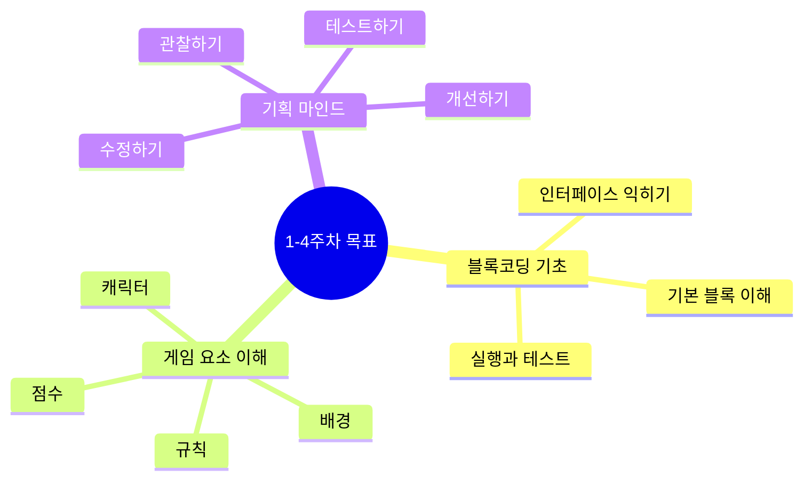
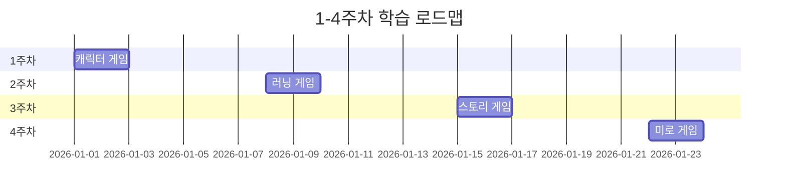
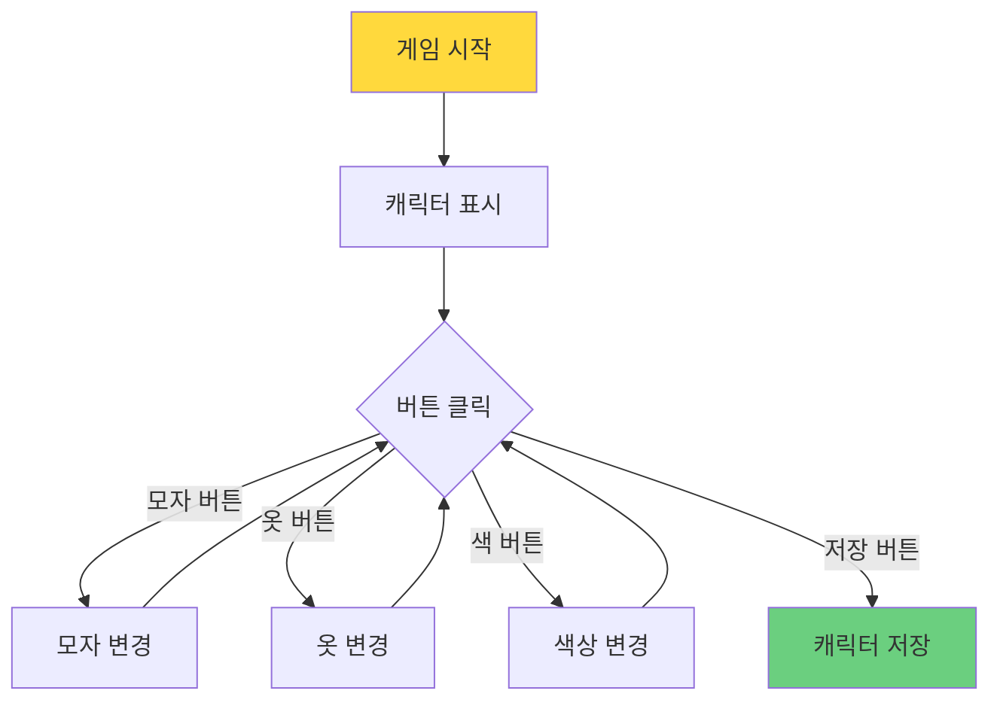
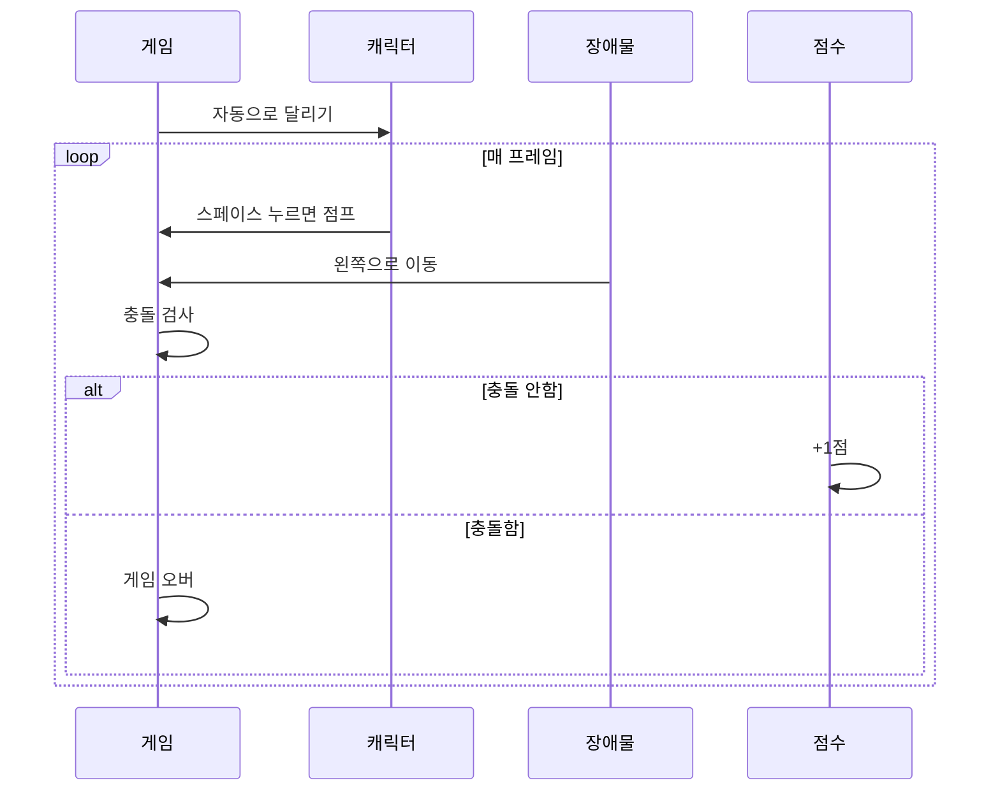
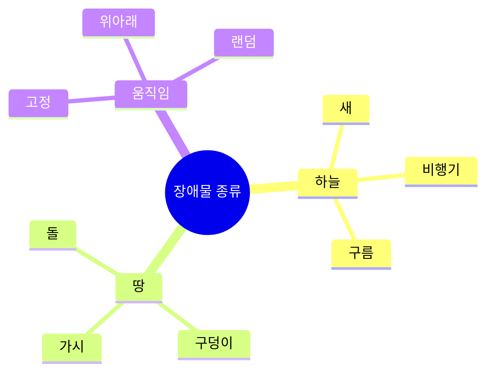
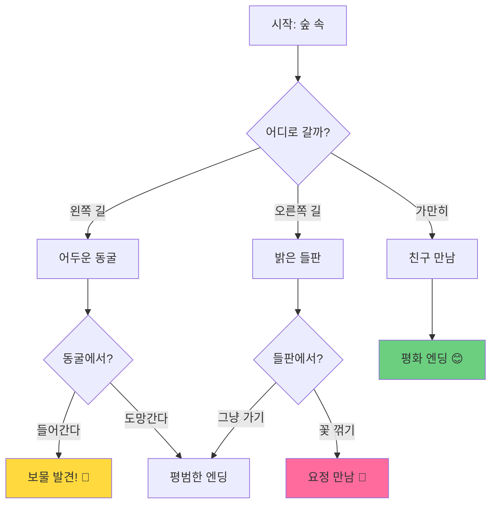
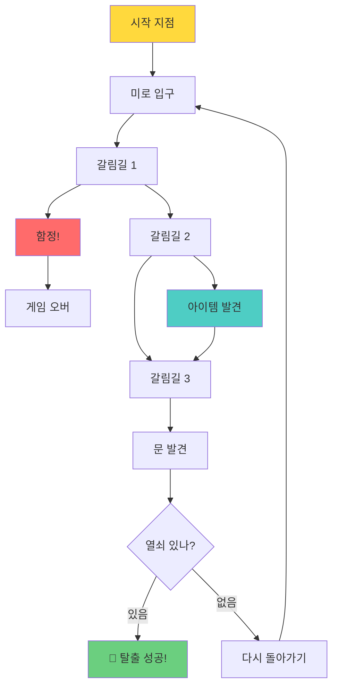
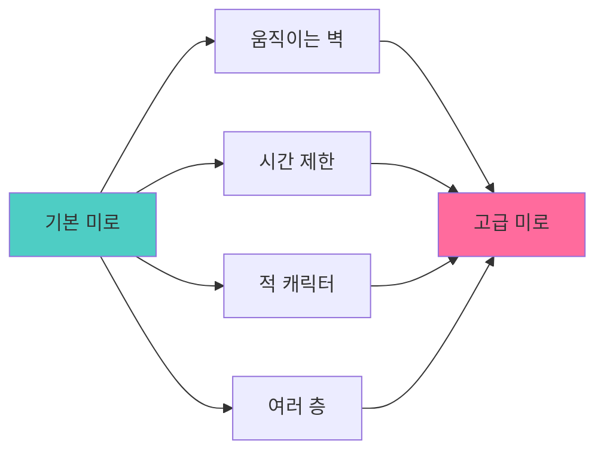
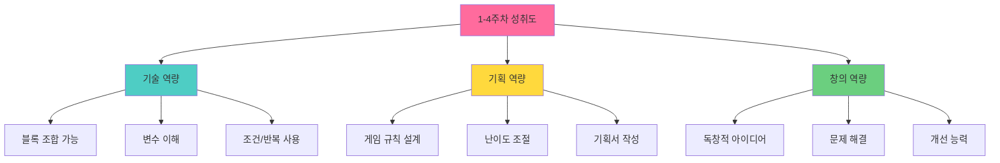

# 🎮 1-4주차: 게임 기획 입문 과정

## 🎯 과정 목표



## 📅 전체 흐름



---

## 📘 1주차: 캐릭터 드레스업 게임

### 🎮 템플릿 구조



### 📝 1차시: 템플릿 체험 및 기획 (40분)

| 시간 | 활동 | 내용 | 교사 역할 |
|------|------|------|-----------|
| 5분 | 🎯 게임 체험 | - 선생님이 만든 캐릭터 게임 플레이<br>- "어떤 기능이 있나요?"<br>- "뭘 바꾸고 싶나요?" | 데모 시연 |
| 10분 | 📝 기획하기 | - 기획서 워크시트 작성<br>- 내 캐릭터 콘셉트 정하기<br>- 추가하고 싶은 것 그리기 | 순회 지도 |
| 20분 | 🎨 수정하기 | - 템플릿 열기<br>- 색상 변경해보기<br>- 캐릭터 크기 조절 | 개별 지원 |
| 5분 | 🗣️ 공유하기 | - 2-3명 발표<br>- 다음 시간 예고 | 격려 및 피드백 |

### 🎯 1차시 학습 목표
- [ ] DWAI 블록코딩 화면 구성 이해
- [ ] 템플릿 열고 실행하기
- [ ] 숫자 블록 값 변경해보기
- [ ] 자신만의 캐릭터 콘셉트 정하기

### 📋 1차시 기획서 워크시트

```markdown
┌─────────────────────────────────────┐
│   나만의 캐릭터 기획서 (1차시)      │
└─────────────────────────────────────┘

👤 캐릭터 이름: ________________

🎨 콘셉트 (○ 표시):
□ 우주인   □ 공주/왕자   □ 닌자
□ 동물     □ 로봇       □ 기타: ______

💭 특별한 점:
_________________________________

🎨 좋아하는 색:
색 1: ______  색 2: ______  색 3: ______

✏️ 추가하고 싶은 아이템 그리기:
[                    ]
[                    ]
[                    ]
```

### 📝 2차시: 자유 창작 및 완성 (40분)

| 시간 | 활동 | 내용 | 교사 역할 |
|------|------|------|-----------|
| 3분 | 🔄 복습 | - 지난 시간 내용 확인<br>- 기획서 다시 보기 | 빠른 리뷰 |
| 7분 | 📈 추가 기획 | - 더 추가할 기능 정하기<br>- 친구 아이디어 참고 | 아이디어 자극 |
| 25분 | 🎨 자유 창작 | - 배경 바꾸기<br>- 애니메이션 추가<br>- 음악 넣기 | 순회 및 도움 |
| 5분 | 🏆 갤러리 워크 | - 자리에서 친구 작품 구경<br>- 좋아요 스티커 붙이기 | 작품 감상 유도 |

### 🎯 2차시 학습 목표
- [ ] 캐릭터 외형 완전히 바꾸기
- [ ] 배경 이미지 적용하기
- [ ] 간단한 애니메이션 추가
- [ ] 작품 저장 및 공유하기

### 🎨 수정 가능한 부분 (난이도별)

**⭐ 쉬움**
- [ ] 캐릭터 색상 변경 (RGB 값 조정)
- [ ] 캐릭터 크기 변경 (숫자 변경)
- [ ] 배경색 변경

**⭐⭐ 보통**
- [ ] 새로운 옷 아이템 추가
- [ ] 버튼 위치 변경
- [ ] 배경 이미지 넣기

**⭐⭐⭐ 어려움**
- [ ] 캐릭터 애니메이션 추가 (깜빡임, 점프)
- [ ] 음악 재생 기능
- [ ] 저장/불러오기 기능 개선

### 💡 교사 팁

**자주 나오는 질문**
Q: "색깔을 어떻게 바꿔요?"
A: "색상 블록을 찾아볼까? 빨강, 초록, 파랑 숫자가 있을 거야."

Q: "친구처럼 만들고 싶어요."
A: "좋아! 친구 화면 보고 어떤 블록을 썼는지 찾아보자."

Q: "이거 깨졌어요!"
A: "괜찮아, 되돌리기 버튼을 눌러보자. 항상 실험하다 보면 그럴 수 있어."

---

## 📗 2주차: 러닝 게임 기획

### 🎮 템플릿 구조



### 📝 1차시: 난이도 기획 (40분)

| 시간 | 활동 | 내용 | 교사 역할 |
|------|------|------|-----------|
| 5분 | 🎮 게임 플레이 | - 기본 템플릿 플레이<br>- 난이도 체감하기<br>- "너무 쉬워요? 어려워요?" | 데모 및 토론 |
| 10분 | 📊 난이도 분석 | - 무엇이 어렵게 만들까?<br>  * 속도? 장애물 개수? 간격?<br>- 워크시트 작성 | 사고 유도 |
| 20분 | 🎚️ 조정 실습 | - 장애물 속도 변경<br>- 간격 조절<br>- 테스트하며 조정 | 순회 지도 |
| 5분 | 🗣️ 발표 | - 내가 만든 난이도 설명<br>- 친구들이 플레이해보기 | 피드백 |

### 📋 난이도 설계 워크시트

```markdown
┌─────────────────────────────────────┐
│     러닝 게임 난이도 설계서          │
└─────────────────────────────────────┘

🎯 목표 플레이어:
□ 초보자 (처음 하는 사람)
□ 중급자 (조금 해본 사람)
□ 고수 (게임 잘하는 사람)

⚡ 속도 설정:
캐릭터 달리기 속도: _____ (1-10)
장애물 이동 속도: _____ (1-10)
속도 증가율: _____ (느림/보통/빠름)

🚧 장애물 설정:
장애물 간격: _____ (가까움/보통/멀리)
장애물 개수: _____ (적음/보통/많음)
장애물 크기: _____ (작음/보통/큼)

🎁 아이템 설정:
□ 무적 아이템 (지속시간: ___초)
□ 점프력 UP (높이: ___)
□ 느리게 하기 (지속시간: ___초)
□ 기타: ______________

💯 점수 설정:
장애물 피하면: +___ 점
아이템 먹으면: +___ 점
목표 점수: _____ 점

🎮 테스트 결과:
3번 플레이해서 평균 점수: _____
느낌: □ 너무 쉬움  □ 적당함  □ 너무 어려움
```

### 📝 2차시: 새로운 요소 추가 (40분)

| 시간 | 활동 | 내용 | 교사 역할 |
|------|------|------|-----------|
| 3분 | 🔄 복습 | 지난 시간 난이도 확인 | 빠른 체크 |
| 7분 | 💡 기획 회의 | - 어떤 장애물을 추가할까?<br>- 어떤 아이템을 만들까? | 브레인스토밍 |
| 25분 | 🎨 창작 시간 | - 새 장애물 추가<br>- 특별 아이템 만들기<br>- 배경/음악 변경 | 개별 지원 |
| 5분 | 🏆 토너먼트 | - 친구들끼리 게임 대결<br>- 누가 제일 높은 점수? | 게임 진행 |

### 🎨 추가 기능 아이디어

**장애물 아이디어**


**아이템 아이디어**
- 🌟 별: 점수 +10
- 💎 다이아: 점수 +50
- 🛡️ 방패: 한 번 실수해도 OK
- ⚡ 번개: 속도 UP (스릴!)
- 🐌 달팽이: 천천히 (쉬워짐)

---

## 📕 3주차: 선택형 스토리 게임

### 🎮 템플릿 구조



### 📝 1차시: 스토리 기획 (40분)

| 시간 | 활동 | 내용 | 교사 역할 |
|------|------|------|-----------|
| 5분 | 📖 스토리 체험 | - 선생님 스토리 플레이<br>- 선택에 따라 달라지는 결말 | 읽어주기 |
| 10분 | ✍️ 스토리 쓰기 | - 스토리 주제 정하기<br>- 시작-중간-끝 구성<br>- 선택지 3개 만들기 | 개별 코칭 |
| 20분 | 🎨 만들기 | - 배경 설정<br>- 캐릭터 배치<br>- 첫 대사 입력 | 순회 지도 |
| 5분 | 📖 낭독 | - 내 스토리 시작 부분 읽기 | 경청 및 칭찬 |

### 📋 스토리 기획 워크시트

```markdown
┌─────────────────────────────────────┐
│      나만의 이야기 기획서            │
└─────────────────────────────────────┘

📚 이야기 제목: ________________

🎭 장르 선택:
□ 모험  □ 판타지  □ 일상  □ 미스터리

👤 주인공:
이름: __________
특징: __________

📍 시작 장소: ________________

📖 스토리 흐름 (그림으로 그려도 좋아요!)

[시작]
__________________________________
__________________________________

      ↓ 선택 1: _________
     
[중간 1]                [중간 2]
____________           ____________
____________           ____________

      ↓ 선택 2              ↓ 선택 2
      
[엔딩 1]  [엔딩 2]    [엔딩 3]
_______  _______    _______
_______  _______    _______

🎯 각 엔딩 느낌:
엔딩 1: □ 행복  □ 슬픔  □ 놀람  □ 재미
엔딩 2: □ 행복  □ 슬픔  □ 놀람  □ 재미
엔딩 3: □ 행복  □ 슬픔  □ 놀람  □ 재미
```

### 📝 2차시: 분기 완성 (40분)

| 시간 | 활동 | 내용 | 교사 역할 |
|------|------|------|-----------|
| 3분 | 🔄 복습 | 지난 시간 스토리 확인 | 빠른 점검 |
| 7분 | 🗺️ 분기 설계 | - 조건문 블록 설명<br>- "만약~하면" 이해하기 | 개념 설명 |
| 25분 | 🎬 제작 | - 선택지 만들기<br>- 각 선택별 결과 만들기<br>- 엔딩 3가지 완성 | 개별 지원 |
| 5분 | 📖 스토리 테스트 | - 짝과 교환해서 플레이<br>- 모든 엔딩 봤는지 확인 | 피드백 유도 |

### 💡 스토리 아이디어

| 주제 | 시작 | 선택 예시 | 엔딩 아이디어 |
|------|------|-----------|---------------|
| 🏰 성 탐험 | 큰 성 발견 | 정문/뒷문/창문 | 왕 만남/보물/귀신 |
| 🐉 드래곤 | 드래곤 울음 | 도망/싸움/친구 | 평화/영웅/친구 |
| 🏫 학교 | 새 전학생 | 말걸기/무시/관찰 | 친구/후회/발견 |
| 🌊 바다 | 무인도 표류 | 신호/집짓기/탐험 | 구조/생존/보물 |

---

## 📙 4주차: 미로 탈출 게임

### 🎮 템플릿 구조



### 📝 1차시: 레벨 디자인 (40분)

| 시간 | 활동 | 내용 | 교사 역할 |
|------|------|------|-----------|
| 5분 | 🎮 게임 플레이 | - 기본 미로 체험<br>- 어려운 점 찾기 | 함께 플레이 |
| 10분 | 🗺️ 맵 그리기 | - 종이에 미로 설계<br>- 함정/아이템 위치 표시 | 순회하며 조언 |
| 20분 | 🏗️ 제작 | - 벽 배치하기<br>- 시작/도착 정하기<br>- 장애물 추가 | 개별 지원 |
| 5분 | 🎮 테스트 | - 직접 플레이해보기<br>- 너무 쉽거나 어렵지 않은지 | 난이도 점검 |

### 📋 레벨 디자인 워크시트

```markdown
┌─────────────────────────────────────┐
│      미로 게임 레벨 디자인           │
└─────────────────────────────────────┘

🎯 미로 콘셉트: ________________
(예: 유령의 집, 우주 기지, 정글 등)

📐 미로 그리기 (5x5 칸)
┌───┬───┬───┬───┬───┐
│ S │   │   │   │   │  S = 시작
├───┼───┼───┼───┼───┤  E = 도착
│   │   │ █ │   │   │  █ = 벽
├───┼───┼───┼───┼───┤  💎 = 아이템
│   │ █ │ █ │ █ │   │  ⚠ = 함정
├───┼───┼───┼───┼───┤
│   │   │   │ █ │   │
├───┼───┼───┼───┼───┤
│   │   │   │   │ E │
└───┴───┴───┴───┴───┘

🎁 아이템 배치:
□ 열쇠 (위치: ___, ___) - 문 열기용
□ 코인 (위치: ___, ___) - 점수 +10
□ 체력 (위치: ___, ___) - 함정 대비
□ 지도 (위치: ___, ___) - 길 보여주기

⚠️ 함정 배치:
□ 가시 (위치: ___, ___) - 체력 -1
□ 낙하 (위치: ___, ___) - 시작점으로
□ 괴물 (위치: ___, ___) - 체력 -2

🎮 조작 방법:
□ 화살표 키
□ 마우스 클릭
□ WASD 키

🎯 클리어 조건:
목표 시간: ___ 초 이내
최소 점수: ___ 점
필수 아이템: __________

💭 특별한 규칙:
__________________________________
__________________________________
```

### 📝 2차시: 완성 및 대회 (40분)

| 시간 | 활동 | 내용 | 교사 역할 |
|------|------|------|-----------|
| 3분 | 🔄 복습 | 지난 시간 미로 불러오기 | 저장 확인 |
| 7분 | 🎨 꾸미기 | - 함정/아이템 추가 기획<br>- 테마에 맞는 디자인 | 아이디어 지원 |
| 20분 | 🏗️ 최종 제작 | - 아이템 효과 만들기<br>- 함정 작동 만들기<br>- 승리 화면 제작 | 문제해결 지원 |
| 10분 | 🏆 미로 대회 | - 친구 미로 도전하기<br>- 가장 빨리 깬 사람?<br>- 가장 어려운 미로? | 대회 진행 |

### 🎨 심화 기능

**⭐⭐⭐ 도전 과제**


1. **움직이는 벽**: 왔다갔다 하는 장애물
2. **타이머**: 30초 안에 탈출하기
3. **적 추적**: 좀비가 따라온다!
4. **다층 미로**: 1층, 2층 계단으로 이동

---

## 📊 1-4주차 종합 평가

### 🎯 역량 체크리스트



### 📋 학생 자기평가지

```markdown
┌─────────────────────────────────────┐
│      1-4주차 나의 성장 기록          │
└─────────────────────────────────────┘

이름: __________  날짜: __________

📚 내가 만든 게임들:
✅ 1주차: ________________
✅ 2주차: ________________
✅ 3주차: ________________
✅ 4주차: ________________

💪 할 수 있게 된 것:
□ 블록을 혼자서 찾아 쓸 수 있다
□ 숫자를 바꿔서 게임을 조절할 수 있다
□ 새로운 기능을 추가할 수 있다
□ 문제가 생기면 스스로 고칠 수 있다
□ 친구에게 내 게임을 설명할 수 있다

🌟 가장 재미있었던 게임:
__________________________________
이유: ____________________________

😅 어려웠던 부분:
__________________________________
어떻게 해결했나요: ______________

💡 다음에 만들고 싶은 게임:
__________________________________

선생님 한마디:
__________________________________
__________________________________
```

### 🏆 포트폴리오 만들기

**각 주차 게임을 스크린샷으로 저장**
```markdown
나의 게임 기획 포트폴리오
========================

학생 이름: __________
기간: 1-4주차

[ 1주차: 캐릭터 드레스업 게임 ]
게임 이름: __________
[스크린샷 붙이기]
특별한 점: __________

[ 2주차: 러닝 게임 ]
게임 이름: __________
[스크린샷 붙이기]
난이도: ⭐⭐⭐⭐☆

[ 3주차: 스토리 게임 ]
게임 이름: __________
[스크린샷 붙이기]
엔딩 개수: ___ 개

[ 4주차: 미로 게임 ]
게임 이름: __________
[스크린샷 붙이기]
클리어 시간: ___ 초
```

## 💡 교사 참고 자료

### 🎯 주차별 핵심 개념

| 주차 | 블록코딩 개념 | 게임 디자인 개념 |
|------|---------------|------------------|
| 1주차 | 순차 구조, 이벤트 | 캐릭터 디자인, UI |
| 2주차 | 반복문, 변수 | 난이도 밸런싱 |
| 3주차 | 조건문, 분기 | 스토리 구조, 선택 |
| 4주차 | 충돌 감지, 좌표 | 레벨 디자인, 공간 |

### 🔧 문제해결 가이드

**학생이 막혔을 때**
1. 무엇을 만들려고 했는지 물어보기
2. 비슷한 예시 보여주기
3. 한 단계씩 나눠서 시도
4. 친구의 도움 받기

**시간이 남았을 때**
- 도전 과제 제공
- 친구 게임 테스터 되기
- 다른 주차 템플릿 체험
- 기획서 더 자세히 쓰기

**시간이 부족할 때**
- 핵심 기능만 완성
- 집에서 이어하기 (선택)
- 다음 주에 계속하기

---

**다음 과정**: [5-8주차: AI 게임 기획](./5-8주차_AI게임기획.md)
