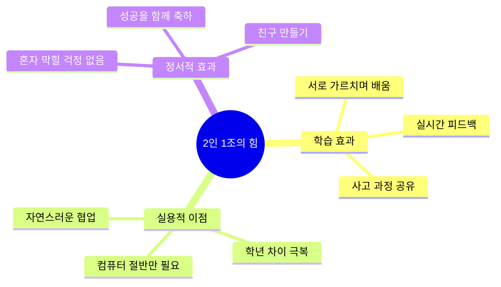

# 🤝 2인 1조 짝 프로그래밍 완벽 가이드

## 📋 목차
1. [왜 2인 1조인가?](#왜-2인-1조인가)
2. [페어 구성하기](#페어-구성하기)
3. [역할 이해하기](#역할-이해하기)
4. [수업 운영 방법](#수업-운영-방법)
5. [문제 해결하기](#문제-해결하기)

---

## 🎯 왜 2인 1조인가?

### ✅ 장점



### 📊 연구 결과

> 짝 프로그래밍은 일반 프로그래밍 대비:
> - **이해도 30% 향상**
> - **흥미도 40% 증가**
> - **완성도 50% 향상**
> 
> (출처: MIT, Stanford 공동 연구)

---

## 👥 페어 구성하기

### 🎯 최적 조합

| 조합 | 추천도 | 이유 | 주의사항 |
|------|--------|------|----------|
| **1학년 + 3학년** | ⭐⭐⭐⭐⭐ | 명확한 멘토-멘티 관계 | 3학년이 독점하지 않도록 |
| **1학년 + 2학년** | ⭐⭐⭐⭐ | 나이 차이 적음, 친근함 | 둘 다 모를 때 지원 필요 |
| **2학년 + 3학년** | ⭐⭐⭐⭐⭐ | 평등한 협업 가능 | 경쟁보다 협력 유도 |
| **같은 학년** | ⭐⭐ | 비추천 (학년 차이 활용 못함) | 부득이한 경우만 |

### 📝 1주차 페어 정하기 체크리스트

#### Step 1: 학생 파악 (수업 전)
```markdown
학생 명단 작성:

[ 1학년 그룹 ]
1. 이름: _____ / 수준: □초급 □중급 / 성격: □활발 □조용
2. 이름: _____ / 수준: □초급 □중급 / 성격: □활발 □조용
...

[ 2학년 그룹 ]
...

[ 3학년 그룹 ]
...
```

#### Step 2: 매칭 원칙
1. **학년 차이 활용**: 저학년 + 고학년
2. **성격 균형**: 활발한 학생 + 조용한 학생
3. **친구 관계 고려**: 너무 친하면 떠들 수 있음
4. **학습 수준**: 극단적 차이는 피하기

#### Step 3: 발표 (1주차 수업 시작)
```
선생님: "오늘부터 2명이 한 팀이에요!
        한 명은 고학년 형/언니,
        한 명은 저학년 동생!
        
        서로 도와가며 게임 만들 거예요.
        컴퓨터 한 대를 함께 사용합니다."

페어 발표:
- 페어 1: 민수(1학년) & 지훈(3학년)
- 페어 2: 서연(2학년) & 하늘(3학년)
...

선생님: "손 흔들어 인사해봐요! 앞으로 12주 동안 
        함께 할 파트너예요!"
```

---

## 🎭 역할 이해하기

### 🚗 드라이버 (Driver)
**역할**: 실제로 컴퓨터 조작하는 사람

```
✅ 해야 할 것:
- 마우스와 키보드 사용
- 파트너의 아이디어 실행
- "이렇게 할까?" 확인하기
- 막히면 파트너에게 질문

❌ 하지 말아야 할 것:
- 혼자서 결정하기
- 파트너 무시하고 진행
- 독점하기
```

### 🗺️ 네비게이터 (Navigator)
**역할**: 아이디어를 제시하고 안내하는 사람

```
✅ 해야 할 것:
- 아이디어 제안: "저거 빨간색으로 바꿔봐!"
- 문제 발견: "앗, 저기 오타!"
- 격려하기: "잘하고 있어!"
- 전체 흐름 생각하기

❌ 하지 말아야 할 것:
- 마우스 빼앗기
- 명령조로 말하기
- 가만히 있기
```

### 🔄 역할 교대

```mermaid
gantt
    title 80분 수업 역할 교대 타임라인
    dateFormat mm
    
    section 1차시(40분)
    저학년 드라이버    :01, 20m
    역할 교대 휴식     :21, 01m
    고학년 드라이버    :22, 18m
    중간 공유          :40, 01m
    
    section 2차시(40분)
    고학년 드라이버    :41, 20m
    역할 교대 휴식     :61, 01m
    저학년 드라이버    :62, 13m
    게임 대회          :75, 05m
    
    style "역할 교대 휴식" fill:#ff6b6b
```

**교대 신호**
- ⏰ 타이머 알람 (20분)
- 🔔 선생님이 "바꿔!" 외치기
- 🎵 음악 틀기

---

## 🏫 수업 운영 방법

### 📅 1차시 (40분)

#### 0-5분: 함께 게임 체험
```
🎮 활동: 선생님이 완성된 게임 시연

학생들 (짝과 함께):
"와! 저거 재밌어 보여!"
"우리도 만들 수 있어?"

선생님:
"당연하지! 지금부터 만들 거야!"
```

#### 5-10분: 짝과 상의 & 역할 정하기
```
💬 활동: 무엇을 바꿀지 상의

대화 예시:
저학년: "나는 캐릭터 빨간색으로 하고 싶어!"
고학년: "좋아! 그럼 나는 배경 바꿀게."
선생님: "누가 먼저 드라이버 할래?"
저학년: "나 먼저 할래요!"
선생님: "좋아! 그럼 (고학년 이름)이는 옆에서 
        도와주는 네비게이터!"
```

#### 10-30분: 저학년 드라이버 (20분)
```
🖱️ 저학년 학생이 마우스 조작
💡 고학년 학생이 옆에서 도움

대화 예시:
고학년: "여기 클릭해봐!"
저학년: [클릭]
고학년: "저기 숫자 바꿔봐. 10 대신 50으로!"
저학년: "어떻게 바꿔?"
고학년: "여기 더블클릭하면 바꿀 수 있어."
저학년: [변경 성공] "됐다!"
둘: "야호!"

선생님 역할:
- 순회하며 관찰
- 한 명이 소외되면 개입
- 잘하는 팀에게 박수
- 막힌 팀 도와주기
```

#### 30-35분: 역할 교대 & 휴식
```
🔔 선생님: "교대 시간! 바꿔!"

학생들:
- 자리 바꾸기
- 스트레칭
- 물 마시기
- 지금까지 한 것 확인
```

#### 35-40분: 고학년 드라이버 시작
```
🖱️ 고학년 학생이 마우스 조작
💡 저학년 학생이 아이디어 제공

대화 예시:
저학년: "더 빨리 만들어봐!"
고학년: [속도 조절] "이 정도?"
저학년: "응! 좋아!"
고학년: "이거 추가하면 더 재밌을 것 같은데?"
저학년: "해봐!"
```

### 📅 2차시 (40분)

#### 0-2분: 빠른 연결
```
선생님: "지난 시간 파일 열어봐!"
학생들: [파일 열기, 게임 실행]
둘: "어? 이거 우리가 만든 거다!"
```

#### 2-5분: 도전 과제 선택
```
선생님: "더 어려운 거 도전해볼래?"
(화면에 초급/중급/고급 보여주기)

짝과 상의:
저학년: "우리 이거 해보자!"
고학년: "오케이!"
```

#### 5-25분: 고학년 드라이버 (20분)
```
이번엔 고학년이 먼저 시작
(1차시와 역할 반대)
```

#### 25-30분: 자유 교대
```
선생님: "이제는 자유롭게 바꿔도 돼!"

학생들:
- 막히면 바꾸기
- 더 잘하는 사람이 하기
- 번갈아가며 하기
```

#### 30-35분: 다른 팀 테스트
```
🧪 활동: 옆 팀 게임 해보기

선생님: "옆 팀이랑 컴퓨터 바꿔봐!"

학생들:
- 다른 팀 게임 플레이
- 포스트잇에 피드백
- "이거 재밌어요!" "더 빠르게 해보세요!"
```

#### 35-40분: 게임 대회!
```
🏆 활동: 팀별 최고 점수 경쟁

선생님: "어느 팀이 제일 높은 점수?"

학생들:
- 자기 게임으로 점수 내기
- "우리 팀 150점!"
- "우리는 200점!"

선생님: "우와! 모두 최고 점수! 박수!"
[전원 박수]
```

---

## 🚨 문제 해결하기

### 문제 1: 한 명이 독점해요

**증상**
```
❌ 고학년이 마우스를 안 줌
❌ 저학년이 가만히 있음
❌ 대화가 없음
```

**해결**
```
1단계: 역할 확인
선생님: "(고학년 이름)이는 지금 드라이버지?
        (저학년 이름)이는 네비게이터!
        네비게이터는 아이디어를 말해야 해.
        (저학년 이름)이, 뭘 바꾸고 싶어?"

2단계: 강제 교대
선생님: "잠깐! 지금 바꿔보자."
[물리적으로 마우스 건네주기]

3단계: 과제 분담
선생님: "(저학년)이는 색 고르기,
        (고학년)이는 속도 조절.
        각자 할 거 정해봐!"
```

### 문제 2: 둘이 싸워요

**증상**
```
❌ "내가 할 거야!" "안 돼!"
❌ 서로 마우스 빼앗으려 함
❌ 말 안 하고 삐짐
```

**해결**
```
1단계: 쿨다운
선생님: "잠깐! 타임아웃!"
[2분 휴식, 각자 물 마시기]

2단계: 역할 재분배
선생님: "뭐 때문에 싸웠어?"
학생 1: "나도 하고 싶어요."
학생 2: "나도 하고 싶은데..."
선생님: "그럼 10분씩 번갈아가면 어때?"

3단계: 목표 재설정
선생님: "오늘 뭘 완성할 거야?"
둘: "게임요!"
선생님: "그럼 같이 해야 완성하지! 혼자는 못 해."
```

### 문제 3: 둘 다 모르겠어요

**증상**
```
❌ 손을 들고 기다림
❌ 아무것도 안 하고 있음
❌ "선생님~ 못 하겠어요"
```

**해결**
```
1단계: 문제 파악
선생님: "어디서 막혔어?"
학생: "이거 어떻게 바꾸는지 모르겠어요."

2단계: 작은 단계로 나누기
선생님: "일단 이 버튼 눌러봐."
[학생이 실행]
선생님: "그 다음 여기 클릭!"
[학생이 실행]
선생님: "이제 둘이 상의해서 색 정해봐."

3단계: 다른 팀 도움
선생님: "옆 팀에게 물어볼래?"
[옆 팀이 도와줌]
```

### 문제 4: 한 명이 너무 느려요

**증상**
```
❌ 마우스 조작이 서툴러서 답답함
❌ 빠른 학생이 짜증남
❌ "나 할래요! 넘겨요!"
```

**해결**
```
1단계: 인내심 교육
선생님: "(빠른 학생) 잠깐 와봐."
[따로 조용히 대화]
선생님: "형/언니는 처음부터 잘했어?
        (느린 학생)이도 연습하면 잘할 거야.
        기다려주는 것도 도와주는 거야."

2단계: 적절한 과제 배분
선생님: "(느린 학생)이는 색 고르기만,
        (빠른 학생)이는 어려운 거 해봐."

3단계: 칭찬
선생님: "와! (느린 학생)이 잘했네!
        (빠른 학생)이가 잘 도와줬구나!"
[둘 다 칭찬]
```

---

## 📊 평가하기

### 짝 활동 평가 체크리스트

**교사용 관찰 체크리스트**

| 페어 | 이름 | 참여도 | 역할교대 | 대화 | 존중 | 종합 |
|------|------|--------|----------|------|------|------|
| 1 | A & B | ⭐⭐⭐⭐⭐ | ⭐⭐⭐⭐⭐ | ⭐⭐⭐⭐ | ⭐⭐⭐⭐⭐ | 우수 |
| 2 | C & D | ⭐⭐⭐ | ⭐⭐⭐⭐ | ⭐⭐ | ⭐⭐⭐ | 보통 |
| ... | ... | ... | ... | ... | ... | ... |

**메모 공간**
```
페어 1: 아주 잘함. A가 B를 잘 도와줌.
페어 2: C가 독점하는 경향. 역할 교대 강화 필요.
페어 3: ...
```

### 학생 자기평가

**우리 팀 평가하기 (학생용)**

```markdown
팀 이름: _________ & _________

오늘 수업 평가:

😊 우리 팀은 어땠나요?
□ 아주 좋았어요!
□ 좋았어요
□ 보통이에요
□ 어려웠어요

🤝 나는 파트너를 도왔나요?
□ 많이 도왔어요
□ 조금 도왔어요
□ 잘 모르겠어요

👏 파트너가 잘한 점:
_________________________________

💡 다음 시간에 더 잘하려면:
_________________________________
```

---

## 🎓 성공 사례

### 사례 1: 1학년 민수 & 3학년 지훈

**초반 (1-2주차)**
```
민수(1학년): 마우스도 잘 못 씀
지훈(3학년): 답답해함, "내가 할래요" 반복
```

**중반 (5-6주차)**
```
민수: 지훈이 설명 듣고 혼자 해봄
지훈: 기다려주기, "잘하네!" 격려
```

**후반 (11-12주차)**
```
민수: "이렇게 하면 돼!" 먼저 제안
지훈: "오! 좋은 생각이다!"
→ 평등한 협업 파트너가 됨
```

### 사례 2: 2학년 서연 & 3학년 하늘 (여학생 조)

**특징**
```
- 아이디어를 그림으로 먼저 그림
- 대화를 많이 함
- 역할 교대를 자연스럽게 함
```

**12주차 최종 프로젝트**
```
→ "공주 구하기 게임" 완성
→ 스토리, 캐릭터, 규칙 모두 함께 기획
→ 메이커 페어 최우수상 수상
```

---

## 💡 꿀팁 모음

### 🍯 Tip 1: 타이머는 필수!
```
⏰ 시각적 타이머 추천
- 핸드폰 앱
- 온라인 타이머 (화면 공유)
- 주방 타이머

효과:
"선생님이 바꾸라고 해서" (X)
"시간이 돼서 바꿔" (O)
→ 자연스러운 교대
```

### 🍯 Tip 2: 첫 차시가 중요!
```
1주차에 집중 투자:
✅ 역할 설명 (5분)
✅ 시범 보이기 (선생님이 학생과 짝)
✅ 첫 교대 연습
✅ "잘하고 있어!" 격려

→ 나머지 11주가 편해짐
```

### 🍯 Tip 3: 성공 스토리 공유
```
매주 수업 마지막:

선생님: "오늘 가장 잘 협력한 팀은?"
학생들: [투표]
선생님: "○○팀! 어떻게 했어?"
학생: "우리는 10분마다 바꿨어요."
선생님: "우와! 다른 팀도 해봐!"

→ 좋은 사례가 퍼짐
```

### 🍯 Tip 4: 유연하게 대처
```
규칙은 가이드일 뿐!

예시:
- 한 팀이 20분보다 빨리 바꾸고 싶다? OK!
- 둘이 동시에 하고 싶다? (1인 마우스, 1인 키보드) OK!
- 역할 없이 자유롭게? 잘하면 OK!

→ 협력만 잘되면 방식은 자유
```

### 🍯 Tip 5: 기록 남기기
```
📸 사진/영상 촬영:
- 협력하는 모습
- 완성된 게임 화면
- 게임 대회 장면

→ 메이커 페어 자료로 활용
→ 학부모에게 공유
→ 다음 학기 홍보 자료
```

---

## 📚 참고 자료

### 📖 더 읽어보기

1. **Pair Programming 연구**
   - "All I Really Need to Know about Pair Programming I Learned In Kindergarten"
   - Laurie Williams, NC State University

2. **협업 학습**
   - "Cooperative Learning in the Classroom"
   - Johnson & Johnson

3. **MIT Media Lab**
   - Creative Learning Spiral
   - Learning by Making

### 🔗 유용한 링크

- **타이머 추천**: 
  - Online Stopwatch (검색)
  - Classroom Timer Apps
  
- **짝 프로그래밍 포스터**:
  - Driver/Navigator 역할 포스터 (출력용)
  
- **게임 템플릿**:
  - DWAI 플랫폼 커뮤니티

---

## ✅ 체크리스트: 준비되셨나요?

### 수업 전
- [ ] 학생 명단으로 페어 구성 완료
- [ ] 컴퓨터 배치 (2인 1조 좌석)
- [ ] 타이머 준비
- [ ] 역할 설명 자료 준비

### 1주차 특별 준비
- [ ] 짝 프로그래밍 설명 (5분)
- [ ] 역할 시범 (선생님이 직접)
- [ ] 첫 교대 연습
- [ ] "우리는 팀!" 다짐

### 매주 준비
- [ ] 페어 명단 확인
- [ ] 20분 타이머 설정
- [ ] 이전 주 작품 저장 확인
- [ ] 문제 팀 파악 (개입 계획)

### 평가
- [ ] 페어 관찰 체크리스트
- [ ] 학생 자기평가지
- [ ] 성공 사례 기록

---

**🎉 축하합니다! 이제 2인 1조 수업을 시작할 준비가 되었습니다!**

> 💡 **기억하세요**: 완벽한 짝은 없습니다. 함께 성장하는 것이 목표입니다!

**문의사항이 있다면** Issue로 등록해주세요!

---

**작성일**: 2026-01-15  
**버전**: 1.0  
**라이선스**: CC BY 4.0
